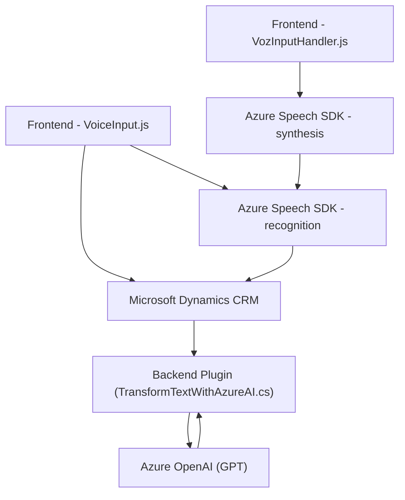

### Breve resumen técnico:
El repositorio describe tres archivos que implementan un solución de integración entre una **plataforma CRM (Microsoft Dynamics)** y **Azure Cloud Services**, utilizando tecnologías como Azure Speech SDK y Azure OpenAI. La solución en su conjunto ofrece:
1. **Frontend** que utiliza **JavaScript** para realizar síntesis y reconocimiento de voz con el SDK de Azure Speech Services.
2. **Backend** con un **plugin para Dynamics CRM**, escrito en **C#**, que emplea **Azure OpenAI** para transformar datos en tiempo real.

El propósito general es facilitar la interacción basada en voz entre el usuario y la aplicación, actualizando formularios dinámicamente y personalizando la experiencia mediante inteligencia artificial.

### Descripción de arquitectura:
La arquitectura del sistema es **n-capas** con una separación entre:
1. **Capa de presentación** (Frontend) para soportar la interacción visual, la síntesis y el reconocimiento de voz (VoiceInput.js y VozInputHandler.js).
2. **Capa de negocio** en el backend, mediante un **Plugin de Dynamics CRM** que utiliza el servicio de Azure OpenAI.
3. **Capa de integración externa**, conectando la aplicación con servicios en la nube como Azure Speech SDK y Azure OpenAI (modelo GPT) para reconocimiento de voz y generación de texto estructurado.

### Tecnologías usadas:
1. **Frontend (JavaScript)**:
   - **Azure Speech SDK**: Usado para síntesis y reconocimiento de voz.
   - **Microsoft Dynamics CRM API**: Para manipular y gestionar campos en formularios.
   - *Event-driven programming*: basado en eventos de voz y ejecución de flujo.
   - Modularización: Los archivos están separados por roles específicos (voz, reconocimiento, API).

2. **Plugin (C#)**:
   - Dynamics CRM SDK (`IPlugin`, `IPluginExecutionContext`, etc.).
   - **Azure OpenAI API** (GPT): para procesar texto y generar datos estructurados en JSON.
   - **System.Text.Json** y **Newtonsoft.Json.Linq**: para el trabajo con estructuras JSON.

### Dependencias o componentes externos:
- **Azure Speech SDK** (URL: `https://aka.ms/csspeech/jsbrowserpackageraw`): Para la síntesis y reconocimiento de voz.
- **Azure OpenAI Service (GPT)**: Utilizado para la transformación de texto mediante solicitudes REST.
- **Microsoft Dynamics SDK**: Framework para extender los objetos de datos y lógica en CRM.
- **System.Text.Json & Newtonsoft.Json.Linq**: Manejo de JSON en el plugin.

### Diagrama Mermaid válido para GitHub:

### Conclusión final:
La solución presentada es una arquitectura **n-capas** que permite la integración entre un CRM (Microsoft Dynamics) y los servicios nube de Azure, específicamente Speech SDK y OpenAI GPT. Utiliza un enfoque modular y moderno, con implementación basada en eventos y uso extensivo de servicios externos para potenciar la funcionalidad del sistema. Esta solución es apta para mejorar la interacción en aplicaciones que requieran reconocimiento de voz y procesamiento de lenguaje natural. Sin embargo, podría considerar la protección de datos sensibles durante la comunicación con los servicios en la nube, especialmente al utilizar fórmulas de transformación personalizadas.