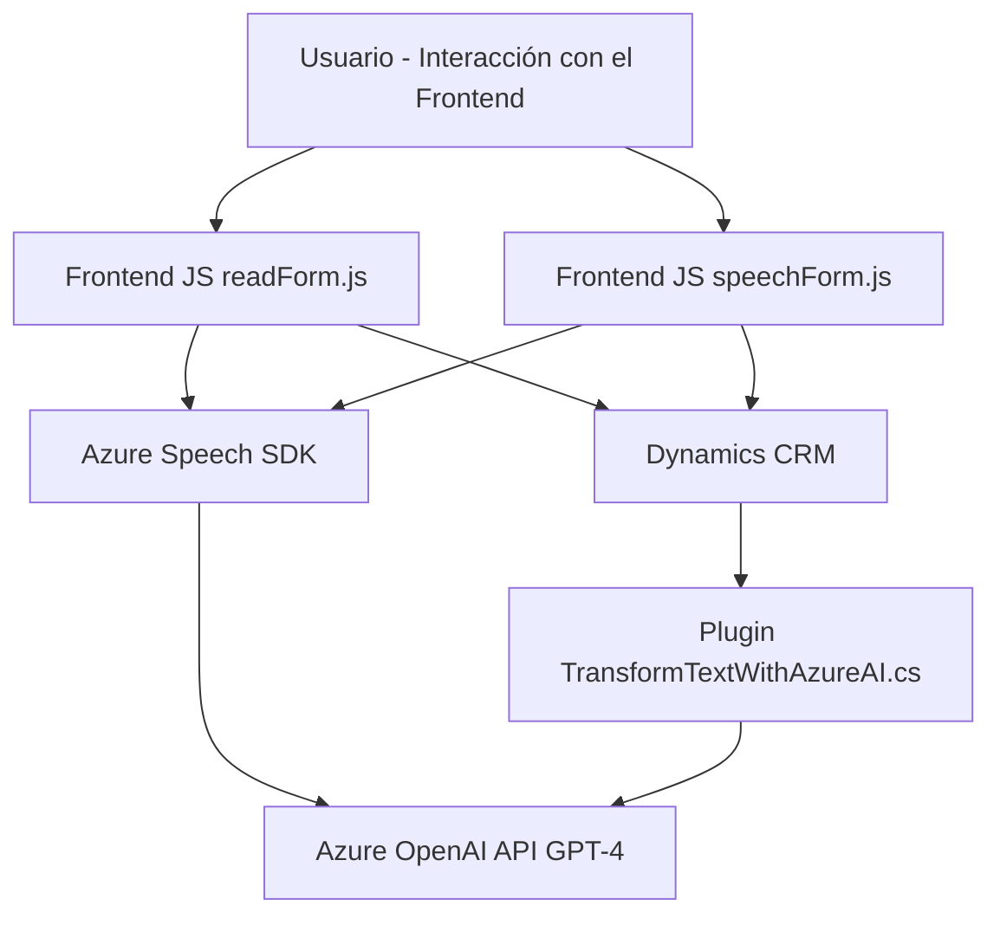

### Análisis técnico completo del repositorio:

#### **1. Breve resumen técnico**
Este repositorio combina código para funcionalidades de front-end en JavaScript y un back-end basado en plugins de Dynamics 365 con integración hacia Azure. Básicamente:
- **Frontend:** Scripts en JavaScript con integración directa y dinámicamente cargada al Azure Speech SDK para síntesis y reconocimiento de voz.
- **Backend:** Código en C# implementando un plugin de Dynamics CRM (`IPlugin`) que utiliza la API de Azure OpenAI para procesamiento de texto.

Los módulos desarrollados facilitan accesibilidad, procesamiento del lenguaje natural (NLP) y automatización de procesos en formularios de Dynamics 365.

---

#### **2. Descripción de la arquitectura**
La solución implementa un enfoque **multicapa**, donde el front-end realiza tareas como reconocimiento y síntesis de voz mediante el SDK de Azure Speech, y delega el procesamiento avanzado a la capa de back-end utilizando la API de Azure OpenAI. 

De manera explícita, la arquitectura incluye:
- **Frontend:** Una capa de interacción con el usuario, centrada en la recogida de datos mediante análisis de formulario y reconocimiento/síntesis de voz. Utiliza llamadas asíncronas al servicio de Dynamics y Azure OpenAI para delegar tareas.
  
- **Backend:** Una capa lógica que implementa el plugin de Dynamics CRM. Actúa como middleware entre Azure OpenAI (procesamiento externo) y Dynamics CRM, transformando los datos.
  
Este enfoque puede acercarse al patrón **hexagonal**/modular, ya que las aplicaciones interactúan con dependencias externas (Azure Speech/AI y Dynamics) mediante puntos de entrada bien definidos.

---

#### **3. Tecnologías, frameworks y patrones usados**
- **Frontend:**
  - **JavaScript**: Desarrollo de scripts para interacción con el DOM y servicios externos.
  - **Azure Speech SDK**: Integración nativa para reconocimiento y síntesis de voz. Se carga dinámicamente desde su CDN.
  - **Patrones:**
    - Carga Condicional: Garantiza la carga del SDK solo si es necesario (`ensureSpeechSDKLoaded`).
    - Encapsulación: Uso de funciones modulares para procesamiento de síntesis y datos del formulario.
    - Fachada: Las funciones del frontend protegen al usuario de la complejidad interna del SDK y su configuración.

- **Backend:**
  - **C# y .NET Framework**: Desarrollo de un plugin basado en `IPlugin` para Dynamics CRM.
  - **Azure OpenAI API (GPT-4)**: Se integra usando solicitudes HTTP con manejo de resultados JSON para procesamiento avanzado de texto.
  - **Microsoft.Xrm.Sdk**: Extensión de Dynamics CRM para desarrollo de plugins.
  - **Patrones:**
    - Plugin Pattern: Implementa `IPlugin`, que actúa como punto de entrada en procesos específicos de Dynamics CRM.
    - Microservicios: Conexión modular hacia Azure OpenAI para delegar el procesamiento de texto.
    - External API Integration: Consume servicios externos bajo un enfoque modular.

---

#### **4. Dependencias o componentes externos identificados**
- **Azure Speech SDK:** Herramienta principal para realización de síntesis y reconocimiento de voz.
- **Azure OpenAI API:** Utilizada para procesamiento avanzado de texto con el modelo GPT-4.
- **Microsoft Dynamics CRM y Xrm API:** Framework de desarrollo extensible para gestión de datos y operaciones en formularios.
- **Frameworks C#:**
  - System.Net.Http y Newtonsoft.JSON para manejo de solicitudes HTTP y datos JSON en la integración al servicio OpenAI.

---

#### **5. Diagrama Mermaid compatible con GitHub**

---

#### **Conclusión final**
La solución se basa en la integración entre el frontend (JavaScript) y la capa de back-end (plugin de Dynamics CRM). Ambos están unidos por una arquitectura modular que consume servicios externos como Azure Speech SDK y Azure OpenAI API. Los patrones utilizados refuerzan la simplicidad, escalabilidad y modularidad. Se podría considerar como una implementación en **n capas** con módulos que cumplen roles específicos dentro de un ecosistema de Dynamics 365 CRM.