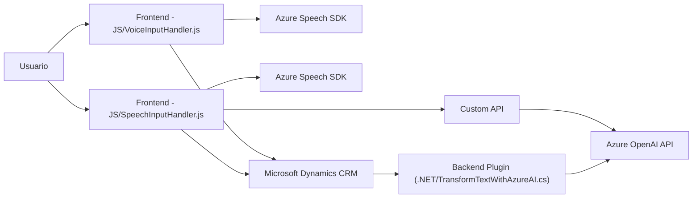

### Resumen Técnico
El repositorio describe un conjunto de componentes diseñados para interactuar con formularios dinámicos de Microsoft Dynamics CRM y proveer capacidades avanzadas de entrada y transformación de texto basado en voz y normas configuradas por el usuario. Estas funcionalidades están habilitadas mediante **Azure Speech SDK** y **Azure OpenAI**. Además, ofrecen integración con APIs internas y externas, brindando servicios avanzados para aplicaciones empresariales como CRMs.

---

### Descripción de Arquitectura

#### Tipo de solución:
La solución se compone de:
1. **Frontend**: Archivos JavaScript integrados en el CRM para la manipulación dinámica de formularios (entrada de datos).
2. **Backend (Plugin)**: Desarrollo en `.NET` para conectarse a **Azure OpenAI**, realizar transformaciones avanzadas de texto y manejar los resultados en Microsoft Dynamics CRM.

#### Tipo de arquitectura:
1. **N-capas**: Por las dependencias hacia capas individuales, como la presentación (interfaz del formulario en CRM), lógica de negocio (plugin que ejecuta transformaciones de datos) y capas externas (integración con servicios de Azure como Speech SDK y OpenAI API).
2. **Service-Oriented Architecture (SOA)**: Uso de APIs externas (Azure OpenAI y Speech SDK) y consumidor de servicios en el entorno CRM como `Xrm.WebApi`.

#### Principales patrones:
- **Plugin Pattern**: Usado en el backend para extender la funcionalidad del CRM mediante la interfaz `IPlugin`.
- **Facade Pattern**: Aplicado en los archivos de frontend (e.g., funciones para cargar Speech SDK y manejar datos de formulario).
- **HTTP Client Pattern** para invocar la API de Azure OpenAI.
- **Estructura orientada a eventos** en el frontend para asegurar la carga dinámica de SDK y flujo de ejecución.
- **Modularidad funcional**: División de código en segmentos independientes para aumentar extensibilidad y mantenimiento.

---

### Tecnologías utilizadas
1. **Frontend**:
   - **JavaScript**: Principal lenguaje para la manipulación de formularios e interacción con la API de **Azure Speech SDK**.
   - **Azure Speech SDK**: Usado para síntesis de voz y reconocimiento de voz.

2. **Backend**:
   - **C# (.NET)**: Lenguaje para el desarrollo del plugin de Microsoft Dynamics CRM.
   - **Microsoft Dynamics SDK**: Framework oficial para la interacción con su entorno CRM.
   - **Azure OpenAI API**: Utilizado para la transformación de texto.
   - **Newtonsoft.Json.Linq** y **System.Text.Json**: Para el manejo de datos en formato JSON.

---

### Dependencias posibles
1. **Azure Speech SDK**: Dependencia necesaria para la síntesis y reconocimiento de voz.
2. **Azure OpenAI API**: Servicio configurado en Azure para la transformación de texto.
3. **Microsoft Dynamics CRM**: Contexto donde se ejecuta todo el ecosistema, con acceso a servicios como `Xrm.WebApi`.
4. **Librerías**:
   - `Microsoft.Xrm.Sdk` y `Microsoft.Xrm.Sdk.Query`: Para el manejo de datos dentro de la plataforma CRM.
   - `System.Net.Http`: Necesario para conexiones REST hacia APIs externas.

---

### Diagrama Mermaid Compatible con GitHub Markdown
El siguiente diagrama representa la relación entre los componentes de la solución:

---

### Conclusión Final
La solución se caracteriza por una arquitectura de **N-capas**, que interactúa de manera eficiente con Microsoft Dynamics CRM a través de SDK y patrones de diseño avanzados como **Facade** y **Plugin Pattern**. Su capacidad de integración con **Azure Speech SDK** para el reconocimiento y síntesis de voz, así como con **Azure OpenAI API** para transformaciones avanzadas basadas en inteligencia artificial, la hacen ideal para aplicaciones empresariales modernas con soporte para formularios dinámicos y procesamiento de datos por voz. La modularidad del diseño asegura escalabilidad y fácil mantenimiento, un factor crucial para sistemas integrados en negocios.