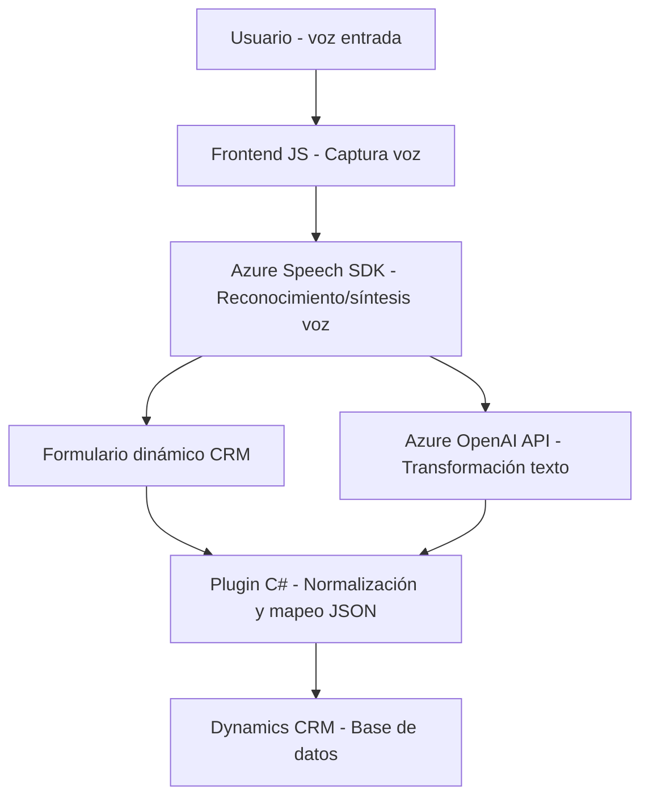

### Breve resumen técnico
El repositorio presenta una solución híbrida que integra procesamiento de datos visuales y vocales en formularios dinámicos (presumiblemente de Dynamics CRM) con tecnologías avanzadas como **Azure Speech SDK** para síntesis y reconocimiento de voz, y **Azure OpenAI GPT** para transformaciones semánticas y estructurales. La estructura incluye un frontend en JavaScript y un backend/plugin en C#.

---

### Descripción de arquitectura
#### Principales características:
1. **Frontend**:
    - Modularizado con funciones para captura y síntesis de voz.
    - Integración directa con el **Azure Speech SDK**, donde el SDK se carga dinámicamente en tiempo de ejecución para reducir la carga inicial y reutilizar componentes en tiempo real.
    - Procesamiento de eventos y mapeo de datos hacia un contexto CRM (Dynamics 365), gestionando atributos específicos como números, opciones y atributos de tipo "lookup".

2. **Backend**:
    - El plugin de **Dynamics 365** (C#) utiliza una arquitectura basada en plugins (concepto de extensión del CRM) para transformar texto mediante el **Azure OpenAI GPT API**. Su objetivo central es normalizar datos y devolver una estructura JSON procesada, útil para mapeo friccional mínimo en el CRM.

#### Tipo de arquitectura:
- El sistema utiliza una arquitectura de **n capas**:
  - **Capa de presentación**: La interfaz (frontend en JavaScript) crea accesibilidad para el usuario.
  - **Capa de lógica empresarial**: Funciones del frontend que procesan datos (voz/formulario) y el backend (plugin C#) con procesamiento avanzado de texto.
  - **Capa de integración**: Comunicación directa con servicios externos como Azure Speech y OpenAI GPT.
  - **Capa de datos**: Contextos de formularios de Dynamics CRM y mapeo entre etiquetas visibles y datos internos del sistema.

- También puede considerarse como una arquitectura extendida orientada a eventos y servicios, dado que la solución depende fuertemente de la integración con **Azure APIs** y sobre la carga dinámica del SDK.

---

### Tecnologías usadas
1. **Frontend**:
   - **JavaScript**:
     - Funciones modulares con técnicas específicas para mapeo y procesamiento de datos CRM.
     - Uso de SDKs externos.
   - **Azure Speech SDK**: Reconocimiento y síntesis de voz en tiempo real.
   - **APIs del navegador**: Manipulación DOM (`Document.head`) y mensajes de alerta.

2. **Backend**:
   - **C#** con .NET:
     - Framework de desarrollo de plugins para Dynamics 365.
     - Implementación de REST API para interactuar con Azure OpenAI GPT.
     - Librerías como `Newtonsoft.Json` para procesamiento JSON.

3. **Servicios externos**:
   - **Azure Speech SDK**: Procesamiento de voz (entrada/salida).
   - **Azure OpenAI GPT**: Modelos AI avanzados para transformación semántica y generación de datos estructurados JSON.

---

### Dependencias o componentes externos presentes
- **Azure Speech SDK**:
  - Dinámico: Carga del SDK desde URL externa (`https://aka.ms/csspeech/jsbrowserpackageraw`).
  - Dependencias en `frontend` para síntesis de voz, reconocimiento, y gestión de eventos en tiempo real.
- **Azure OpenAI GPT API**:
  - Servicio REST para transformar texto normativo en estructuras semánticas.
- **Navegador**:
  - APIs como `Document.head` para carga dinámica.
- **Dynamics CRM Capa de Datos**:
  - Gestión de contextos de formularios CRM, mapeo entre etiquetas visibles y claves internas.

---

### Diagrama Mermaid válido para GitHub

---

### Conclusión final
El sistema es sofisticado, integrando múltiples capas y servicios externos, diseñado para enriquecer formularios dinámicos y su interacción mediante voz y procesamiento AI. Su enfoque híbrido entre frontend y backend optimiza tareas específicas: el frontend se centra en la síntesis/mapeo de voz, mientras el backend contribuye con normalización profunda, transformaciones semánticas y almacenamiento. Esta arquitectura es robusta para soluciones empresariales modernas, particularmente aquellas basadas en el manejo de datos dinámicos y accesibilidad avanzada mediante voz.