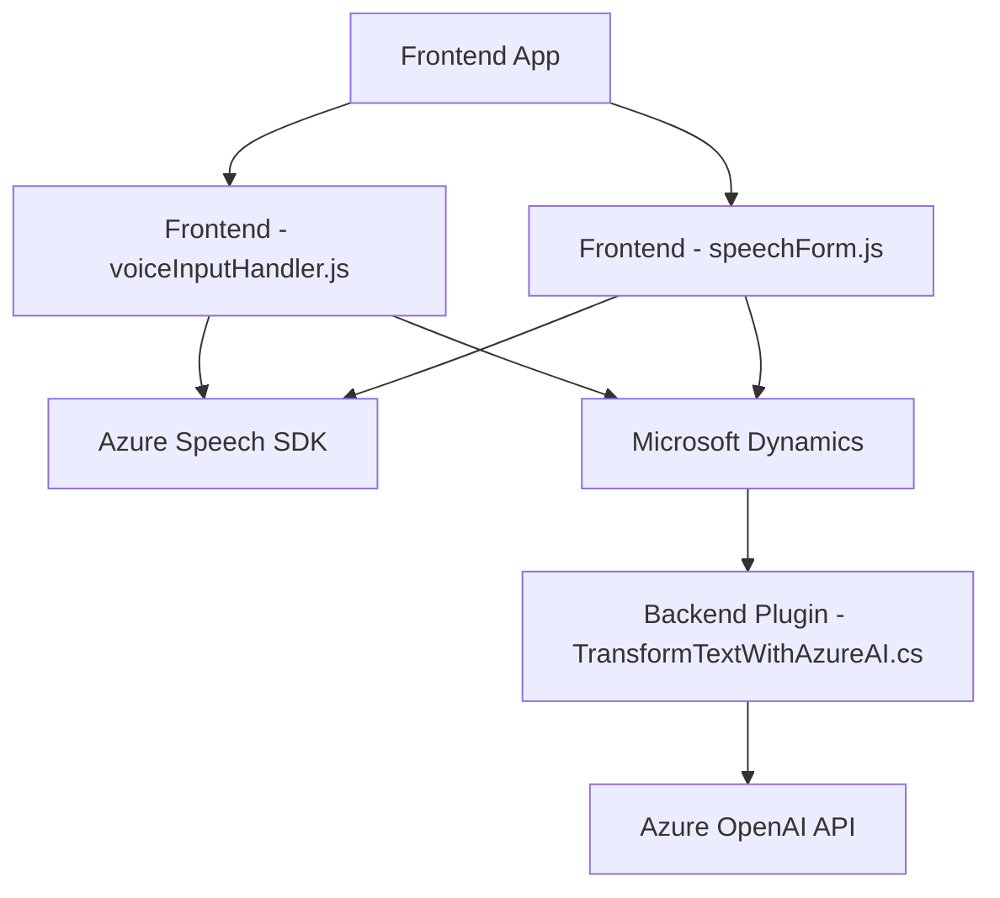

### Breve resumen técnico:
El repositorio analiza muestras de código que implementan soluciones relacionadas con procesamiento y síntesis de voz, integraciones con formularios dinámicos y uso de servicios de inteligencia artificial como `Azure Speech SDK` y `Azure OpenAI API`. Estas funcionalidades están diseñadas como componentes reutilizables, integrados a una plataforma como Microsoft Dynamics CRM.

---

### Descripción de arquitectura:
1. **Estructura general:**
   - La solución combina lógica frontend y plugins backend.
   - Integra APIs externas (Azure Speech y Azure OpenAI) para funciones avanzadas como reconocimiento de voz y transformación de texto.

2. **Tipo de arquitectura:**
   - **Frontend (navegador):** Modular con separación de funciones específicas, similares al patrón de diseño orientado a servicios (Service-oriented Architecture, SOA).
   - **Plugin para Dynamics CRM:** Sigue una arquitectura basada en plugins, acoplada a eventos de Dynamics 365.
   - **General:** Se asemeja a una arquitectura híbrida, combinando elementos de microservicios (porque invoca APIs externas) y de aplicaciones n-capas cuando interactúa con Dynamics.

---

### Tecnologías usadas:
1. **Frontend:**
   - Lenguaje: JavaScript.
   - SDK externo: `Azure Speech SDK` para síntesis y reconocimiento de voz.
   - Plataforma: Navegador y Microsoft Dynamics CRM.
   - Patrones: Modularización de funciones, integración de servicios, carga de dependencias dinámicas.

2. **Backend Plugin:**
   - Lenguaje: C# (Microsoft .NET Framework).
   - Framework: Microsoft Dynamics CRM SDK.
   - Servicios externos: `Azure OpenAI API` para procesamiento de lenguaje natural.
   - Bibliotecas: `Newtonsoft.Json.Linq`, `System.Net.Http` para manipulación y comunicación mediante REST APIs.
   - Patrones: Plugin-based architecture, Service-oriented architecture.

---

### Dependencias y componentes externos:
1. **Azure Speech SDK:**
   - Uso: Síntesis y reconocimiento de voz.
   - Método: Dinámicamente importado como recurso externo en el navegador.

2. **Azure OpenAI API:**
   - Uso: Procesamiento avanzado de lenguaje y generación de JSON.
   - Método: Llamadas HTTP usando `HttpClient`.

3. **Microsoft Dynamics 365 API:**
   - Uso: Integración y manipulación de registros de formularios.
   - Método: Usando interfaces estándar de la biblioteca `Microsoft.Xrm.Sdk`.

---

### Diagrama Mermaid 100% válido para GitHub:

---

### Conclusión final:
La solución en el repositorio representa una arquitectura de integración orientada a servicios que conecta un sistema frontend (JavaScript) con servicios externos como el `Azure Speech SDK` y una implementación plugin para integración con Microsoft Dynamics CRM, que además interactúa con `Azure OpenAI API`. Destaca un diseño modular, robusto y adaptable, basado en buenas prácticas para la evolución y escalabilidad futura.

