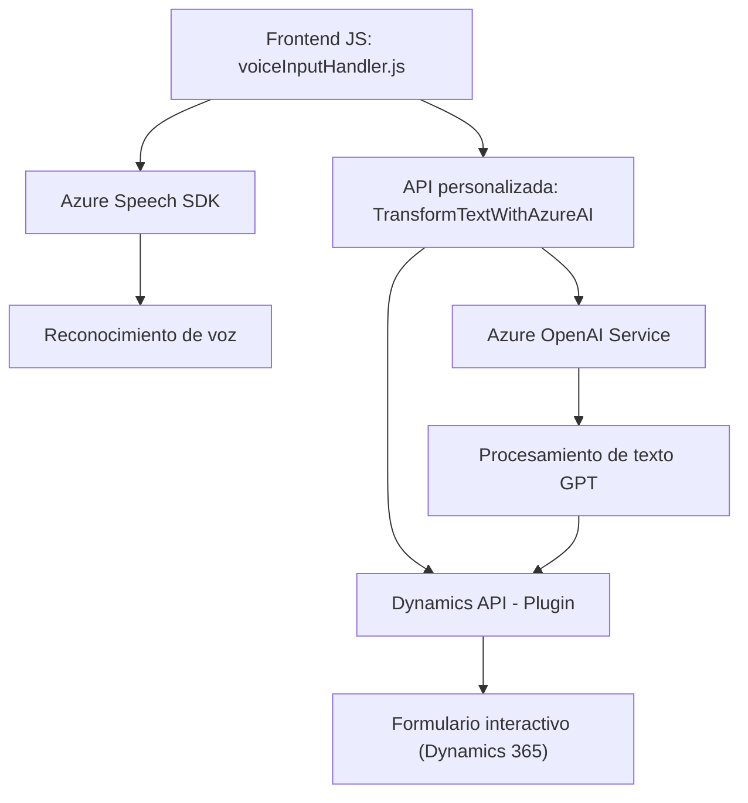

### Breve resumen técnico

El repositorio analiza un sistema distribuido que integra funciones de voz, procesamiento de texto mediante IA, y manipulación de formularios en una plataforma CRM (Dynamics 365). Los tres archivos propuestos abarcan:
1. **Frontend (JavaScript)**: Responsable de la interacción del usuario con formularios, utilizando reconocimiento y síntesis de voz (Azure Speech SDK).
2. **API personalizada (Plugin)**: Extensión en Dynamics 365 escrita en C# que realiza transformaciones de texto utilizando el servicio Azure OpenAI.

---

### Descripción de la arquitectura

#### Tipo de solución
La solución combina un **Frontend basado en web** con funcionalidades extendidas en la **API de Microsoft Dynamics 365** mediante plugins personalizados. Se utiliza la comunicación directa entre frontend y backend para tareas de reconocimiento de voz, procesamiento basado en IA y gestión dinámica de formularios.

#### Arquitectura general
1. **Distribuida** con **componentes acoplados**:
   - **Frontend/JS**: Interacción del usuario mediante JavaScript (en navegador), conectado a servicios en la nube (Azure Speech).
   - **Backend/Plugin (C#)**: Integración con Dynamics CRM y procesamiento en la nube con Azure AI/OpenAI.
2. **Patrones de arquitectura**:
   - **N capas**: Separación entre interacción frontend y lógica del backend.
   - **SOA (Service-Oriented Architecture)**: Uso de servicios externos (Azure Speech, OpenAI).
   - **Plugins dinámicos**: Componentes extendidos para encapsular procesos dentro de CRM.

---

### Tecnologías usadas

1. **Frontend**:
   - **JavaScript**: Desarrollo web interactivo.
   - **Azure Speech SDK**: Reconocimiento y síntesis de voz.
   - **DOM API**: Manipulación gráfica de formularios.

2. **Backend**:
   - **C#**: Implementación de lógica y plugins.
   - **Microsoft Dynamics SDK**: Para extender funcionalidad en la plataforma CRM.
   - **Azure OpenAI**: Procesamiento de texto avanzado.
   - **Newtonsoft.Json**: Serialización y deserialización de JSON.
   - `System.Net.Http`: Comunicación con servicios web.

---

### Dependencias y componentes externos

1. **Azure Speech SDK**:
   - Manejo de reconocimiento y síntesis de voz.
   - Carga dinámica en el frontend mediante un script remoto.

2. **Azure OpenAI Service**:
   - Proporciona la capacidad de transformar texto utilizando GPT.

3. **Microsoft Dynamics CRM**:
   - Plataforma base para formularios y extensiones.

4. **Custom API**:
   - Operaciones avanzadas sobre texto mediante integración directa en Dynamics CRM.

---

### Diagrama Mermaid

---

### Conclusión final

El sistema combina funcionalidades de **voz**, **procesamiento de texto** y **dinámica de formularios CRM**, integrándose a través de servicios en la nube como **Azure Speech SDK** y **Azure OpenAI**. Su arquitectura es principalmente de tipo **N capas** con patrones **SOA** y componentes **plugin-based**. La solución es adecuada para entornos empresariales que requieren la automatización de tareas mediante aplicaciones inteligentes. Sin embargo, algunos puntos de mejora incluyen la seguridad en la gestión de claves de API y una mayor abstracción en la arquitectura para facilitar la escalabilidad.

