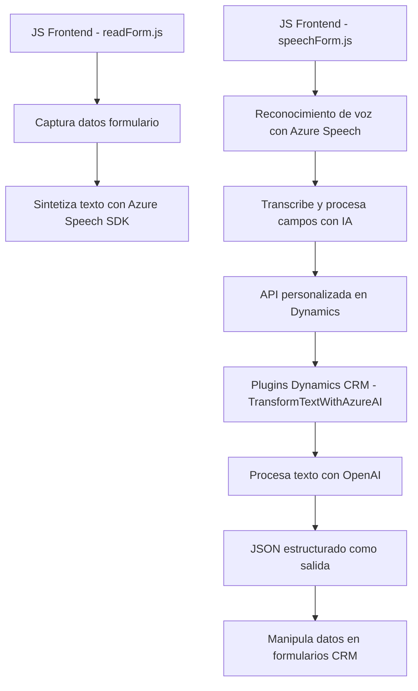

### Breve resumen técnico

El repositorio contiene tres archivos clave:
1. **`readForm.js`**: Gestión de datos de formularios dinámicos y síntesis de texto a voz a través de Azure Speech SDK.
2. **`speechForm.js`**: Implementación de entrada de voz, transcripción y manipulación de datos en formularios de Microsoft Dynamics 365, usando el Azure Speech SDK.
3. **`TransformTextWithAzureAI.cs`**: Plugin para Dynamics CRM que aplica transformaciones a texto utilizando Azure OpenAI y retorna un objeto JSON estructurado.

---

### Descripción de arquitectura

Esta solución es una integración entre una **frontend** escrita en JavaScript y Dynamics CRM (backend), con capacidades de reconocimiento y síntesis de voz mediante **Azure Speech SDK** y procesamiento inteligente de datos a través de **Azure OpenAI**.

La arquitectura combina:
1. **Microservicios centrados en funcionalidad específica:** Cada componente aborda una parte de la funcionalidad: entrada de voz, síntesis de voz, y transformación de texto en objetos JSON.
2. **Arquitectura de capas:** El backend con Dynamics CRM actúa como una "capa de negocio", resolviendo lógica específica mientras el frontend opera como interfaz interactiva para los usuarios.
3. **API Integration:** Fuerte dependencia de integraciones con Azure Speech SDK y Azure OpenAI.

---

### Tecnologías usadas

1. **Frontend (JavaScript)**:
   - **Frameworks y SDK:** Azure Speech SDK.
   - **Contexto:** Integración con Microsoft Dynamics 365 para la manipulación de formularios desde `executionContext`.
   - **Patrones de diseño:** Modularidad, patrón delegado/callback.

2. **Backend (C#)**:
   - **Framework:** Microsoft Dynamics CRM SDK.
   - **Servicios:** Azure OpenAI para transformación inteligente de texto mediante JSON estructurado.
   - **Patrones:** Plugin Framework de Dynamics CRM, integración con servicios externos, código siguiendo la arquitectura de Service Layers y estructuras de encapsulación.

---

### Potenciales dependencias o componentes externos

1. **Azure Speech SDK**: Dependencia crítica para la síntesis y reconocimiento de voz en la capa frontend.
2. **Azure OpenAI Service**: Servicio usado desde el backend para transformaciones de texto avanzadas.
3. **Dynamics 365 CRM SDK**: Backend integrado con Dynamics CRM que consume datos de entrada y realiza operaciones con estos.
4. **Plugin Customization**: Dependencia de entornos de Dynamics CRM, donde los plugins están configurados para ejecutarse.

---

### Diagrama Mermaid válido para GitHub

---

### Conclusión final

La solución implementa una arquitectura notablemente modular y orientada a servicios para habilitar funcionalidades avanzadas como síntesis de voz, reconocimiento de voz y procesamiento de datos mediante IA, todo integrado con Microsoft Dynamics 365. Está diseñada para facilitar la interacción directa con plataformas externas como Azure Speech SDK y Azure OpenAI. Esto agrega flexibilidad para actualizaciones y escalabilidad al sistema, aunque la inclusión de credenciales estáticas llama la atención como un posible riesgo de seguridad que debe abordarse.