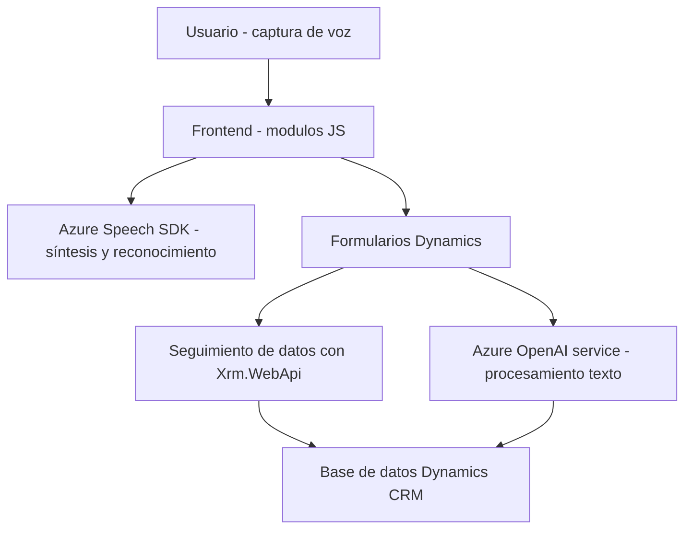

### Breve resumen técnico
El repositorio está compuesto principalmente por archivos que trabajan con Microsoft Dynamics y Azure Cognitive Services para proporcionar interacciones avanzadas en formularios. Incluye funcionalidades de síntesis de voz, reconocimiento de voz y procesamiento avanzado de texto utilizando servicios externos como el Azure Speech SDK y Azure OpenAI.

---

### Descripción de arquitectura
La solución integra varios módulos y depende de servicios externos, como Azure Cognitive Services y Dynamics CRM. Por su estructura y descripción funcional, parece estar diseñada en forma de **arquitectura de n capas**. Esto es evidenciado por:
1. **Capa de presentación**: Archivos relacionados con frontend (JavaScript) que interactúan directamente con los formularios en Microsoft Dynamics CRM.
2. **Capa de lógica de negocio**: Plugins como `TransformTextWithAzureAI.cs`, que contienen lógica para procesar datos y transformarlos utilizando servicios externos (Azure OpenAI).
3. **Capa de datos**: Interacción directa con Dynamics CRM (mediante `Xrm.WebApi`, consultas y atributos) para recuperar y modificar datos.

La solución puede considerarse **service-oriented architecture (SOA)** debido a que delega funcionalidades complejas a servicios externos específicos (Azure Speech SDK y Azure OpenAI).

---

### Tecnologías usadas
1. **Frontend/JavaScript**:
   - **Azure Speech SDK**: Para reconocimiento y síntesis de voz.
   - **Microsoft Dynamics API (`executionContext`)**: Para manipulación de formularios y obtención de datos en el cliente.
   - **DOM APIs**: Para interacción dinámica en el navegador.

2. **Backend/C#**:
   - **Microsoft Dynamics SDK** (`IPlugin`): Desarrollo de plugins personalizados.
   - **Azure OpenAI Service**: Procesamiento de texto con inteligencia artificial.
   - **Librerías de C#**:
     - `System.Net.Http`: Para solicitudes externas al servicio Azure OpenAI.
     - `Newtonsoft.Json` y `System.Text.Json`: Manejo de datos JSON para serialización/deserialización.

3. **Arquitectura y Patrones**:
   - **N-Capas**: Separación clara entre frontend (presentación), backend (lógica de negocio) y la interacción con datos.
   - **Event-driven Programming**: En el frontend, las funciones se disparan por eventos como carga SDK, entrada de voz o acciones en el formulario.
   - **Repository Pattern**: En el plugin en C#, el acceso a datos de Dynamics CRM utiliza servicios específicos y consultas.
   - **Service-Oriented Architecture (SOA)**: Uso de componentes externos como Azure y Dynamics CRM para la lógica principal de IA y procesamiento de voz.

---

### Diagrama Mermaid

---

### Conclusión final
La solución descrita es un entorno altamente dependiente de servicios externos que busca ampliar la funcionalidad nativa de Microsoft Dynamics. Por su enfoque en formularios y procesamiento de voz/IA, se alinea más con una arquitectura de **n capas**, mientras que también incluye componentes orientados a servicios externos, característicos de SOA. Es apta para aplicaciones empresariales que requieren una interacción avanzada con los datos, especialmente en entornos donde se necesiten herramientas automatizadas de voz y procesamiento inteligente de textos.

La integración con Azure y Dynamics facilita escalabilidad y ofrece características de inteligencia artificial como transcripción y síntesis de voz, destacando el uso de tecnologías modernas para mejorar la experiencia del usuario en un entorno corporativo.