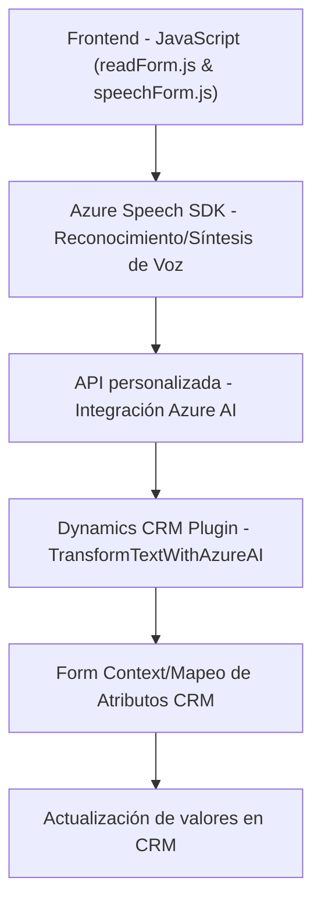

# Análisis detallado de la solución

## Breve resumen técnico:
El repositorio muestra una solución que combina **frontend JavaScript**, **Azure Speech SDK**, y un **plugin dinámico de Microsoft Dynamics CRM** para procesar formularios mediante voz y texto. Utiliza **Azure OpenAI** y APIs personalizadas para reconocimiento de voz, síntesis de texto en voz, y transformación inteligente de texto. La arquitectura implementa patrones de modularidad y conexión a servicios externos.

---

## Descripción de arquitectura:
La solución tiene una arquitectura **multicapa orientada a eventos**, donde cada capa interactúa con servicios externos y sistemas internos:
1. **Frontend modular**: Maneja la interfaz y se conecta con formularios de CRM.
2. **Middle-tier Service Integration**: Utiliza **Azure Speech SDK** (para voz) y **Azure OpenAI** (para transformación de texto) como servicios externos.
3. **Dynamics Plugin Layer**: Implementa lógica de negocio dentro del CRM para transformar datos usando las reglas personalizadas.
   
Esta arquitectura busca integrar **servicios externos** en un flujo centralizado, con módulos independientes que interactúan en tiempo de ejecución.

---

## Tecnologías usadas:
- **Frontend/JavaScript:**
  - Azure Speech SDK (`SpeechSDK.AudioConfig`, `SpeechSDK.SpeechRecognizer`): Reconocimiento y síntesis de voz.
  - Callbacks y ejecución dinámica de scripts.
  - Funciones interactivas como `formContext` para transformación dinámica de datos en formularios CRM.
  
- **Backend/C#:**
  - Microsoft Dynamics CRM Plugins (`IPlugin`): Extensiones para lógica del servidor.
  - API Azure OpenAI para análisis y transformación textual.
  - HTTP Client (`System.Net.Http`, `Newtonsoft.Json`) para integraciones externas.

- **Frameworks/Servicios externos:**
  - Azure Speech SDK: Procesamiento de voz y síntesis.
  - Azure OpenAI: Transformación de texto basado en IA.
  - Microsoft Dynamics CRM Framework.

---

## Dependencias o componentes externos:
1. **Azure Speech SDK**: Como dependencia primaria para reconocimiento y síntesis de voz.
2. **Azure OpenAI API**: Configurado para transformar texto con IA personalizada.
3. **Integración con Microsoft Dynamics CRM**:
   - `formContext` para manipular formularios en la interfaz CRM.
   - `Xrm.WebApi`, utilizado para comunicación CRUD dentro del CRM.
4. **Librerías de soporte**:
   - `Newtonsoft.Json`: Deserialización y tratamiento JSON en plugins.
   - `System.Net.Http`: Para solicitudes HTTP.
   - APIs personalizadas como `TransformTextWithAzureAI`.

---

## Diagrama Mermaid válido para GitHub Markdown:

---

## Conclusión final:
1. **Tipo de solución**: La solución es un sistema híbrido que combina **frontend**, **backend plugins**, y servicios externos para ofrecer interacción basada en reconocimiento de voz y transformación de texto inteligente dentro de un **CRM corporativo**.
   
2. **Tecnologías y patrones**: Utiliza **Azure Speech SDK** para voz, **Azure OpenAI** para transformación de texto, y **Dynamics CRM Plugins** como capa de negocio. Patrones como modularidad, event-driven setup, y DTO entre frontend-backend son evidentes.

3. **Arquitectura general**: Tiene una arquitectura **orientada a eventos**, combinando **capas independientes** y una **integración externa estructurada**. Esta solución se adapta principalmente a tareas específicas dentro de un sistema CRM.

4. **Consideraciones importantes**:
   - Uso de claves y configuración en el código requiere un enfoque más seguro (Azure KeyVault).
   - La solución depende estrictamente de Azure SDK y el contexto exclusivo de Dynamics CRM, reduciendo su adaptabilidad a otros entornos.
   - Correcta orientación modular y clara separación de responsabilidades entre interfaz, negocio, y servicios externos.