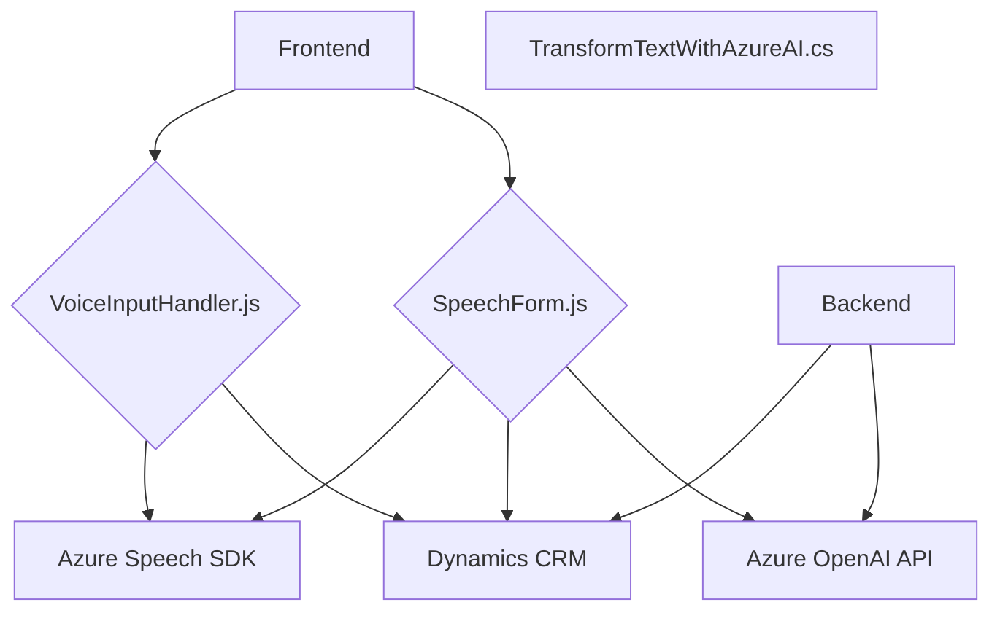

### Breve Resumen Técnico
El conjunto de archivos y lógica definida en el repositorio describe una solución **orientada al procesamiento de voz y texto** para una aplicación integrada en Microsoft Dynamics CRM. La funcionalidad principal gira en torno a dos aspectos:
1. Procesamiento y síntesis de voz utilizando el **Azure Speech SDK** y contextualización con entradas del formulario.
2. Integración de **Azure OpenAI API** en un plugin de CRM para aplicar reglas y transformar texto en objetos JSON estructurados.

---

### Descripción de la Arquitectura
#### Arquitectura del Sistema:
1. **Hybrida: Monolito + Servicios**  
   - La solución combina componentes tradicionales en una arquitectura monolítica (para los plugins de Dynamics CRM) con integración a **servicios externos basados en Azure**.
   - El frontend actúa como un **cliente ligero** ejecutado en el navegador y conectado a APIs y servicios (Azure Speech SDK, CRM APIs).
   
2. **N-capas**:
   - La clasificación general del sistema responde a una estructura de n-capas:
      - **Frontend para interacción**: Incluye lectura de datos del formulario y funcionalidad de voz.
      - **Backend configurado como plugins**: Procesa la lógica del negocio usando Dynamics CRM como punto de referencia.
      - **Servicios externos (Azure)** para la síntesis y transformación de datos.

3. **Orientación a eventos**:
   - Uso de callbacks/promesas (en funciones como `ensureSpeechSDKLoaded` y llamadas al Speech SDK), adaptándose al modelo de ejecución asíncrona en el frontend.

---

### Tecnologías, Frameworks y Patrones Usados
#### Tecnologías y Frameworks:
1. **Frontend:**
   - **JavaScript/ES6**: Desarrollo de lógica para lectura de formularios y síntesis de voz.
   - **Azure Speech SDK**: Biblioteca de Azure para interacción con servicios de voz, con carga dinámica desde CDN.
   - **Document Object Model (DOM)**: Manipulación de elementos para cargar dependencias externas.

2. **Backend:**
   - **Microsoft Dynamics CRM SDK**: Framework para desarrollo de plugins y extensiones para CRM.
   - **Azure OpenAI API**: Proveedor para servicios de inteligencia artificial aplicada.
   - **HTTP Client for .NET (System.Net.Http)**: Llamadas REST para invocar servicios externos.
   - **JSON Serialization with System.Text.Json**: Manejo de estructuras JSON.

#### Principales Patrones:
1. **Carga diferida** para optimizar recursos:
   - Carga dinámica del Speech SDK en el navegador, asegurando que solo se emplee si es necesario.
2. **Fachada**: Las funciones encapsulan la complejidad de múltiples pasos (ej., conexión con Speech SDK, procesamiento de formularios).
3. **Promesas y asíncronía**: Gestión de dependencias externas (SDK, APIs) empleando promesas/callbacks en el frontend y estructuras asíncronas en el backend.
4. **Inversión de Dependencias** en el backend: El plugin utiliza una interfaz estándar (`IPlugin`) que desacopla la implementación específica del marco Dynamics CRM.
5. **Modularidad**: El código organiza cada funcionalidad en funciones que se especializan en tareas claras (procesamiento de voz, entrada de datos, transcripción, etc.).

---

### Dependencias o Componentes Externos
1. **Azure Speech SDK**: Proporciona capacidades para síntesis de voz y transcripción en tiempo real.
2. **Azure OpenAI API**: Utilizada para transformar texto en objetos JSON estructurados según reglas predefinidas.
3. **Microsoft Dynamics CRM**: Base del sistema donde se integra el plugin `TransformTextWithAzureAI` y las APIs internas mencionadas.
4. **System.Net.Http** y **System.Text.Json**: Manejo de comunicación mediante HTTP y serialización de datos JSON en el plugin de Dynamics CRM.

---

### Diagrama Mermaid (100% compatible con GitHub Markdown)

---

### Conclusión Final
La solución descrita combina **funcionalidades avanzadas de interacción por voz (Azure Speech SDK)** y **procesamiento basado en inteligencia artificial (Azure OpenAI API)** para estructuración de datos textuales. La arquitectura es **híbrida** y combina un frontend modular y ligero con un backend integrado como plugins de Dynamics CRM. Las tecnologías y patrones empleados hacen que la solución sea escalable, robusta, y orientada al procesamiento dinámico de datos en tiempo real.