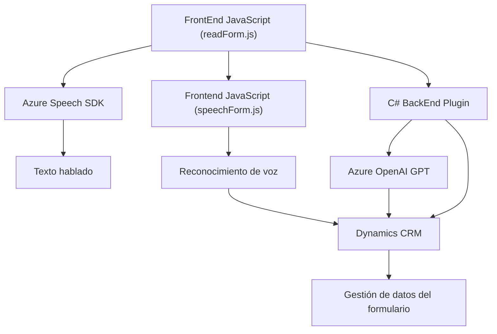

### Breve resumen técnico

La solución implementada en el repositorio tiene como objetivo extender aplicaciones alojadas en **Microsoft Dynamics CRM** mediante funcionalidades de entrada de voz, conversión de texto mediante **Azure OpenAI**, y síntesis de texto a voz con **Azure Speech SDK**. La arquitectura es modular y está segmentada en diferentes componentes que interactúan con APIs externas y dinámicas de formulario.

---

### Descripción de arquitectura

La solución sigue una arquitectura **n-capas**:
1. **Capa de Presentación**: Archivos JavaScript (`readForm.js`, `speechForm.js`) que manejan la interacción de usuario en formularios y gestionan la comunicación con servicios externos.
2. **Capa de Lógica de Negocios**: Plugins específicos en **C#** (`TransformTextWithAzureAI.cs`) que procesan texto mediante **Azure OpenAI** y manipulan datos dentro de Dynamics CRM según reglas preconfiguradas.
3. **Capa de Servicios**: Las conexiones con los servicios externos de **Azure** están integradas en la solución mediante SDKs y APIs (Speech SDK y OpenAI).

El archivo `TransformTextWithAzureAI.cs` utiliza el patrón de **plugin** característico de Dynamics CRM para encapsular procesos de negocio que se ejecutan cuando ocurren eventos en el sistema.

---

### Tecnologías usadas

1. **Front-End**:
   - **JavaScript**: Lenguaje para la manipulación del DOM y contextualización del formulario.
   - **Azure Speech SDK**: Para síntesis y reconocimiento de voz.
   - **Dynamics 365 Web API**: Gestión de datos de entidades CRM.

2. **Back-End**:
   - **Azure OpenAI GPT-4o**: Para transformación de texto mediante modelos avanzados.
   - **C# y .NET Framework**: Para la creación de plugins que interactúan con Dynamics CRM.
   - **Newtonsoft.Json**: Librería para procesamiento de JSON.

3. **Patrones**:
   - **Capa de Lógica de Negocios**: Plugins y procesamiento estructurado.
   - **SDK Loading Dynamically** (JavaScript): Mejora eficiencia al cargar dependencias externas sólo cuando es necesario.
   - **DTOs**: Uso de JSON estructurado para comunicación interna y externa.

---

### Diagrama Mermaid válido para GitHub

---

### Conclusión final

Esta solución destaca por integrar múltiples servicios de Azure con Dynamics CRM para mejorar la experiencia de usuario mediante entrada de voz, síntesis de texto hablado y procesamiento avanzado con modelos de inteligencia artificial. La arquitectura en **n-capas** permite separar las responsabilidades de presentación, lógica de negocio y acceso a servicios externos. Su modularidad y uso de SDKs de Azure lo hacen extensible y adecuado para entornos empresariales complejos que necesiten personalización avanzada en Dynamics.