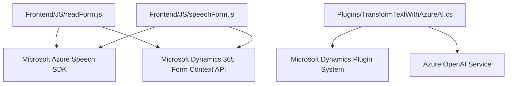

### Breve resumen técnico:
El repositorio implementa una solución completa de interacción avanzada con formularios de Dynamics 365 utilizando procesamiento de voz (Azure Speech SDK) y transformación de texto mediante Azure OpenAI Service. Tiene tres componentes: un **frontend en JavaScript**, un **plugin en C# para Dynamics CRM**, y una dependencia notable en APIs externas de Azure. Está orientado a mejorar la accesibilidad y automatización mediante inteligencia artificial y voz.

---

### Descripción de arquitectura:
La arquitectura es **multi-capas** con componentes bien definidos:
1. **Frontend**:
    - Proceso de voz a texto y síntesis de voz text-to-speech mediante el **Azure Speech SDK**.
    - Manipulación dinámica de formularios en Dynamics 365 a través de su API de cliente.
2. **Backend (Dynamics Plugin en C#)**:
    - Transformaciones avanzadas de texto con Azure OpenAI Service en el contexto de eventos del CRM.
    - Uso de la **interfaz IPlugin** para intervenir en procesos del CRM.
3. **Servicios Externos**:
    - Integración con APIs externas: Azure Speech Service y Azure OpenAI Service.

La solución tiene una arquitectura orientada a **integración de servicios externos** con un enfoque en modularidad y escalabilidad. Es una implementación híbrida donde cada parte cumple una tarea específica (procesamiento de voz, interacción con usuarios y transformación de datos) y opera desde distintos puntos del sistema.

---

### Tecnologías usadas:
1. **Frontend**:
   - **Microsoft Azure Speech SDK**: Para reconocimiento de voz y síntesis text-to-speech.
   - **JavaScript**: Para lógica en cliente y manipulación dinámica de formularios.
   - **Dynamics 365 Form Context API**: Permite interactuar con los datos de formularios del CRM.
2. **Backend**:
   - **C# .NET Framework**: Para extensiones del CRM mediante el plugin.
   - **Dynamics SDK (`Microsoft.Xrm.Sdk`)**: Para integrar operaciones backend en Dynamics 365.
   - **Azure OpenAI Service**: Para transformación avanzada de texto basada en normas de negocio.
   - **Newtonsoft.Json** y **System.Text.Json**: Para manipulación de datos JSON.
3. **Servicios externos**:
   - **Azure Speech Service**: Procesamiento de voz y síntesis de texto.
   - **Azure OpenAI**: Llamadas a modelos como GPT para analítica y transformación de texto.

---

### Diagrama Mermaid válido para GitHub:

---

### Conclusión final:
La solución tiene una arquitectura modular y escalable, adecuada para sistemas empresariales como Dynamics CRM. Al integrar servicios de Microsoft Azure Speech y OpenAI, proporciona capacidades avanzadas de síntesis y procesamiento de texto, lo que la hace ideal para automatización basada en voz en entornos corporativos. La arquitectura multi-capas y el enfoque de integración aseguran adaptabilidad y reutilización del código en diferentes contextos.

Este repositorio es una muestra clara de una implementación basada en SDKs y APIs modernos, haciendo uso de patrones como **Facade**, **Modularidad Funcional**, y **Request-Response** en su diseño. Es altamente alineado con los requerimientos de proyectos orientados a accesibilidad y manejo automatizado de datos estructurados.