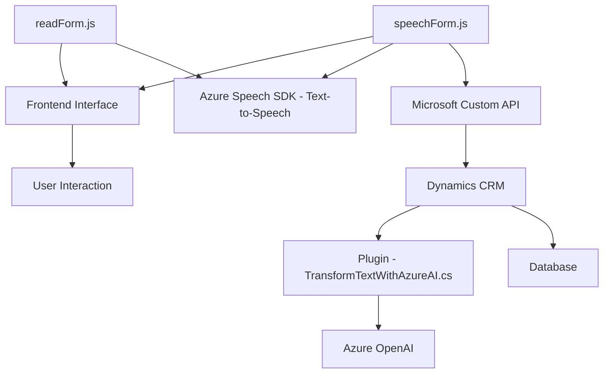

### Breve Resumen Técnico
El repositorio integra diversos componentes que trabajan para implementar funcionalidades de procesamiento de voz, manipulación de formularios en interfaces web y transformación de texto mediante servicios de IA. Los archivos están relacionados con un sistema que emplea **Azure Speech SDK**, **Microsoft Dynamics** y **Azure OpenAI** para crear una solución accesible, automatizada e inteligente basada en datos de formularios.

---

### Descripción de la Arquitectura
La solución muestra características de una arquitectura **n capas** con integración de servicios externos:
1. **Frontend**:
   - Archivos **readForm.js** y **speechForm.js** en el directorio `FRONTEND/JS`.
   - Proporcionan la capa de presentación y conectan con servicios como Azure Speech SDK y APIs locales/personalizadas.
2. **Backend Dynamics Plugin**:
   - `TransformTextWithAzureAI.cs` es un plugin para **Dynamics CRM**, operando como una capa de lógica que aplica transformaciones de texto utilizando **Azure OpenAI** antes de devolver valores refinados.

#### Patrones usados
- **Modularidad orientada a funciones**: Cada archivo tiene funciones específicas encapsulando lógicas de negocio.
- **Carga dinámica de dependencias**: El SDK de Azure Speech se carga dinámicamente para minimizar el impacto en el rendimiento.
- **Uso de API externas**: Los componentes dependen de APIs de Microsoft Dynamics, Azure Speech, y OpenAI.
- **Interfaz contextual**: Tanto el frontend como el plugin están basados en el contexto de formularios dinámicos, adaptándose a entornos como Microsoft Dynamics.

---

### Tecnologías Usadas
1. **Frontend**:
   - Lenguaje: JavaScript.
   - Servicios:
     - **Azure Speech SDK** para síntesis de voz y reconocimiento de entrada por voz.
   - Cargando scripts dinámicos desde fuentes como `https://aka.ms/csspeech/jsbrowserpackageraw`.

2. **Backend Dynamics Plugin**:
   - Lenguaje: **C#**.
   - Framework: .NET Framework.
   - SDKs/Librerías:
     - **Microsoft Dynamics SDK** para extensión mediante plugins.
     - **Azure OpenAI** para procesamiento de lenguaje natural.
     - Serialización/Deserialización: `System.Text.Json` y `Newtonsoft.Json`.

---

### Dependencias o Componentes Externos
- **Microsoft Dynamics CRM** mediante:
  - Contexto: `IPluginExecutionContext` y otras interfaces.
  - API propia: Para operar con datos CRM.
- **Azure Services**:
  - **Azure Speech SDK**: Reconocimiento de voz y síntesis.
  - **Azure OpenAI Service**: Procesamiento y transformación de texto.
- **Custom APIs**: Utilizadas posiblemente para operaciones específicas dentro del sistema.

---

### Diagrama Mermaid

---

### Conclusión Final
La solución representa una arquitectura **n capas** que mezcla un frontend accesible con un backend extendido mediante **Microsoft Dynamics plugins**. Las interacciones en la interfaz utilizan **Azure Speech SDK** para la síntesis de voz y un procesamiento avanzado mediante API personalizadas. El sistema integra tecnologías modernas como **Azure OpenAI**, llevando la funcionalidad más allá de un simple procesamiento de voz hacia aplicaciones enriquecidas basadas en **Dynamics CRM**. Su diseño modular y orientado a funciones facilita la extensibilidad y el mantenimiento.