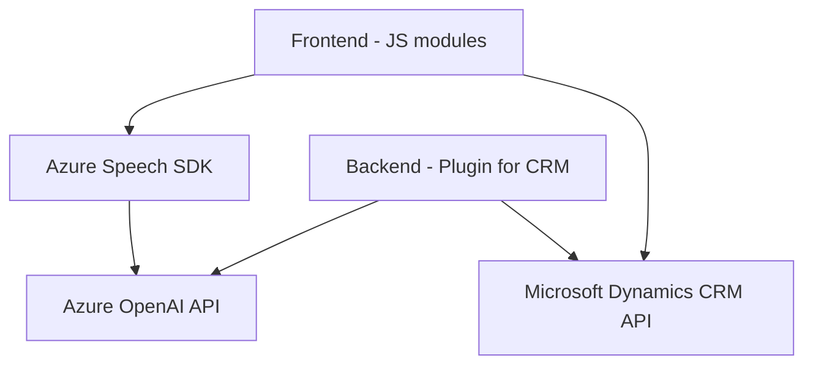

## Breve resumen técnico:
El repositorio contiene múltiples archivos relacionados con una solución que integra el Azure Speech SDK y el Azure OpenAI API en un sistema basado en Microsoft Dynamics CRM. Los archivos están organizados en capas funcionales donde el frontend maneja la interacción del usuario a través del navegador y el backend se encarga de procesos como transformación avanzada de datos con OpenAI.

## Descripción de arquitectura:
El sistema implementa una arquitectura **n-capas** con separación de responsabilidades entre frontend y backend. El frontend se encarga de realizar interacciones dinámicas con los usuarios a través de formularios web, mientras que el backend (representado por el plugin en C#) utiliza servicios externos de Azure para realizar tareas avanzadas de procesamiento y síntesis de voz. Adicionalmente, el uso de APIs (Azure Speech y OpenAI) introduce elementos de **arquitectura orientada a servicios (SOA)**.

### Componentes:
1. **Frontend**:
   - Implementa funciones para la extracción de datos visibles del formulario e interacción con el servicio de síntesis de voz proporcionado por Azure Speech SDK.
   - Permite la entrada de datos por voz y su procesamiento dinámico en formularios web.
   - Agrega módulos para convertir valores hablados en texto estructurado mediante mapeos dinámicos.
   
2. **Backend**:
   - Un plugin para Microsoft Dynamics CRM desarrollado en C# (Azure OpenAI Plugin), responsable de transformar texto con reglas predefinidas utilizando Azure OpenAI API.
   - Se comunica con servicios externos a través de JSON y solicitudes HTTP robustas.

### Arquitectura:
- **Frontend**: Modular, con patrones de integración para SDK/DOM y enfoque en procesamiento dinámico condicional.
- **Backend**: Plugin basado en el patrón de transacciones contextuales que delega procesamiento avanzado a un microservicio externo (Azure OpenAI).
- **General**: Una arquitectura **orientada a servicio (SOA)** aplicada sobre una infraestructura de Microsoft Dynamics CRM extendida con APIs de Azure.

---

## Tecnologías, frameworks y patrones usados:
- **Frontend**:
  - Azure Speech SDK: Para síntesis de voz y reconocimiento.
  - JavaScript: Lenguaje principal para interacción en UI/DOM y lógica.
  - API personalizada: Integración con servicios de Azure OpenAI desde el frontend.
  - Patrones: Modularidad, Wrapper/Facade para manejar SDK y servicios externos.

- **Backend**:
  - Microsoft Dynamics CRM SDK: Plataforma subyacente que maneja plugins.
  - Azure OpenAI API: Para transformación avanzada de texto (usando técnicas de IA).
  - .NET Framework: Implementación del plugin y manejo de solicitudes HTTP.
  - Patrones: Plugin Architecture, Microservicios (externos), Transacciones distribuidas.

---

## Diagrama Mermaid:

### Descripción del diagrama:
1. El módulo de frontend (`Frontend - JS modules`) interactúa tanto con el Azure Speech SDK para síntesis y reconocimiento de voz como con Dynamics CRM para manipular los datos del formulario y actualizar los valores basados en la entrada del usuario.
2. El `Speech SDK` utiliza internamente el servicio de `Azure OpenAI API` como procesamiento externo en el flujo de entrada por voz.
3. Por otro lado, el plugin (`Backend - Plugin for CRM`) implementado en C# se apoya directamente en la `Azure OpenAI API` para transformar texto según reglas predefinidas y utiliza la `Dynamics CRM API` como capa de conexión con el sistema CRM.

---

## Conclusión final:
Este repositorio integra múltiples componentes en una solución robusta y extensible orientada a **procesamiento de datos dinámicos**. Utiliza tecnologías avanzadas de Microsoft Dynamics CRM junto con servicios de Azure para ofrecer capacidades como entrada y salida de voz, además de procesamiento de IA para transformación textual. La arquitectura n-capas combinada con microservicios externos como Azure OpenAI demuestra una buena utilización de las mejores prácticas en integración y modularidad.