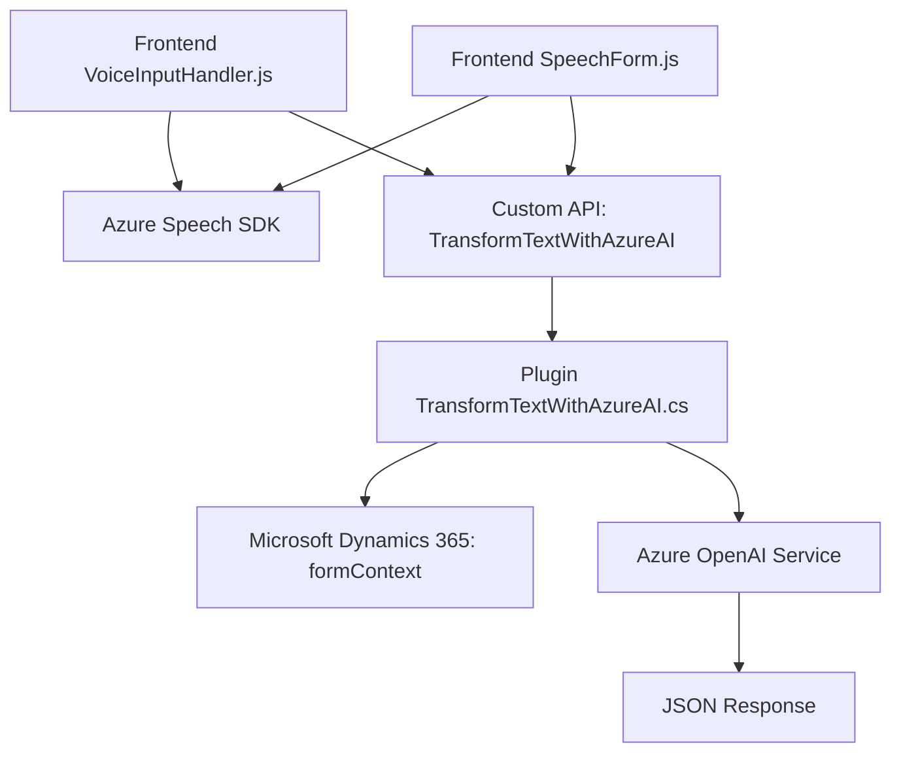

### Análisis detallado

---

#### **Breve resumen técnico**
Este repositorio contiene tres principales archivos organizados en carpetas (`FRONTEND/JS` y `Plugins`). Está diseñado para integrar funcionalidades avanzadas de entrada y salida de voz (Azure Speech SDK) directamente en los formularios de Microsoft Dynamics 365 y para aplicar transformaciones de texto avanzadas mediante el servicio Azure OpenAI para reglas contextuales estructuradas. Su propósito principal es enriquecer aplicaciones empresariales basadas en Dynamics 365 con capacidades de inteligencia artificial y procesamiento de voz.

---

#### **1. Qué tipo de solución es**
- **Tipo de solución:** Este repositorio es una solución **híbrida de procesamiento y entrada/salida de voz** que implementa dos elementos clave:
  - Un **frontend** interactivo que habilita la entrada de comandos de voz y la síntesis de voz desde Dynamics 365 usando Azure Speech SDK.
  - Una **API middleware lateral** mediante plugins de Dynamics CRM que integra el servicio de Azure OpenAI para la transformación avanzada de datos de texto.

---

#### **2. Tecnologías, frameworks y patrones**
**Tecnologías principales:**
1. **Azure Speech SDK:** Funcionamiento de entrada/salida de voz en tiempo real.
2. **Microsoft Dynamics 365:** Se utilizan objetos como `formContext` junto con `Custom API` para la interacción directa de formularios.
3. **Azure OpenAI Service:** Transformaciones de texto avanzadas mediante IA.
4. **HTTP Client:** Realización de solicitudes a APIs REST.
5. **JavaScript:** Frontend modular para interfaz personalizada.
6. **C# .NET SDK:** Conceptos del SDK de Dynamics CRM en el plugin (`IPlugin`).

**Patrones identificados:**
1. **Modularidad:** Separación de funciones y tareas claramente definidas en el frontend.
2. **Encapsulación:** Uso del patrón de carga condicional en el SDK (`ensureSpeechSDKLoaded`).
3. **Integración API externa:** Uso del patrón de integración para interactuar con Azure Speech SDK y Azure OpenAI.
4. **Event-driven architecture:** Flujo controlado por eventos en tiempo real (`recognizeOnceAsync` y los métodos del plugin).
5. **MVC (enfoque informal):** Los métodos del frontend tienen roles específicos representando controladores que manipulan objetos similares a modelos (formContext), aunque informalmente.
6. **Middleware Plugin:** Patrón orientado al plugin y componentes de inyección de dependencia en Dynamics CRM.

---

#### **3. Qué tipo de arquitectura tiene**
1. **Frontend:** Una arquitectura de interacción basada en eventos con integración modular hacia APIs externas (`Azure Speech SDK` y comandos de Dynamics).
2. **Plugin (C#):** Seguir patrón de **middleware en n-capas**, representando un componente encargado de extender operaciones nativas de Dynamics CRM e invocar APIs mediante integración externa.

La solución global sigue una **arquitectura híbrida en capas**:
- Primera capa (Frontend modulares): Procesa voz y comunicación dinámica con el usuario en el navegador.
- Segunda capa (Middleware Plugin): Lógica empresarial y comunicación profunda integrada con Azure OpenAI mediante peticiones HTTP.

---

#### **4. Dependencias o componentes externos presentes**
1. **Azure Speech SDK:** Para reconocimiento y síntesis de voz.
2. **Microsoft Dynamics 365 SDK:**
   - API para manipular datos de formularios.
   - Integración con Custom APIs para acceder a funcionalidades avanzadas.
3. **Azure OpenAI Service:** Para transformación avanzada de texto con IA.
4. **Framework JSON (Newtonsoft, System.Text.Json):** Serialización y manejo de datos entre el plugin y la API OpenAI.
5. **HTTP Client:** Comunicación externa con APIs REST.

---

#### **5. Diagrama Mermaid**

---

### Conclusión final
Este repositorio define una solución híbrida diseñada para extender Dynamics 365 con capacidades avanzadas de **entrada de voz** y **inteligencia artificial**. El diseño técnico utiliza módulos altamente especializados y asegura una arquitectura flexible que integra servicios externos como Azure Speech SDK y OpenAI, lo que proporciona un enfoque moderno y escalable para manejar interacciones basadas en IA y voz.