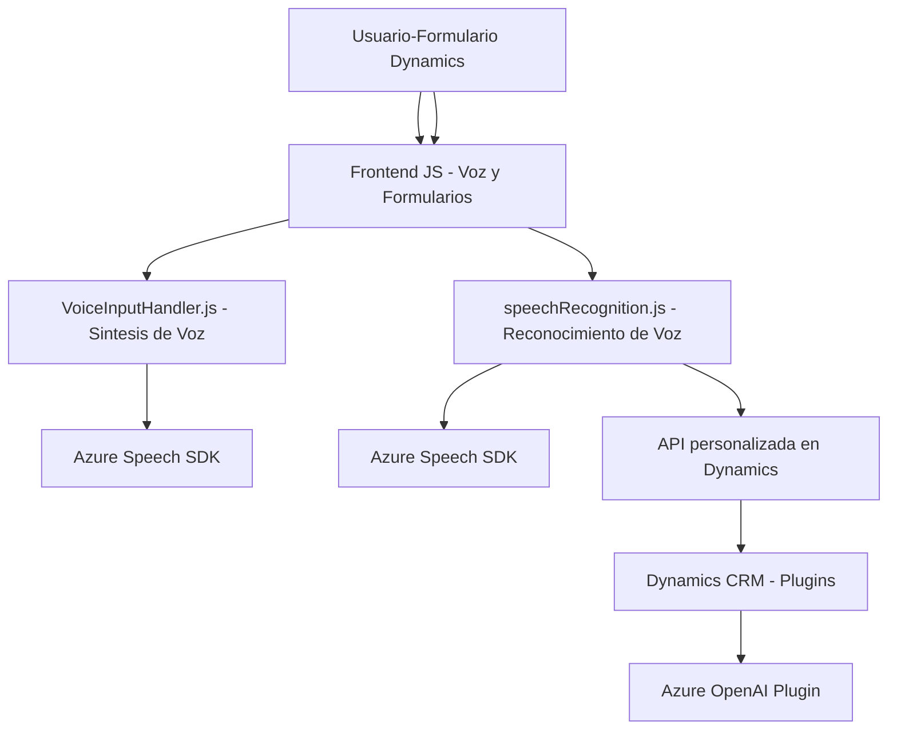

### Breve resumen técnico:
La solución parece estar diseñada para una integración de servicios de Microsoft Dynamics CRM y Azure, centrada en un contexto de Formularios. Incluye funcionalidades de reconocimiento y síntesis de voz con **Azure Speech SDK** y procesamiento de texto mediante **Azure OpenAI Service**. Utiliza principalmente **JavaScript** para la interfaz y conexión dinámica del SDK en un contexto de formularios, complementado por un plugin en **C#** para back-end en Dynamics CRM.

---

### Descripción de arquitectura:
La arquitectura de la solución se divide en dos capas principales:
1. **Frontend - Capa de Presentación**:
   - Ubicada en el directorio `FRONTEND/JS/`.
   - Compuesta por JavaScript para interactuar con los formularios de Dynamics CRM. Esta capa se basa en un flujo de eventos que integran Azure Speech SDK para funciones de texto a voz y reconocimiento de voz.
   - Arquitectura estructurada bajo el patrón "evento-acción" con funciones definidas para gestionar la interacción entre el usuario y los formularios.

2. **Backend - Plugin para Dynamics CRM**:
   - Representado por el archivo `TransformTextWithAzureAI.cs`.
   - Sigue un patrón de arquitectura **Plugin-Based**, adherente a la API de extensibilidad de Dynamics CRM, y un enfoque **Facade** para comunicación con el servicio de Azure OpenAI.
   - Se integra con servicios externos como Azure OpenAI mediante solicitudes HTTP para transformar y estructurar texto recibido en el flujo de negocio.

En conjunto, esta solución parece implementar una **arquitectura N-Capas**, dada la separación entre la capa de presentación y el backend. Sin embargo, la fuerte integración con una plataforma como **Dynamics CRM** y servicios de **Azure** puede definirse también como una variante de arquitectura SaaS (Software as a Service).

---

### Tecnologías usadas:
1. **Frontend**:
   - **JavaScript** (utilizado para implementar la lógica de la UI y SDK).
   - **Azure Speech SDK** (para síntesis de voz y reconocimiento de frases).
   - **Dynamics 365 SDK** (para acceso a los formularios de CRM y mapeo de datos en el frontend).

2. **Backend**:
   - **C#** (.NET Framework) para el desarrollo del plugin.
   - **Microsoft Dynamics CRM (Xrm SDK)** para interacción con datos y funciona como la base de la lógica.
   - **Azure OpenAI Service** para la generación de texto estructurado mediante servicios en la nube.
   - **System.Net.Http** para llamadas a servicios REST.
   - **Newtonsoft.Json** para manejar objetos JSON.
   - **Microsoft Plugins**: Implementación de la arquitectura basada en eventos de CRM.

3. **Servicios Externos**:
   - Azure Speech SDK URL (`https://aka.ms/csspeech/jsbrowserpackageraw`).
   - Azure OpenAI endpoint (integración con servicios inteligentes de IA).

---

### Diagrama Mermaid válido para GitHub:

---

### Conclusión final:
La solución está diseñada para extender la funcionalidad de Microsoft Dynamics CRM, permitiendo interacción con los datos de formularios a través de voz y procesamiento avanzado de texto mediante inteligencia artificial (Azure OpenAI). La arquitectura consiste en una separación clara entre el frontend (JavaScript para interacción en formularios) y el backend (Plugin C# en Dynamics CRM), lo que identifica esta solución como una variante de arquitectura **N-Capas** complementada con patrones orientados a eventos (event-driven architecture) y servicios SaaS de Azure. Aunque modular y flexible, su dependencia de Dynamics CRM y Azure sugiere un alto acoplamiento con estas plataformas, limitando su portabilidad fuera de este ecosistema.