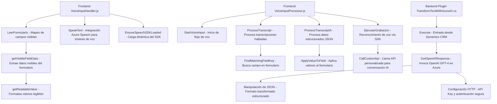

### Breve resumen técnico:
El repositorio ofrece una solución que implementa funcionalidades avanzadas de entrada y síntesis de voz, así como integración con APIs externas. Facilita aplicaciones dinámicas como mapeo de formularios en Dynamics 365 y procesamiento de texto mediante Azure OpenAI. Los tres archivos proveen elementos clave: interacción con el usuario vía voz, reconocimiento y síntesis de datos y transformación de texto en sistemas de gestión empresarial.

---

### Descripción de arquitectura:
1. **Tipo de solución**: La solución se presenta como un conjunto modular compuesto por: 
   - **Frontend** para entrada y síntesis de voz en interfaz de usuario web o formularios.
   - **Backend plugin** como servicio extensible para Dynamics CRM que emplea inteligencia artificial en procesamiento de texto.
2. **Arquitectura**: Es híbrida, con varios componentes:
   - **Backend plugin**: Sigue la arquitectura de **plugins** de Microsoft Dynamics CRM.
   - **Frontend**: Presenta una arquitectura modular basada en **JavaScript** organizada como componentes funcionales.
3. **Interacción con APIs**: La solución muestra un diseño que adopta el patrón de **adapter** para interconectar datos provenientes de Azure AI y Speech SDK con el sistema de formularios y CRMs de Dynamics.

---

### Tecnologías Usadas:
1. **Frontend**:
   - JavaScript para la interacción con la interfaz de usuario.
   - **Azure Speech SDK**: Procesamiento de entradas de voz, reconocimiento y síntesis de audio.
   - **Dynamics Web API**: Manipulación de formularios en Dynamics 365.
   
2. **Backend**:
   - C# para la implementación de plugins en Dynamics CRM.
   - **Microsoft.Xrm.Sdk**: Biblioteca nativa para manipulación de datos en el CRM.
   - **Newtonsoft.Json** y **System.Text.Json** para manejo de datos JSON.
   - **Azure OpenAI API (GPT-4)**: Procesamiento de lenguaje natural.

3. **Patrones arquitectónicos implementados**:
   - **Modularización**: Funciones separadas por responsabilidades en el frontend.
   - **Callback Pattern** para garantizar la carga y ejecución en procesos asíncronos.
   - **Integración de servicios**: APIs externas (Speech SDK y Azure AI) usadas como servicios adaptados para la aplicación.

---

### Diagrama Mermaid:

---

### Conclusión Final:
La solución evidencia una integración directa con servicios de inteligencia artificial y voz, diseñada para ser utilizada en entornos corporativos como Dynamics 365. Combina arquitectura modular y extensibilidad, con integración entre frontend web, APIs externas y componentes de backend. Una optimización podría incluir controles adicionales para seguridad en la gestión de claves API de Azure y una mayor centralización de configuración.