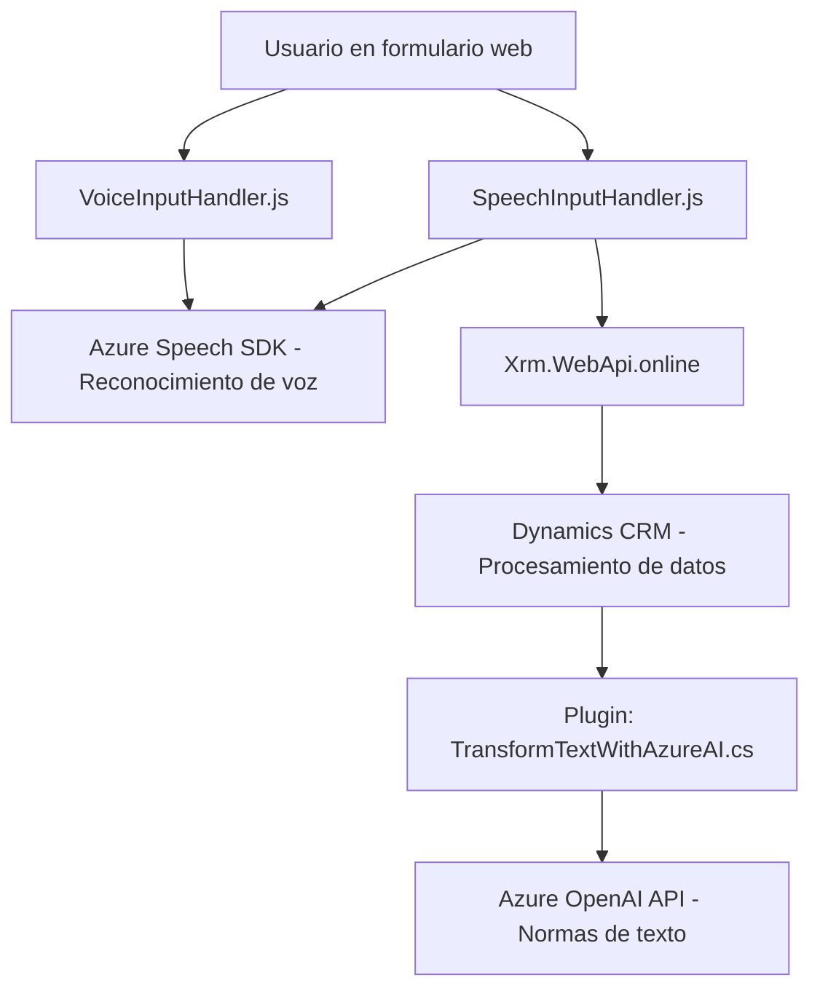

# Análisis técnico del repositorio

### 1. Breve resumen técnico
El repositorio parece estar diseñado para una **aplicación basada en formularios** (Dynamics CRM) que integra funcionalidades avanzadas de entrada y salida por voz y text-to-speech. La herramienta utiliza **Azure Speech SDK** para poder sintetizar voz y reconocer comandos hablados, así como un plugin en C# que interactúa con Azure OpenAI API para transformar los datos ingresados mediante IA.

---

### 2. Descripción de arquitectura
- La solución está basada en una arquitectura **multicapas (n-capas)**:
  - **Capa de presentación (frontend)**: Implementada principalmente en **JavaScript**, encargada de la interacción con el usuario en formularios visuales, incluyendo la captura de voz, reconocimiento de comandos, y mapeo de datos.
  - **Capa de lógica de negocios**: Implementada mediante un **plugin en C#** (Dynamics CRM), que interactúa con Azure OpenAI para el procesamiento de mensajes y transformación avanzada en texto formateado.
  - **Capa de servicios externos**: Usa la **Azure Speech SDK** y **Azure OpenAI API** para funcionalidades de voz e inteligencia artificial.

La arquitectura sigue principios de **modularidad** y **integración SOA** (Service-Oriented Architecture), aprovechando APIs externas para delegar responsabilidades específicas como el reconocimiento, síntesis y procesamiento de comandos de voz. Este diseño facilita la escalabilidad y separa claramente las responsabilidades entre el frontend y back-end.

---

### 3. Tecnologías usadas
- **Frontend**:
  - **JavaScript**: Para procesamiento del formulario y la interacción por voz.
  - **Azure Speech SDK**: Para entrada de voz (reconocimiento) y salida de voz (síntesis).
  - **Dynamics APIs (`Xrm.WebApi.online`)**: Para comunicación con las interfaces de Microsoft Dynamics CRM.
  
- **Backend**:
  - **C# (Microsoft.Xrm.Sdk)**: En el desarrollo de plugins para Dynamics CRM y manejo de lógica empresarial.
  - **Azure OpenAI API**: Para procesamiento y transformación de texto en un formato específico.
  - **System.Net.Http, System.Text.Json, Newtonsoft.Json.Linq**: Manejo de objetos JSON y solicitudes HTTP.

---

### 4. Dependencias o componentes externos
- **Servicios de Azure:**
  - **Azure Speech SDK**: Facilita funciones de texto a voz y reconocimiento de comandos en formularios contextuales.
  - **Azure OpenAI API**: Utilizado para realizar transformaciones avanzadas de texto usando IA.
  
- **Dinámicas CRM APIs**:
  - Integración con la API de Dynamics para manipular datos de formularios y gestionar las interacciones de negocio.

- **Frameworks de C#:**
  - Dependencias estándar de C# (.NET), como `Newtonsoft.Json` y `System.Net.Http`, para la serialización y comunicación HTTP.

---

### 5. Diagrama Mermaid

---

### Conclusión final
Este repositorio implementa una solución basada en formularios con capacidades avanzadas que aprovechan el ecosistema de Microsoft Azure y Dynamics CRM. La arquitectura es **modular y multicapa**, donde cada componente tiene una responsabilidad claramente definida: el frontend gestiona la interfaz de usuario y la interacción por voz, mientras que el backend (plugin C#) procesa datos en profundidad utilizando inteligencia artificial. Por último, su integración con APIs externas lo hace un ejemplo claro de **Service-Oriented Architecture**, facilitando la reutilización y escalabilidad del sistema.