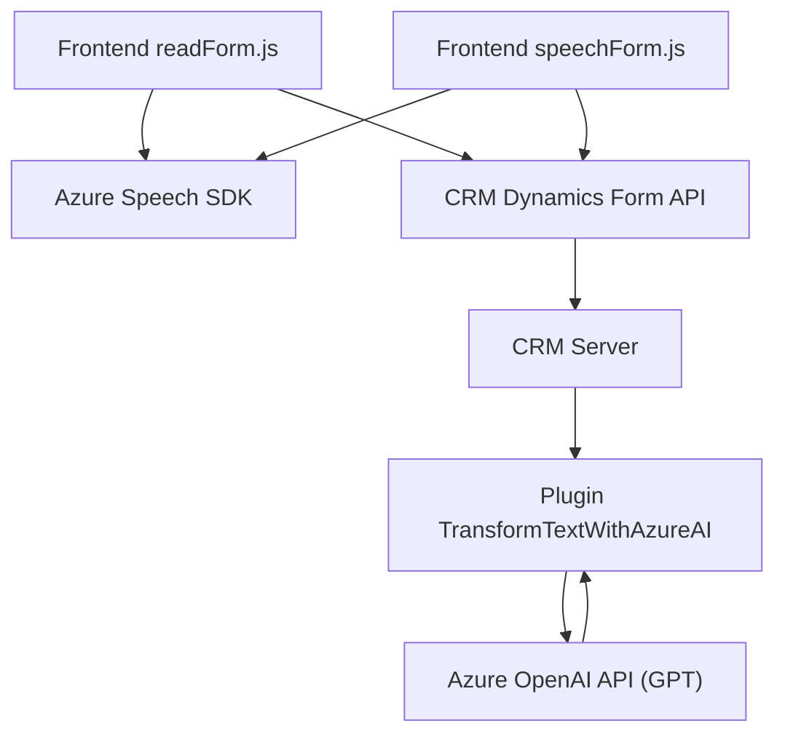

### Breve resumen técnico
La estructura del repositorio muestra una solución orientada a integrar funcionalidades de procesamiento de texto, síntesis de voz y transcripción mediante servicios de Azure (Speech SDK y OpenAI API) con formularios CRM Dynamics 365. El enfoque se basa en la interacción cliente-servidor entre un frontend en JavaScript y plugins en C# para extender las capacidades del CRM.

---

### Arquitectura
La solución tiene elementos de una arquitectura **n-capas**:
1. **Capa de presentación**: Los archivos `readForm.js` y `speechForm.js` manejan directamente la lógica de visualización utilizando CRM Dynamics 365 como interfaz del usuario.
2. **Capa de negocio**: La lógica principal está encapsulada en los métodos del plugin `TransformTextWithAzureAI.cs`, que interactúan con el servicio Azure OpenAI para definir reglas de negocio.
3. **Capa de integración**: Integración con servicios externos como Azure Speech SDK y Azure OpenAI API permite manejar funcionalidades avanzadas como la transcripción de voz y el procesamiento de texto.

---

### Tecnologías usadas
1. **Frontend**:
   - **JavaScript**: Para lógica de interacción con CRM Dynamics y servicios de Azure.
   - **Azure Speech SDK**: Manejo de síntesis y reconocimiento de audio.
   - **CRM Dynamics API**: Visualización y actualización de formularios del CRM.

2. **Backend**:
   - **C# (Microsoft.Xrm.Sdk)**: Plugin para realizar procesamiento de texto.
   - **Azure OpenAI API (GPT)**: Aplicación de inteligencia artificial para transformar texto bajo reglas predefinidas.

3. **Dependencias externas**:
   - **System.Net.Http**: Comunicación HTTP.
   - **Newtonsoft.Json**: Manejo de JSON estructurado.

---

### Diagrama Mermaid compatible con GitHub Markdown

---

### Conclusión final
La solución implementa una integración avanzada entre sistemas CRM y servicios de Azure, proporcionando capacidades de accesibilidad (síntesis de voz y transcripción) y ampliando la funcionalidad del CRM (procesamiento de texto vía IA). La arquitectura sigue un enfoque modular con separación de lógica de presentación y negocio, permitiendo un diseño escalable y mantenible. Sin embargo, la solución depende fuertemente de servicios de Azure, lo que puede ser un punto crítico si existe pérdida de conectividad o cambios en la configuración de los servicios.