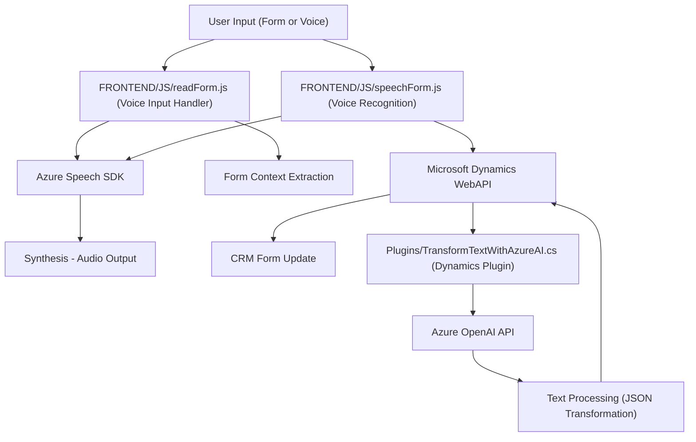

### Breve resumen técnico:
El repositorio descrito contiene archivos que forman parte de una solución híbrida orientada a la integración entre **Microsoft Dynamics** y servicios externos, como **Azure Speech SDK** y **Azure OpenAI**. Las funcionalidades principales incluyen:
1. Gestión de formularios dinámicos en el frontend mediante reconocimiento y síntesis de voz.
2. Procesamiento de texto avanzado en el backend usando inteligencia artificial (IA) otorgada por Azure OpenAI.

---

### Descripción de arquitectura:
La arquitectura general de la solución utiliza un enfoque **n-capas** combinado con características de arquitectura orientada a servicios. Hay:
- **Frontend:** Afronta la interacción del usuario y realiza reconocimiento/síntesis de voz con Azure Speech SDK.
- **Backend:** Implementa lógica personalizada como plugins de Dynamics CRM para llamar a servicios externos.
- **Servicios externos:** Se integran con los **API de Azure** para inteligencia artificial y servicio de voz.

Patrones observados:
- **Service Layer:** Interacciones con Dynamics WebAPI y Azure Speech/OpenAI están separadas en funciones específicas.
- **Event-driven Plugin Architecture:** El archivo `TransformTextWithAzureAI.cs` responde a eventos en Dynamics CRM siguiendo el patrón plugin.
- **Helper Methods:** Ambas capas (frontend y backend) integran funciones auxiliares para abstracción y modularidad.
- **Lazy Loading:** El SDK de Azure Speech se carga dinámicamente solo cuando es necesario, optimizando recursos en el frontend.

---

### Tecnologías usadas:
**Frontend:**
- **JavaScript:** Ventana principal de interacción. Utiliza módulos funcionales para síntesis/reconocimiento de voz.
- **Azure Speech SDK:** Reconocimiento y síntesis de voz con integración en tiempo real.
- **Microsoft Dynamics WebAPI:** Proporciona interacciones del frontend con el backend.

**Backend (Plugins en Dynamics CRM):**
- **.NET Framework:** Código compilado en C# para la lógica de plugins.
- **Azure OpenAI API:** Procesamiento avanzado de textos usando IA.
- **Dynamics SDK:** Gestión de eventos CRM y entidades.
- **RESTful Web Services:** Integración con otros servicios utilizando solicitudes HTTP.

---

### Dependencias o componentes externos:
1. **Microsoft Azure Speech SDK:** Reconocimiento y síntesis de voz.
2. **Microsoft Azure OpenAI:** Transformación de texto mediante IA.
3. **Dynamics WebAPI:** Manejo y actualización de datos en el CRM, como formularios.
4. **Newtonsoft.Json** (**Backend**): Manipulación y parsing de datos JSON.
5. **CDN:** `https://aka.ms/csspeech/jsbrowserpackageraw` utilizado en el frontend.
6. **Microsoft Dynamics SDK:** Para lógica de plugin y CRM.

---

### Diagrama Mermaid para GitHub Markdown:

---

### Conclusión final:
La estructura del repositorio indica un sistema dinámico que proporciona integración avanzada entre interfaces de usuario, sistemas empresariales, y servicios externos habilitados por inteligencia artificial y síntesis/reconocimiento de voz. El enfoque arquitectónico **n-capas** permite gestionar el flujo desde el frontend, donde se procesan los datos, hasta el backend, que los transforma mediante procesos personalizados y los inserta en el CRM.

Aunque el sistema está bien diseñado para sus propósitos, se podrían mejorar algunos aspectos, como:
1. **Seguridad:** Evitar el almacenamiento explícito de claves API; integrarlas a través de sistemas seguros.
2. **Escabilidad:** Considerar adaptaciones hacia microservicios si el sistema crece en uso y complejidad.
