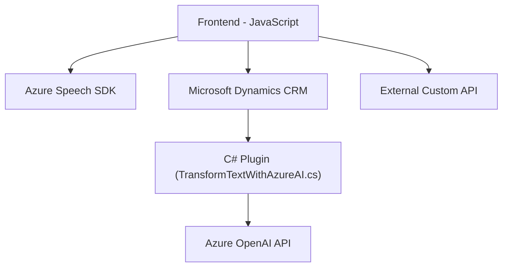

### Breve resumen técnico
El repositorio analiza el diseño y la implementación técnica de una solución que combina cliente y servidor, constituida por scripts de Frontend en JavaScript para el reconocimiento y síntesis de voz (utilizando **Azure Speech SDK**) junto con un plugin de **Dynamics CRM** desarrollado en **C#** para transformar texto a formato estructurado mediante **Azure OpenAI**. Estos componentes interactúan entre sí para mejorar la manipulación de datos en formularios, con la capacidad de procesar información de manera dinámica e integrarse con servicios de inteligencia artificial en la nube.

---

### Descripción de arquitectura
El sistema parece ser una solución híbrida basada en un esquema de **arquitectura n-capas**:
1. **Capa de presentación (Frontend)**:
   - Contiene scripts en **JavaScript** que operan en el cliente y sobre elementos de interfaces de usuario (como formularios en Dynamics CRM, interfaces web, etc.).
   - Utiliza el SDK de Speech de Azure para habilitar el reconocimiento de voz y la síntesis.
2. **Capa de negocio**:
   - El plugin en **C#** se ejecuta en el servidor de Dynamics CRM. Permite transformar el texto obtenido del cliente en información estructurada (JSON) utilizando **Azure OpenAI API**.
3. **Capa de datos**:
   - Usa el servicio de Microsoft Dynamics **Web API** para interactuar con datos del sistema CRM, asignando los valores procesados a campos del cliente.

La arquitectura combina elementos de integración con APIs, modularización del código, y uso de componentes cloud como **Azure Speech SDK** y **Azure OpenAI API**.

---

### Tecnologías usadas
1. **Lenguajes de programación**:
   - **JavaScript**: Utilizado para la lógica del frontend y manipulación del DOM.
   - **C#**: Implementación del plugin en Dynamics CRM.

2. **Frameworks y servicios**:
   - **Azure Speech SDK**: Para reconocimiento y síntesis de voz en cliente.
   - **Azure OpenAI API (REST)**: Para generación de JSON estructurado mediante IA.
   - **Microsoft Dynamics SDK**: Usado especialmente para la implementación del plugin, gestión de datos y comunicación con APIs de Dynamics.

3. **Patrones de diseño**:
   - **Facade Pattern**: Simplifica la interacción con SDKs de Azure mediante encapsulación en funciones específicas como `speakText`.
   - **Cliente/Servidor**: Comunicación entre el cliente (JavaScript) y servidor (Dynamics Plugin).
   - **Microservicios**: Uso de servicios externos como APIs de Azure Speech y OpenAI.
   - **Modularización**: Código separado en funciones claras reutilizables.

4. **Dependencias externas potenciales**:
   - **Azure Speech SDK** y **Azure OpenAI APIs**.
   - **Microsoft Dynamics SDK** para llamadas a APIs y manipulación de datos CRM.
   - Librerías como `Newtonsoft.Json` y `System.Net.Http` para manipulación de JSON y solicitud HTTP en el plugin.

---

### Diagrama Mermaid válido para GitHub Markdown

---

### Conclusión final
La solución presenta una robusta integración de tecnologías para resolver un problema específico: manipular datos en formularios utilizando reconocimiento de voz y servicios de inteligencia artificial en la nube. Organizada en una arquitectura **n-capas** con capas bien delimitadas (presentación, lógica de negocio y datos), hace uso estratégico de **Azure Speech SDK** para la síntesis y reconocimiento de voz, así como **Azure OpenAI API** para la transformación de texto. Se destacan los patrones de modularización y cliente/servidor para mejorar la mantenibilidad y extensibilidad del sistema. 

Sin embargo, se podrían incorporar técnicas para optimizar el rendimiento, como la mejora en el manejo de errores, restricciones más claras en la validación interna, y una mayor profundización en el control de seguridad para las comunicaciones entre cliente, servidor y servicios externos.