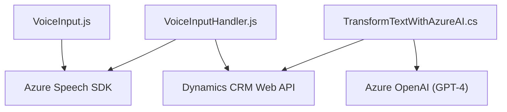

### **Breve resumen técnico**
Este repositorio contiene tres archivos (dos de frontend y uno de backend) que están orientados a la integración de la funcionalidad de voz y procesamiento de texto utilizando Microsoft Azure y Dynamics 365. Los archivos trabajan en conjunto para reconocer voz y texto, procesar información en formularios y transformar texto en un formato estructurado utilizando GPT-4 de Azure OpenAI.

---

### **Descripción de arquitectura**
La solución sigue una arquitectura basada en **servicios combinados** e integración con proveedores externos (Azure Speech SDK y Azure OpenAI). Los archivos de JavaScript trabajan como conectores y manejadores de eventos para vincular la entrada de voz con formularios en la interfaz de Dynamics CRM. Por otro lado, el archivo `TransformTextWithAzureAI.cs` implementa un **plugin autónomo de Dynamics 365**, que opera como un microservicio para procesar y transformar texto en conjunto con Azure OpenAI.

El diseño general utiliza una arquitectura **n-capas** desde el punto de vista funcional:
1. **Frontend (presente)**: Captura la voz y actualiza el formulario en Dynamics CRM a través de la SDK.
2. **Backend como servicio (plugin)**: Ejecuta lógica de transformación basada en reglas proporcionadas y responde con datos estructurados.
3. **Externo (Azure Services)**: Depende de Azure Speech SDK y Azure OpenAI para síntesis de voz y procesamiento automático.

---

### **Tecnologías utilizadas**
#### **Frontend**
- **JavaScript** (sin frameworks especificados).
- **Azure Speech SDK** (procesamiento de voz).
- **Dynamics CRM Web API** (`Xrm.WebApi`).

#### **Backend (C# Plugin)**
- Lenguaje: C# (framework .NET).
- Servicios: Azure OpenAI (GPT-4).
- Librerías:
  - `HttpClient`: Uso de HTTP para llamadas al modelo GPT.
  - `Newtonsoft.Json` y `System.Text.Json`: Para manipulación avanzada de JSON.

#### **Patrones usados**
- **Facade Pattern (Patrón de fachada)**: Algunas funciones como `startVoiceInput` encapsulan procesos más complejos.
- **Cargador dinámico**: SDK de Azure Speech cargado en tiempo de ejecución.
- **Cliente HTTP**: Procesamiento JSON basado en solicitudes HTTP para conectar con Azure OpenAI.
- **Data Mapping**: En el mapeo de datos entre campos del formulario y su interpretación textual o procesada.

---

### **Dependencias y componentes externos**
1. **Extranets/servicios**:
   - Microsoft Azure Speech SDK y Azure OpenAI para síntesis de voz y transformación del texto.
2. **Frameworks específicos**:
   - Dynamics CRM para la interacción entre APIs y formularios.
   - .NET Framework necesario para ejecutar el plugin C#.
3. **Proveedores de paquetes**:
   - Carga dinámica de bibliotecas (ej. Speech SDK) desde endpoints especializados de Microsoft Azure.

---

### **Diagrama Mermaid**

### **Conclusión final**
La solución presentada tiene una arquitectura orientada a servicios que integra capacidades de interfaz de voz y procesamiento de texto con Azure Speech SDK y Azure OpenAI. El diseño está distribuido entre frontend para interactuar con voz y formularios, mientras que el backend (plugin) se ocupa de la transformación del texto y lógica avanzada mediante servicios de Azure. Es una implementación eficiente para aplicaciones que requieren interacción avanzada entre voz, APIs y sistemas CRM como Dynamics 365.