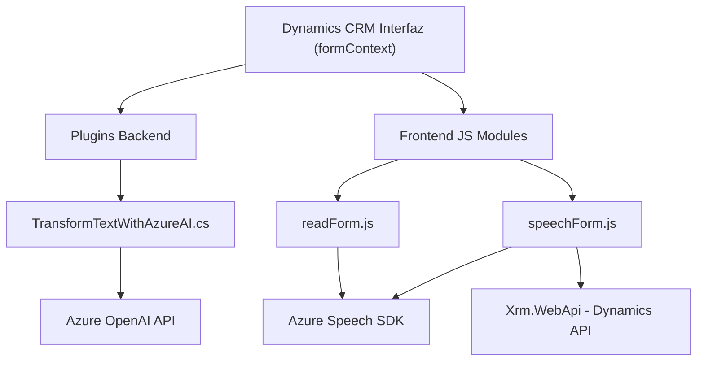

### Breve resumen técnico

El repositorio contiene componentes orientados a integrar funcionalidades avanzadas en aplicaciones que interactúan con Microsoft Dynamics CRM. Estas funcionalidades incluyen entrada y síntesis de voz mediante **Azure Speech SDK** en el frontend y procesamiento de texto basado en **Azure OpenAI** en el backend. Cada archivo detallado corresponde a diferentes módulos que se orquestan para manejar datos dinámicos y mejorar la experiencia del usuario mediante IA en interacción con formularios.

### Descripción de arquitectura

1. **Tipo de solución:**  
   - La solución combina frontend interactivo y backend inteligente:  
     - **Frontend:** Procesa entrada y salida de voz para formularios en Dynamics CRM.  
     - **Backend:** Extiende Dynamics CRM con plugins que procesan texto mediante **Azure OpenAI**.  
   - Es una arquitectura híbrida orientada a servicios y eventos asincrónicos.

2. **Tipo de arquitectura:**  
   - **Frontend:** Arquitectura basada en módulos con separación lógica de responsabilidades: un enfoque cercano a una **arquitectura de capas** para la interacción con los formularios.  
   - **Backend:** Arquitectura **plugin-oriented** integrada con Dynamics CRM, donde cada plugin extiende la funcionalidad del sistema basado en **integración con servicios externos**.

### Tecnologías usadas

- **Frontend:**  
  - JavaScript.  
  - Azure Speech SDK (para entrada y síntesis de voz).  
  - Dynamics CRM API (`formContext` y `Xrm.WebApi`).  
  - DOM API para carga dinámica de recursos.  

- **Backend:**  
  - C#.  
  - Azure OpenAI API (GPT-4).  
  - Microsoft Dynamics CRM SDK.  
  - HTTP Client y JSON frameworks (`Newtonsoft.Json` y `System.Text.Json`).

### Dependencias externas

- **Azure Speech SDK:** Maneja entrada y salida de voz mediante síntesis y reconocimiento.  
- **Azure OpenAI API:** Se utiliza para transformar texto en estructuras JSON siguiendo reglas específicas.  
- **Dynamics CRM (Microsoft.Xrm.Sdk):** Integración garantizada para transformación y gestión de datos del sistema de formularios.

### Diagrama Mermaid válido para GitHub

### Conclusión final

La solución implementada refleja una integración eficiente de servicios externos avanzados (Azure Speech, Azure OpenAI) con Dynamics CRM tanto en el frontend como en el backend. Su enfoque híbrido orientado a eventos y servicios externos fomenta la escalabilidad y modularidad. Es ideal para contextos donde la automatización y la interacción simplificada entre usuarios y sistemas dinámicos son críticas (e.g., empresas que utilizan Dynamics 365). El diseño modular asegura que cada funcionalidad esté separada y orientada a su responsabilidad específica.