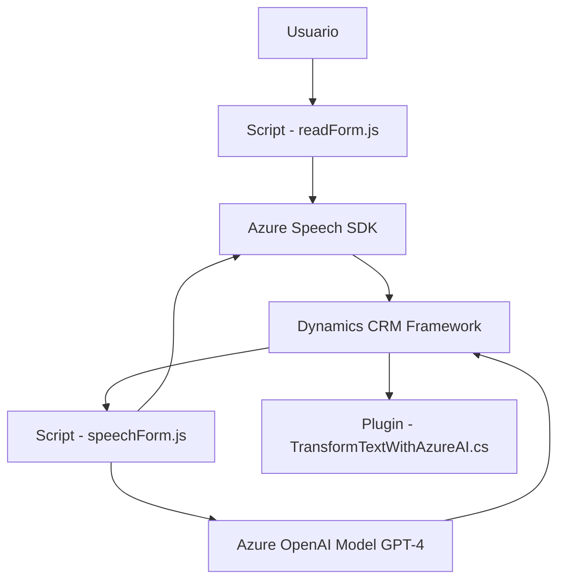

# Análisis Técnico Detallado

## Breve Resumen Técnico
El repositorio parece alojar una solución que integra diversas tecnologías, destacando la explotación de capacidades de **cognitive services** (Azure), para gestionar datos en formularios y transformar texto usando inteligencia artificial. Se divide en tres partes:
1. **Frontend:** Scripts escritos en JavaScript que interactúan con formularios y estimulan la síntesis y reconocimiento de voz mediante Azure Speech SDK.
2. **Backend:** Plugin en C# diseñado específicamente para la plataforma Dynamics CRM, que usa una integración con Azure OpenAI para el procesamiento avanzado de texto.

---

## Descripción de Arquitectura
La solución puede clasificarse como **modular, basada en arquitectura n-capas**:
1. **Capa de Presentación**: Scripts JavaScript (frontend) son responsables de manejar la interacción del usuario en los formularios, procesar el reconocimiento de voz y llamar a la API del backend.
2. **Capa de Negocio**: El plugin en C# contiene lógica empresarial que analiza y transforma texto, utilizando reglas específicas definidas por el usuario y conectándose con Azure OpenAI.
3. **Capa de Integración/Servicios**: La solución depende de servicios externos como **Azure Speech SDK**, **Azure OpenAI**, y potencialmente a través de **Xrm.WebApi**, la API interna de Dynamics CRM.

La arquitectura adopta el paradigma **modular**, al organizar la funcionalidad por áreas claras: interacción con el usuario, integración con servicios externos y procesamiento empresarial. Aunque hay componentes desacoplados, la solución depende de Dynamics CRM como base, lo que limita la flexibilidad en términos de microservicios y la convierte en una arquitectura orientada a n-capas.

---

## Tecnologías Usadas
1. **Frontend:**
   - Lenguaje: **JavaScript**.
   - SDK externo: **Azure Speech SDK**.
   - Framework CRM: Probablemente utiliza **Dynamics CRM form libraries**.

2. **Backend (Plugins):**
   - Lenguaje: **C#**.
   - SDK: **Dynamics CRM SDK (Microsoft.Xrm.Sdk)**.
   - Librerías para procesamiento:
     - **System.Text.Json** y **Newtonsoft.Json.Linq** para manejo de JSON.
     - **System.Net.Http** para comunicación RESTful con Azure OpenAI.

3. **Servicios Externos:**
   - **Azure Speech SDK (Sintetizador de voz y reconocedor de voz).**
   - **Azure OpenAI Service (GPT-4 o similar para transformación avanzada de texto).**

---

## Dependencias o Componentes Externos
1. **Azure Speech SDK:** Servicio de Azure especializado en el manejo de voz a texto y viceversa. Integrado principalmente con el frontend.
2. **Dynamics CRM:** Estructura base donde los formularios son mostrados y procesados.
3. **Azure OpenAI:** Endpoint para gestión y transformación de texto/json mediante modelos de IA.
4. **API personalizada (probablemente gestionada por Dynamics CRM):** Identificada en el método `callCustomApi(inputText)` del archivo `speechForm.js`.

---

## Diagrama Mermaid 100 % compatible con GitHub Markdown

---

## Conclusión Final
Este repositorio tiene una funcionalidad centrada en **potenciar la experiencia de usuario mediante inteligencia artificial**, facilitando la interacción de voz en formularios y la transformación dinámica de datos mediante **Azure OpenAI**. La arquitectura está organizada bajo el enfoque **n-capas**, donde:
- El frontend gestiona la síntesis/reconocimiento de voz.
- El backend se conecta directamente con Azure OpenAI y procesa resultados siguiendo reglas ajustadas para Dynamics CRM.

Aunque no está diseñada como una arquitectura desacoplada como **microservicios**, su modularidad proporciona claridad y eficiencia en el manejo de formularios y servicios cognitivos avanzados.