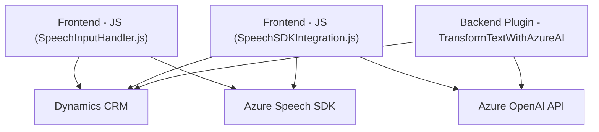

### **Breve resumen técnico**

Los archivos en este repositorio forman parte de una solución integrada que utiliza **Microsoft Dynamics CRM** junto a servicios de **Azure Speech SDK** y **Azure OpenAI**. Están diseñados para combinar capacidades de reconocimiento de voz, síntesis de audio, procesamiento de texto mediante IA y manipulación de datos a través de formularios dinámicos en un entorno CRM.

---

### **Descripción de arquitectura**

La arquitectura refleja una solución **n-capas**, con elementos distribuidos de la siguiente manera:
1. **Capa de frontend**:
    - Archivos Javascript que manejan la interacción directa con el usuario. Implementan reconocimiento de voz, síntesis de audio y procesamiento de datos en formularios.
      
2. **Capa backend** (plugins de Dynamics CRM y servicios de APIs externas):
    - Plugins C# que procesan datos externos con **Azure OpenAI** para transformar texto basado en reglas personalizadas y actuar como un componente que interactúa directamente con el entorno CRM.
    - Dependencia de APIs externas como **Azure Speech SDK** y **Azure OpenAI** para realizar operaciones específicas (como reconocimiento de voz, síntesis de texto y transformación de datos mediante IA).

La solución está orientada a combinar procesos manuales y automáticos en un flujo definido para CRM, mientras utiliza servicios externos en tiempo real.

---

### **Tecnologías usadas**

1. **Frontend (JS)**:
   - **Azure Speech SDK**: Sintetiza voz desde texto y realiza reconocimiento de voz.
   - **Microsoft Dynamics CRM Framework**: Para manipulación de formularios y datos en el contexto del CRM.
   - **JavaScript**: Modular y enfocado en tareas específicas, como extracción y síntesis de datos.

2. **Backend (C# Plugin)**:
   - **Azure OpenAI API**: Para transformación avanzada de texto.
   - **Dynamics CRM SDK**: Manejo del contexto del CRM.
   - **Dependencias estándar C#**: `HttpClient` para llamadas HTTP, `System.Text.Json` y `Newtonsoft.Json` para procesamiento JSON.

3. **Patrones**:
   - **Modularización**: Separación de responsabilidades para cada funcionalidad (extracción de datos, síntesis de voz, comunicación con APIs).
   - **Delegación e inyección dinámica**: Uso de dependencias cargadas en tiempo real (Azure Speech SDK).
   - **Plugin Architecture**: Para extender funcionalidades específicas del CRM mediante interacción con servicios externos.

---

### **Diagrama Mermaid**

Este diagrama ilustra los componentes principales y cómo interactúan entre sí:

---

### **Conclusión final**

La solución implementada utiliza una combinación estratégica de herramientas y servicios externos para añadir capacidades avanzadas a un entorno Dynamics CRM. A través de integración con APIs de Azure, otorga tres funcionalidades clave:
1. **Reconocimiento y síntesis de voz** para mejorar la interacción del usuario.
2. **Transformación de texto con IA** mediante OpenAI API, lo que extiende las capacidades del CRM.
3. **Procesamiento dinámico** de formularios para manipulación y mapeo de datos.

La arquitectura n-capas proporciona flexibilidad y escalabilidad aprovechando servicios externos con enfoque modular, mientras mantiene la interacción y la lógica delimitada entre el cliente y el servidor. Se trata de una solución robusta, ideal para integrar capacidades avanzadas de IA y voz en flujos CRM empresariales.