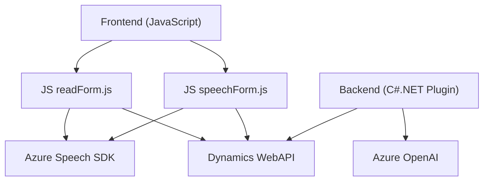

### Breve resumen técnico:
El repositorio parece estar destinado a implementar soluciones para la interacción entre usuarios y formularios mediante voz y procesamiento de texto utilizando servicios Azure. Los archivos analizados tienen funcionalidades específicas: incorporación de lectura y síntesis de voz, procesamiento de transcripción, y transformación de texto en JSON estructurado mediante un plugin integrado con Dynamics CRM y Azure OpenAI. 

---

### Descripción de arquitectura:
La solución sigue un enfoque modular con patrones de arquitectura como **Cliente-Servidor**, **Plugin Pattern**, y **Service-Oriented Architecture (SOA)**. Se distribuye principalmente en dos capas:
1. **Frontend Dynamic Forms**: Implementa la lectura/escritura de formularios interactivos mediante voz en el cliente.
2. **Backend Plugin**: Integra transformaciones complejas de texto en Dynamics CRM mediante un plugin avanzado que consume APIs de Azure.

La arquitectura no es monolítica, ya que utiliza servicios externos como Azure Speech SDK y OpenAI, lo que permite un grado de **desacoplamiento** importante y apunta hacia una solución de **N capas** donde cada componente maneja su responsabilidad.

---

### Tecnologías usadas:
1. **Azure Speech SDK**:
   - Para lectura y transcripción de voz en tiempo real.
   - Integración vía CDN (`https://aka.ms/csspeech/jsbrowserpackageraw`).
2. **Dynamics WebAPI**:
   - Para gestionar datos y formularios interactivos en Dynamics CRM.
3. **Azure OpenAI**:
   - Realiza transformaciones de texto según reglas predefinidas.
4. **JavaScript (ES6+)** y **C#.NET**:
   - Lógica de frontend (interacciones de voz) y backend (plugin para procesamiento avanzado).
   
Patrones identificados:
- **Controlador**: Coordina operaciones en frontend.
- **Lazy Loading**: Retrasa la carga de SDK hasta que sea necesario.
- **Proxy/Adapter**: Manejo de interacciones con APIs externas.
- **Plugin Pattern**: Usado para extender la funcionalidad de Dynamics CRM.
- **SOA**: Integración con servicios externos como Azure Speech y OpenAI.

---

### Diagrama Mermaid:
El siguiente diagrama muestra la relación entre los componentes y dependencias:

---

### Conclusión final:
La solución es una **aplicación dinámica y modular** destinada a mejorar la experiencia del usuario con formularios mediante comandos de voz y procesamiento de texto con inteligencia artificial. Con una arquitectura basada en N capas, desacoplada y orientada a servicios (SOA), utiliza componentes como Azure Speech SDK y OpenAI para ejecutar tareas complejas como reconocimiento de voz, síntesis de audio y transformación de texto. El uso de un plugin en Dynamics CRM asegura un control integrado y eficiente de las operaciones, mientras que el enfoque de carga por demanda garantiza una gestión de recursos optimizada.