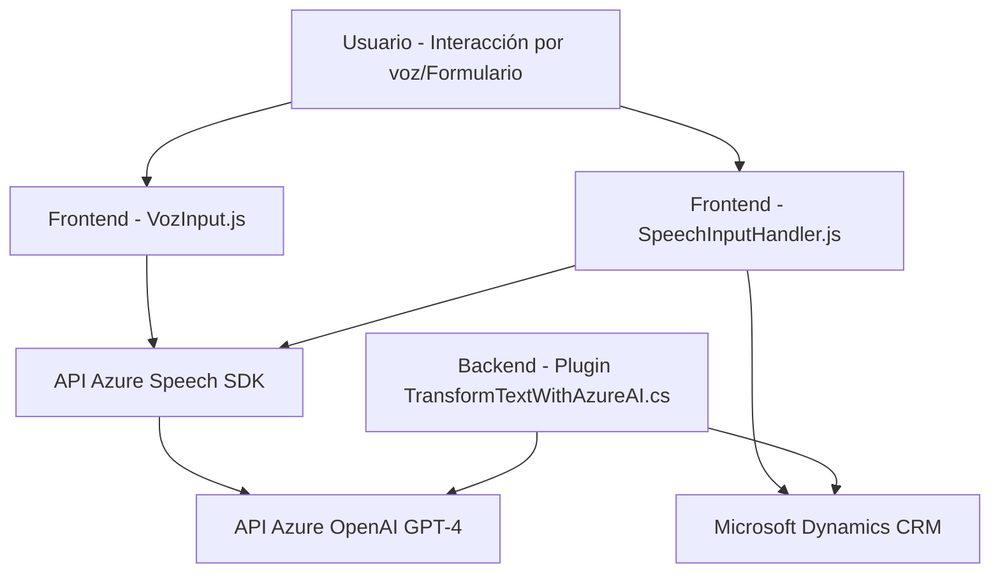

### Breve resumen técnico
El repositorio implementa funcionalidades relacionadas con sintetización de voz, entrada por voz y la transformación de datos con inteligencia artificial. Está diseñado para integrarse con Microsoft Dynamics CRM y Azure Speech/OpenAI, lo que evidencia la intención de trabajar con formularios dinámicos y accesibles.

---

### Descripción de arquitectura
La solución contiene tres principales componentes:
1. **Frontend (JavaScript)**: Funciona como un cliente para manejar la voz en tiempo real, permitiendo lectura y escritura de datos mediante Azure Speech SDK.
2. **Plugin (C#)**: Provee integración con Azure OpenAI (GPT-4) y sirve como backend para la transformación de datos.
3. **Externa (APIs)**: Utiliza servicios externos como Azure Speech y OpenAI.

El diseño general sigue una arquitectura de **n capas**, donde cada capa tiene roles definidos:
- **Presentación (Frontend)**: Captura interacción del usuario (voz y formularios).
- **Lógica de negocio (Plugins)**: Procesa acciones específicas como transformar texto y enviar datos a servicios externos.
- **Integración y datos (APIs)**: Conecta ambas capas con los servicios de Azure Speech y OpenAI.

---

### Tecnologías usadas
#### Frameworks y SDKs:
- **Azure Speech SDK (JavaScript)**: Utilizado para síntesis y reconocimiento de voz. Ej. funciones como `SpeechConfig`, `AudioConfig`, y carga dinámica desde CDN oficial de Microsoft.
- **Microsoft Dynamics CRM SDK** (C#): Manejo del contexto CRM para plugins.
- **Azure OpenAI API**: Servicios GPT-4 accesibles vía `System.Net.Http`.

#### Herramientas:
- **JSON Manipulation**: `Newtonsoft.Json` y `System.Text.Json` para manipulación de datos.
- **Regex y C# Utils**: Asegura robustez en el procesamiento y validación de texto.

#### Patrones arquitectónicos:
- **Event-Driven Execution**: Uso de callbacks en funciones frontend para procesos asincrónicos.
- **Service-Oriented Architecture (SOA)**: Consumo de APIs (Azure Speech y OpenAI).
- **Modular Design**: Separación lógica por funciones en frontend y por clases en el plugin de backend.
- **Data Mapper**: Traducción de datos entre voz/formularios en frontend y transformación en backend.

---

### Diagrama Mermaid válido para GitHub

---

### Conclusión final
Esta solución está diseñada para crear herramientas de accesibilidad y automatización utilizando voz y servicios avanzados de inteligencia artificial. La arquitectura **n capas** permite una separación modular entre la interfaz de usuario (frontend), lógica de negocio (plugin), y servicios externos (Azure Speech/OpenAI). Es adecuada para aplicaciones centradas en usuarios que requieren interacción en tiempo real. Además, el uso de estándares de servicios y SDK asegura la extensibilidad del proyecto en entornos modernos de desarrollo.