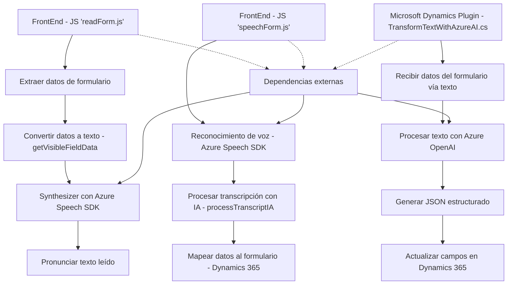

### Breve resumen técnico:
El repositorio engloba una solución relacionada con Microsoft Dynamics 365 integrada con servicios de inteligencia artificial (Azure Speech SDK y OpenAI GPT) para mejorar la interacción con formularios. Utiliza tecnologías tanto del frontend (procesos de voz y reconocimiento) como del backend (plataforma Dynamics y plugins).

---

### Descripción de arquitectura:
La arquitectura general parece orientarse a un modelo de capas que interactúan entre sí:
1. **Capa de presentación**: Compuesta por los archivos de frontend. Proporciona funcionalidades como la entrada de voz, sintetización en texto, interacción con formularios de Dynamics 365 y procesamiento.
2. **Capa de aplicación/plataforma**: Microsoft Dynamics CRM actúa como base de datos y lógica empresarial.
3. **Capa de integración/externalización**: Plugin en C# que interactúa con Azure OpenAI para transformación de texto y generación de datos estructurados en JSON.

Este diseño se aproxima a una **arquitectura de n capas** debido a su separación de responsabilidades clara y su enfoque en módulos específicos para frontend y backend.

---

### Tecnologías usadas:
1. **Frontend**:
   - JavaScript.
   - Interacción con DOM y APIs del navegador.
   - Azure Speech SDK para análisis de voz/síntesis en texto hablado.
   
2. **Backend**:
   - Microsoft Dynamics SDK (C#) para el diseño de plugins.
   - Azure OpenAI y GPT-4 para procesamiento de texto.

3. **Plataforma**:
   - Microsoft Dynamics 365 para la lógica empresarial y manejo de eventos.
   - Servicios Rest API para integración hacia sistemas externos.

---

### Dependencias externas presentes:
1. **Azure Speech SDK**:
   - Procesamiento de voz para convertir entrada en texto hablado o realizar síntesis de tecnología de voz.

2. **Azure OpenAI**:
   - Generación de texto estructurado usando GPT-4 para mejorar la interacción y generación de datos útiles para formularios.

3. **Microsoft Dynamics SDK**:
   - Herramientas para implementar plugins y extensiones en Dynamics.

4. **Newtonsoft.Json**:
   - Manipulación avanzada de JSON en el backend.

---

### Diagrama Mermaid válido para GitHub Markdown:

---

### Conclusión final:
La solución presentada mezcla capacidades avanzadas de inteligencia artificial (Azure OpenAI/GPT-4 y Azure Speech SDK) con herramientas empresariales (Microsoft Dynamics 365). Esto permite una integración fluida de datos de voz y texto en sistemas de gestión CRM. La arquitectura tiene un enfoque modular basado en **n-capas**, con una clara distinción entre la capa de presentación, lógica empresarial y los servicios externos requeridos. Gracias al uso de SDKs y servicios en la nube, la integración se configura como eficaz, escalable y adaptable.