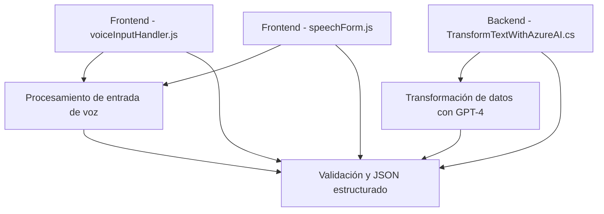

### Breve resumen técnico:

El repositorio incluye tres componentes principales relacionados con el manejo de formularios, reconocimiento de voz, procesamiento de texto automático, e integración con servicios en la nube como Azure Speech SDK y Azure OpenAI. Las soluciones están orientadas a Dynamics 365 CRM, aprovechando eventos y APIs para interactuar con formularios y transformar datos mediante servicios externos.

---

### Descripción de arquitectura:

La arquitectura implementada parece híbrida, donde:
1. **Frontend basado en JavaScript**: Se manejan eventos de interacción con el usuario, como entrada de voz y lectura de formularios.
2. **Plugins en Dynamics CRM**: Se intervienen eventos del flujo de negocio para transformar y procesar datos (integración con Azure AI).
3. **Niveles de integración distribuida**: Usa servicios como Azure Speech SDK para síntesis/reconocimiento de voz y Azure OpenAI para transformación textual en JSON.

Esto apunta a una arquitectura de **n capas** dado que tenemos:
- **Capa de presentación**: Con manejo de frontend para entrada de voz y lectura de formularios por parte del usuario.
- **Capa de lógica de negocio**: Plugins que interceptan y procesan eventos en Dynamics CRM.
- **Capa de datos**: Interactúan directamente con APIs y servicios externos en la nube (Azure) para procesamiento.

---

### Tecnologías usadas:

1. **Frontend**:
   - **JavaScript** con modularidad (funciones encapsuladas).
   - **Azure Speech SDK** para reconocimiento y síntesis de voz (`voiceInputHandler.js`).

2. **Backend/Plugins Dynamics**:
   - Microsoft Dynamics CRM SDK (`IPlugin`) para interceptar eventos.
   - Azure OpenAI Service utilizando GPT-4 para transformaciones de texto.
   - C# (.NET Framework) para desarrollo del plugin (`TransformTextWithAzureAI.cs`).
   - `System.Net.Http` y `Newtonsoft.Json` para manejo de solicitudes HTTP y JSON.

3. **Integración con servicios externos**:
   - **Azure Speech SDK** para la síntesis y reconocimiento de voz.
   - **Azure OpenAI API** para procesamiento avanzado de texto.

---

### Diagrama Mermaid válido para GitHub:

---

### Conclusión final:

El repositorio integra soluciones dinámicas para interactuar con formularios en entornos Dynamics CRM, utilizando tecnologías innovadoras como Azure Speech SDK y Azure OpenAI. La arquitectura proporciona una capa de presentación robusta para reconocimiento de voz y procesamiento de datos y una capa de backend eficiente para transformación y asignación en servicios CRM. La estructura es modular, distribuida e integrada con servicios en la nube, pero mantiene características de **n capas** debido a la separación de responsabilidades entre frontend, backend y servicios externos.