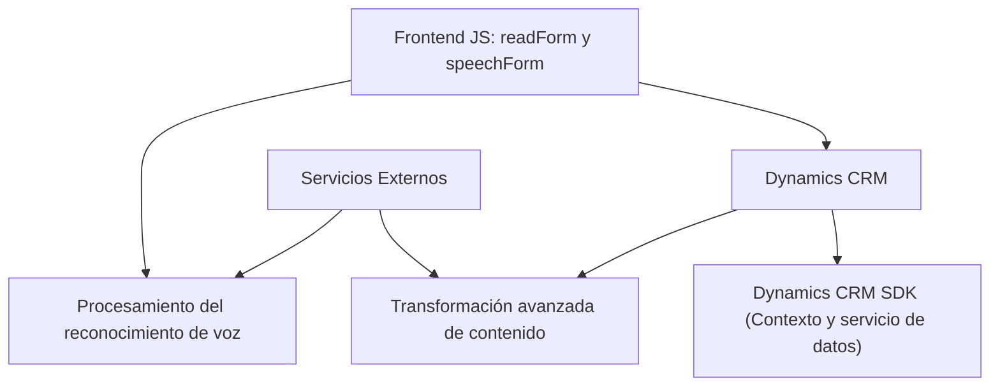

**Breve Resumen Técnico:**

El repositorio implementa una solución híbrida para dinamizar la interacción de voz y procesamiento de texto en aplicaciones basadas en Microsoft Dynamics CRM mediante servicios de inteligencia artificial (Azure Speech SDK y Azure OpenAI). Se utiliza una arquitectura combinada centrada en plugins de CRM, procesadores de voz basados en JavaScript, y servicios de terceros.

---

**Descripción de Arquitectura:**

La arquitectura está conformada por tres capas principales:
1. **Frontend JS**: Scripts que interactúan directamente con los formularios en Dynamics CRM, habilitando la entrada de voz y salida de texto a voz (speech), así como la interacción del usuario mediante comandos vocales.
2. **Backend (Plugin)**: Implementación de lógica específica de negocio en forma de un plugin en Dynamics CRM, que consume la API de Azure OpenAI para transformar texto según reglas predefinidas y devolver un JSON estructurado.
3. **Servicios Externos**:
   - **Azure Speech SDK**: Reconocimiento y síntesis de voz, integrado mediante JavaScript en el frontend.
   - **Azure OpenAI API**: Proceso avanzado de transformación de texto basado en inteligencia artificial.

La solución adopta una arquitectura de **n capas con integración externa**. El frontend maneja la lógica de interacción del usuario y comunica con el backend (CRM y API de IA) a través de servicios definidos que permiten desacoplar las funcionalidades básicas de procesamiento de texto/voz del negocio principal.

---

**Tecnologías Usadas:**

1. **Frontend:**
   - Azure Speech SDK: Procesamiento de entrada de voz y síntesis de salida.
   - JavaScript (funciones asincrónicas): Control de eventos, manejo dinámico de datos y mapeo de formularios.
   - Dynamics CRM Xrm.WebApi SDK: Comunicación con la API del entorno CRM.

2. **Backend (Plugin):**
   - Dynamics CRM Plugin Framework (`IPlugin`).
   - System.Net.Http: Realización de peticiones HTTP a servicios externos.
   - Newtonsoft.Json y System.Text.Json: Procesamiento y manipulación de datos en formato JSON.
   - Azure OpenAI API: Proyección avanzada utilizando OpenAI completions.

3. **Patrones Arquitectónicos:**
   - **Modularidad**: Código organizado en componentes que cumplen roles específicos (voz, transformación de texto, mapeos).
   - **Asincronía**: Promesas y callbacks para el manejo efectivo de SDKs y APIs.
   - **Integración Externa**: Dependencia fuerte de SDKs y API externas como Azure Speech y Azure OpenAI.
   - **Encapsulación**: El backend encapsula la lógica de negocio de transformación de texto en una clase y plugin reutilizable.

---

**Diagrama Mermaid:**

---

**Conclusión Final:**

La solución fusiona frontend modular basado en JavaScript con un plugin backend de Dynamics CRM para habilitar la entrada de voz, conversión de texto a voz, y procesamiento de texto con inteligencia artificial. Su arquitectura de n capas, combinado con servicios externos (Azure SDK y OpenAI), la hace ideal para aplicaciones accesibles y automatización de tareas en entornos empresariales.

Sin embargo, para ambientes críticos, se recomienda la implementación de controles más robustos para el manejo de claves y servicios externos, así como considerar la posibilidad de desacoplar aún más la lógica del negocio de los servicios externos utilizando intermediarios (e.g., middleware).