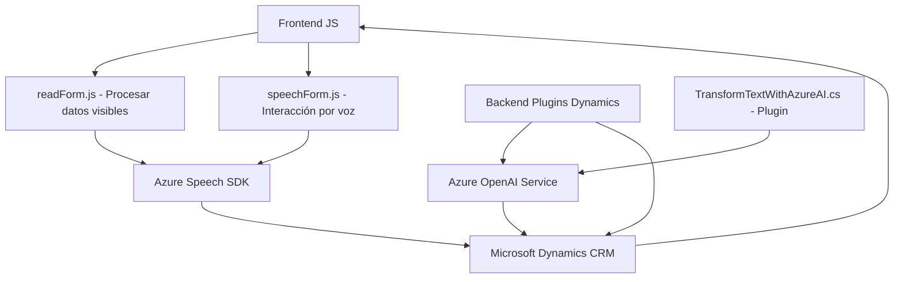

### **Análisis del Repositorio**

#### **Resumen Técnico**
El repositorio implementa una solución híbrida que integra un sistema CRM (Dynamics 365) con capacidades avanzadas de interacción por voz utilizando el **Azure Speech SDK** y de procesamiento de texto estructurado con **Azure OpenAI Service**. La solución incluye código frontend JS, backend en C# como plugins para Dynamics CRM, y dependencias de servicios externos de inteligencia artificial.

---

#### **Descripción de la arquitectura**

La arquitectura general del sistema puede ser clasificada principalmente como de **n capas** con separación de responsabilidades entre:
1. **Frontend**: Interacción con el usuario para reconocimiento de voz, síntesis de voz y captura de datos dinámicos de formularios.
   - Comprende archivos de frontend basados en JavaScript (`readForm.js`, `speechForm.js`).
2. **Backend (Plugins)**: Procesamiento avanzado y transformación de datos utilizando reglas específicas en **Dynamics CRM** a través de eventos disparadores que están integrados con services en **Azure OpenAI**.

Ambos módulos están conectados a servicios externos como el **Azure Speech SDK** y **Azure OpenAI** para expandir las capacidades predeterminadas del sistema CRM.

---

#### **Tecnologías, Frameworks y Patrones Usados**
1. **Frameworks**:
   - **Microsoft Dynamics CRM**: Para formularios dinámicos y ejecución de lógica empresarial.
   - **Azure Speech SDK**: Reconocimiento y síntesis de voz para interacción.
   - **Azure OpenAI Service (GPT-4)**: Transformación de texto en objetos JSON estructurados.

2. **Lenguajes y Bibliotecas**:
   - **Frontend**: JavaScript, junto con soporte de programación event-driven con funciones y promises (asynchronous programming).
   - **Backend**: C# con Microsoft.Xrm.Sdk para manipular datos del plugin CRM.
   - JSON Libraries: `Newtonsoft.Json.Linq`, `System.Text.Json` para manejo de datos JSON.

3. **Patrones arquitectónicos**:
   - **Separación de responsabilidades**: Cada módulo tiene una función dedicada (frontend para interacción visual y lógica basada en el cliente, backend para procesamiento estructurado).
   - **Dependency Injection**: Facilita la carga dinámica de SDK de Azure.
   - **Event-driven design**: En el plugin de Dynamics CRM, se desencadenan eventos específicos para llamar a las APIs externas.
   - **Integración externa**: Comunicación con los servicios de Azure para tareas de voz y procesamiento de datos.

---

#### **Dependencias o Componentes Externos**

1. **Azure Speech SDK** - Reconocimiento y síntesis de voz para la interacción del usuario.
   - URL: `https://aka.ms/csspeech/jsbrowserpackageraw`
2. **Azure OpenAI Service** - API de procesamiento avanzado de texto mediante modelos GPT-4.
   - URL: `https://openai-netcore.openai.azure.com`
3. **Microsoft Dynamics CRM** - Framework para gestión empresarial y desarrollo de plugins conectados a formularios.
4. **JavaScript** - Adicionales:
   - Manejo de formularios dinámicos del CRM.
   - Request a APIs personalizadas dentro del ecosistema del CRM.

---

### Diagrama **Mermaid**

---

### **Conclusión Final**
Este repositorio representa una arquitectura bien estructurada para integrar capacidades de inteligencia artificial y reconocimiento de voz en un entorno de CRM (Dynamics 365). Destaca por usar servicios de Azure, como **Speech SDK** y **OpenAI**, para dotar al sistema de capacidades avanzadas para interacción y procesamiento de voz, sintetización de texto, e interpretación de datos. La separación de responsabilidades entre frontend y backend muestra el uso de una arquitectura **n capas** con una clara orientación hacia modularidad y escalabilidad, ideal para sistemas empresariales que conectan usuarios con servicios basados en IA.