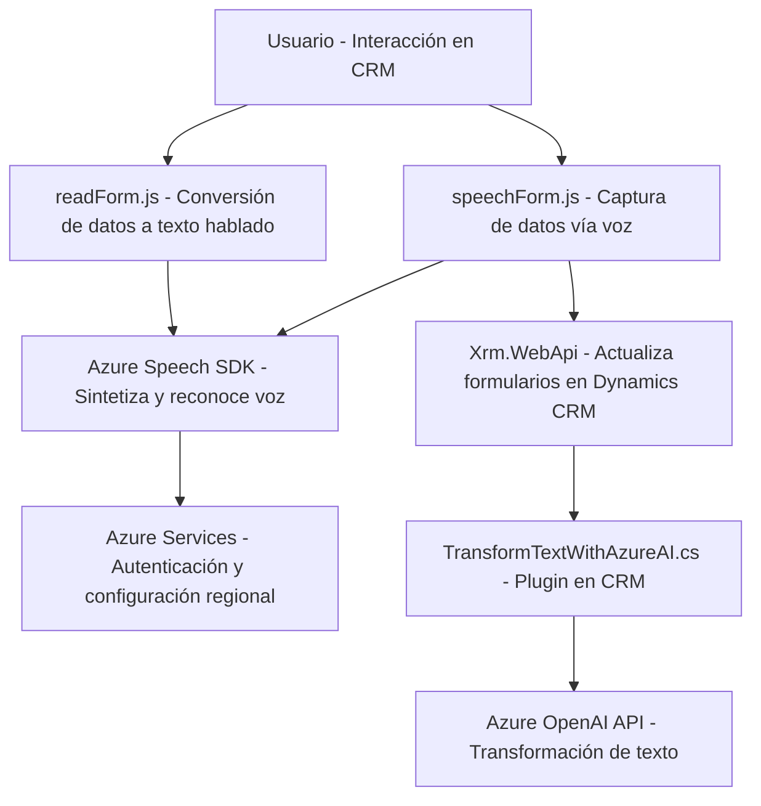

### Breve resumen técnico
El repositorio contiene una solución orientada a la integración de servicios de reconocimiento de voz y transformación de texto, específicamente con tecnología Azure. Está diseñada para operar en sistemas CRM, como Dynamics 365, y contiene tanto módulos frontend para la interacción del usuario como plugins de backend que emplean servicios de Azure OpenAI.

---

### Descripción de arquitectura
La solución adopta una arquitectura **n capas**, donde diferentes componentes se encargan de manejar la entrada de datos (frontend), procesar y transformar información (backend), y consumir servicios externos (Azure Speech SDK y Azure OpenAI). También se evidencia un patrón de integración con servicios externos, lo que permite que el sistema obtenga capacidades avanzadas (reconocimiento de voz y transformación textual) sin implementarlas directamente, reduciendo complejidad interna.

- **Frontend JS**: Maneja la interacción del usuario con reconocimiento de voz y síntesis (visibles en `readForm.js` y `speechForm.js`).
- **Backend Plugins**: Extiende Dynamics CRM proporcionando capacidades de transformación basadas en Azure OpenAI (visible en `TransformTextWithAzureAI.cs`).

---

### Tecnologías usadas
1. **Lenguajes y frameworks**:
   - **JavaScript**: Utilizado en los módulos frontend (para el reconocimiento y síntesis de voz).
   - **C# .NET**: Usado en los plugins del backend para extender funcionalidades de Dynamics CRM.
2. **Servicios externos**:
   - **Azure Speech SDK**: Reconocimiento y síntesis de voz.
   - **Azure OpenAI**: Uso de modelos GPT para transformación avanzada de texto.
   - **Xrm.WebApi**: API específica de Dynamics CRM para manipulación de datos.
3. **Librerías secundarias**:
   - `Newtonsoft.Json.Linq`: Para la manipulación de JSON.
4. **Patrones de desarrollo**:
   - **Modularidad**: Componentes bien aislados (cada archivo tiene un propósito específico).
   - **Integración RESTful**: Uso de servicios web externos mediante solicitudes HTTP.
   - **Eventos y callbacks**: Carga dinámica y ejecución asincrónica de la lógica.

---

### Dependencias o componentes externos presentes
1. **Dependencias del frontend**:
   - Azure Speech SDK, cargado dinámicamente vía URL (`https://aka.ms/csspeech/jsbrowserpackageraw`).
   - Necesidad de claves de autenticación y configuración de región para los servicios de Azure.
2. **Dependencias del backend**:
   - Microsoft Dynamics CRM SDK (`Microsoft.Xrm.Sdk`).
   - Azure OpenAI API: Endpoint HTTP configurado para transformación de texto.
   - Microsoft .NET Core librerías estándar.
3. **Servicios adicionales**:
   - `Xrm.WebApi` para consultas y manipulación de datos en Dynamics.

---

### Diagrama **Mermaid**

---

### Conclusión final
La solución presentada es un sistema **híbrido orientado a eventos** que integra reconocimiento de voz, síntesis y transformación de texto mediante servicios de Azure. Está diseñado para operar en un entorno CRM como Dynamics 365, extendiendo sus capacidades con plugins y scripts personalizados. Su arquitectura en capas asegura una separación de responsabilidades y facilita la interacción con servicios externos. Es modular, escalable y se basa en el uso de APIs RESTful y SDKs de terceros, lo que refuerza su enfoque en la reutilización y adaptabilidad frente a cambios tecnológicos.