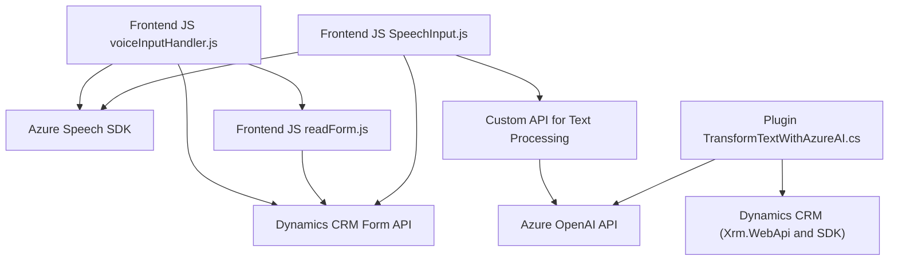

### Breve Resumen Técnico

Este repositorio es una solución integrada para Dynamics CRM, que implementa una combinación de herramientas y técnicas para la interacción directa con formularios de CRM utilizando voz como medio de entrada y salida (comandos y síntesis de voz), además de un plugin para gestionar transformaciones del texto mediante Azure OpenAI API. La solución se compone de un frontend desarrollado en JavaScript para la interacción de usuarios y de plugins en C# que extienden las funcionalidades del CRM.

---

### Descripción de la Arquitectura

La solución sigue una arquitectura de **n-capas**:
1. **Interfaz de usuario (Frontend)** en JavaScript: Permite capturar comandos de voz y convertirlos en texto, interactuar con campos del formulario, y reproducir síntesis de voz.  
2. **Lógica de negocio** en C#: Utiliza plugins de Dynamics CRM para extender el comportamiento del sistema mediante interacción con external APIs (Azure OpenAI para procesamiento y generación automática de texto).  
3. **Acceso a datos** a través de la API de Dynamics CRM (`Xrm.WebApi` en el JavaScript y `Microsoft.Xrm.Sdk` en los plugins), que interactúa con los registros y campos del CRM.  

El uso de integración profunda entre APIs externas (Azure Speech SDK y OpenAI API) junto con el contexto de formularios de Dynamics CRM demuestra un diseño basado en **arquitectura modular** y **uso de dependencias externas**, lo que promueve extensibilidad y escalabilidad.

---

### Tecnologías Usadas

1. **JavaScript**: Implementación de funcionalidades de reconocimiento y síntesis de voz para el front.
   - SDK: **Azure Speech SDK** para reconocimiento y síntesis.
   - Conceptos clave: Modularización, asincronía, manejo de APIs dinámicas.

2. **C#:**
   - Integración directa con **Dynamics CRM** mediante plugins (`Microsoft.Xrm.Sdk`) que se ejecutan en eventos definidos.
   - Uso de **Azure OpenAI API** para realizar transformaciones avanzadas de texto.
   - Dependencias adicionales: `HttpClient` (para interacciones API externas), serialización con `Newtonsoft.Json` y `System.Text.Json`.

3. **Azure Services**:
   - **Azure Speech Service**: Reconocimiento y síntesis de voz en múltiples idiomas.
   - **Azure OpenAI**: Integración de inteligencia artificial para la transformación y análisis del texto.

4. **Patrones de diseño**:
   - **Event-Driven Architecture**: Uso de eventos y mecanismos de callback para gestionar interacciones con las APIs.
   - **N-capas**: Lógica de presentación (JavaScript), negocio (C# Plugins) y datos (Dynamics CRM).
   - **Dependency Injection**: Servicios como `IServiceProvider` en los plugins de CRM.
   - **Modularidad**: Separación del código en funciones reutilizables y especializadas.

---

### Diagrama Mermaid para GitHub Markdown

---

### Conclusión Final

Este repositorio es una **solución híbrida** diseñada para integrarse profundamente con Dynamics CRM. La arquitectura del sistema es claramente de **n-capas**, con un frontend para interacción del usuario mediante voz y una capa de lógica de negocio en los plugins de Dynamics CRM que ejecutan lógica extendida, aprovechando servicios externos como **Azure Speech SDK** y **Azure OpenAI API**. Es una implementación modular, escalable y bien adaptada para un entorno CRM extendido.