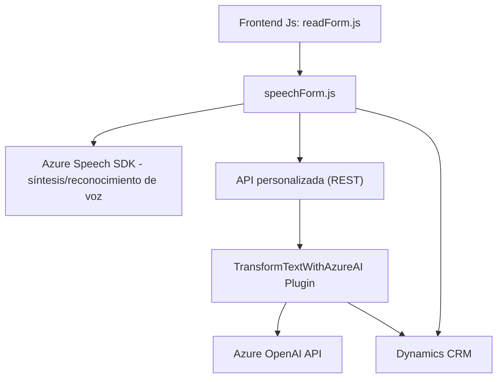

### Breve Resumen Técnico

El repositorio presenta una solución integrada que combina el frontend y plugins de Dynamics CRM para interacción con formularios y servicios externos como Azure Speech SDK y OpenAI API. El objetivo central de los módulos es reconocer voz, sintetizar texto hablado y procesar entradas dinámicas en formularios mediante inteligencia artificial.

---

### Descripción de Arquitectura

La arquitectura de la solución es **modular**, basada en la integración de servicios externos (API de Azure Speech y OpenAI) y dividida en dos capas principales:
1. **Frontend**: Módulos en JavaScript interactúan con el usuario para transformar voz en texto y procesar dicho texto hacia valores en formularios de Dynamics CRM. 
2. **Backend/plugin**: El plugin en C# se integra con Dynamics CRM, procesando texto mediante la API de Azure OpenAI siguiendo normas específicas.

Esta arquitectura puede clasificarse como **n-capas**, ya que hay una separación entre:
- **Interfaz de usuario** (Frontend),
- **Lógica de negocio** (Plugin que procesa texto definido por normas),
- **Servicios externos** (Integración con Azure/OpenAI API),
y se usa paradigmas de integración con APIs RESTful.

---

### Tecnologías Usadas

1. **Dynamics CRM**: Manipulación y extracción de datos en formularios mediante `formContext` y Xrm API.
2. **Azure Speech SDK**: Reconocimiento de voz, síntesis de texto a audio y carga dinámica de scripts.
3. **Azure OpenAI API**: Procesamiento avanzado de texto con normas específicas.
4. **Frontend (JavaScript)**:
   - Modularidad evidente, funciones reutilizables para dividir responsabilidades.
5. **Backend (C#)**:
   - Construcción del plugin bajo la arquitectura de Dynamics CRM.
   - Uso de `System.Net.Http` para llamadas HTTP REST.

**Patrones de diseño**:
   - **Event-driven** para manejar procesos asincrónicos como la carga de SDK y transcripción de voz.
   - **Adapter** para transformar datos entre el frontend y los formularios.
   - **Plugin Architecture** para integrar la lógica con Dynamics.

---

### Dependencias o Componentes Externos

1. **Azure Speech SDK**:
   - Funciones de reconocimiento y síntesis de voz.
   - Carga asincrónica del SDK vía CDN.
2. **Azure OpenAI API**:
   - Implementa reglas avanzadas para procesar texto.
   - Integración con plugins en Dynamics CRM.
3. **Xrm.WebApi**:
   - API REST de Dynamics para manipular formularios.
4. **System.Net.Http**:
   - Llamadas REST en `TransformTextWithAzureAI.cs`.

---

### Diagrama Mermaid

---

### Conclusión Final

La solución es una integración directa entre el frontend y Dynamics CRM para facilitar la interacción con formularios mediante voz y procesamiento de datos. Utiliza tecnologías de Microsoft como Azure Speech SDK y OpenAI para ofrecer opciones avanzadas de transcripción y síntesis de voz. La arquitectura modular y el uso de n-capas garantiza la separación de responsabilidad entre los componentes, haciendo la solución escalable y manejable en entornos de desarrollo empresariales.