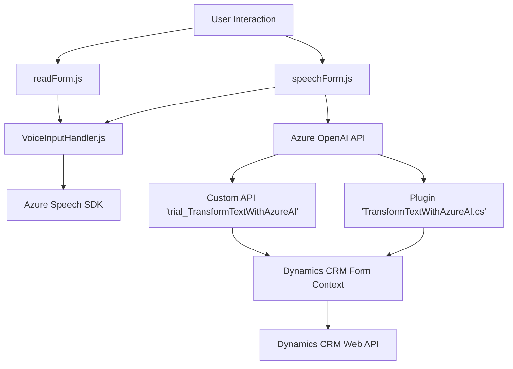

### Breve Resumen Técnico  
Este repositorio representa una solución interactiva centrada en la integración de voz, procesamiento de datos por APIs externas (Azure Speech SDK y Azure OpenAI), y uso de plugins para personalizar la funcionalidad en Microsoft Dynamics CRM. Se trata de una solución que combina frontend, backend a través de plugins y servicios en la nube para mejorar la accesibilidad (texto a voz y entrada por voz) y automatización de procesos con IA.

---

### Descripción de Arquitectura  
La arquitectura general sugerida para este repositorio está basada en un **multi-tier architecture** con componentes frontend, backend y servicios en la nube:

- **Frontend**: En esta capa, hay scripts con funcionalidades de síntesis de voz y captura de comandos de voz utilizando Azure Speech SDK. Los datos se procesan dentro del navegador y luego se integran con el backend. Esto incluye patrones como programación por eventos y modularización.  
- **Backend**: Un plugin .NET en Dynamics CRM que interactúa con servicios de Azure OpenAI API, mediante una integración REST para procesar datos textuales. Este sigue el patrón de integración con servicios REST (Facade).  
- **External Services**: Dos Servicios en la nube (Azure Speech e OpenAI) para interacción por voz y transformación inteligente de texto respectivamente.

La arquitectura completa se puede clasificar como **multi-tier con integración de servicios en la nube**, junto con el uso de patrones web como API integration y procesamiento lógico en el cliente para determinar registros y valores.  

---

### Tecnologías Usadas  
1. **Frontend**:  
   - **JavaScript (JS)**: Principal lenguaje utilizado en los archivos `readForm.js` y `speechForm.js`.  
   - **Azure Speech SDK**: Integación para procesamiento de voz con síntesis y reconocimiento de texto mediante el SDK de Azure Speech.  
   - **HTML/DOM API**: Manipulación de la estructura y datos de los formularios en la web.  
   - **Custom API**: Utilización de una API personalizada para mensajes con IA.

2. **Backend**:  
   - **C# .NET Framework**: Desarrollo de plugins para Dynamics CRM.  
   - **Microsoft Dynamics 365 SDK APIs**: `IPlugin` y `IOrganizationServiceFactory`.  
   - **Azure OpenAI API**: Servicios para transformación de texto mediante modelos como GPT-4.  
   - **REST Client (HttpClient)**: Comunicación entre el plugin y Azure OpenAI.  

3. **Servicios en la nube** (Microservicios):
   - **Azure Speech Service API**: Funciones de síntesis y reconocimiento de voz.
   - **Azure OpenAI API**: Generación y procesamiento de texto basado en inteligencia artificial.

4. **Patrones de diseño**:  
   - **Event-driven programming**: Activación de eventos (carga del SDK, interacción del usuario, análisis de texto).  
   - **Modularización**: Dividir las responsabilidades en funciones pequeñas y específicas.  
   - **Facade pattern**: Plugin en backend que centraliza el acceso a Azure OpenAI.  
   - **Mapper pattern**: Construcción de mapas para relacionar entidades de datos (`label` → `fieldName`).  

---

### Dependencias o Componentes Externos  
- **Azure Speech SDK**: Para síntesis y reconocimiento de voz.  
- **Azure OpenAI**: En el backend, para transformación avanzada de texto.  
- **Dynamics 365 SDK**: Integración de plugins con Microsoft Dynamics CRM.  
- **Custom API (`trial_TransformTextWithAzureAI`)**: Transformación inteligente de datos basada en lenguaje natural generado por IA.  
- **HTTP Client**: Para llamar recursos de REST API.  
- **JavaScript DOM API**: Manipulación estructural y eventos.  

---

### Diagrama Mermaid  
El siguiente diagrama mapea cada componente y flujo de funcionalidades, integrando las dependencias externas.

---

### Conclusión Final  
La solución presentada es un sistema que combina interacción por voz en frontend, procesamiento inteligente de texto en backend y servicios en la nube para accesibilidad y automatización avanzada. Su arquitectura, basada en capas y con integración de APIs, permite modularidad y escalabilidad al usar microservicios como Azure Speech SDK y Azure OpenAI. Es ideal para plataformas empresariales como Dynamics CRM que necesiten incorporar capacidades modernas de IA y accesibilidad multicanal.