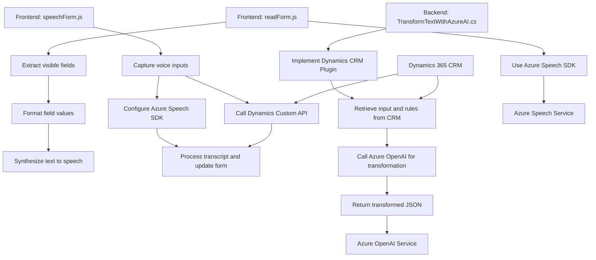

### Breve resumen técnico
El repositorio contiene múltiples archivos que implementan diferentes funcionalidades orientadas al procesamiento de texto o voz en un sistema Dynamics 365 integrado con servicios en la nube de Microsoft Azure. Los objetivos principales incluyen:
1. **Frontend:** Procesamiento de voz y entrada de datos manipulando formularios de Dynamics 365.
2. **Backend/Plugin:** Uso de un plugin para transformar texto utilizando Azure OpenAI Service en Dynamics CRM.

---

### Descripción de arquitectura
La solución se basa en una arquitectura **n capas**:
- **Capa Frontend:** Archivos JavaScript como `speechForm.js` y `readForm.js` representan componentes específicos del frontend que interactúan directamente con los usuarios (captura de datos y presentación).
- **Integración con APIs Externas:** Implementa integraciones con servicios Azure (Speech SDK y OpenAI API) para operaciones avanzadas, como reconocimiento de voz y procesamiento de texto mediante IA.
- **Capa de Plugin CRM:** Implementa una lógica personalizada en el servidor de Dynamics 365 a través de la interfaz de plugin (`IPlugin`) que interactúa con APIs externas y con el backend del CRM.

---

### Tecnologías usadas
#### **1. Frontend:**
- **Lenguaje:** JavaScript.
- **APIs:** 
  - Azure Speech SDK: Para reconocimiento y síntesis de voz.
  - Dynamics 365 Web API: Interacción con el formulario y manipulación de datos.
- **Patrones:** Event-driven programming, modularidad de funciones.

#### **2. Backend Plugin:**
- **Lenguajes:** C# (.NET Framework).
- **Servicios Utilizados:**
  - Azure OpenAI API: Para aplicar transformaciones avanzadas de texto.
  - Dynamics CRM SDK: Para interacción con entidades y datos del sistema.
- **Patrones de Diseño:**
  - Plugin Patterns: Ejecución de lógica personalizada en el contexto CRM.
  - External Service Integration: Uso de servicios externos mediante llamadas REST.
  
#### **3. Cloud:**
- **Microsoft Azure:** 
  - Azure Speech SDK para operaciones de TTS.
  - Azure OpenAI Service para IA generativa de texto.

---

### Dependencias o componentes externos
1. **Microsoft Azure Services:**
   - Speech SDK para manejar reconocimiento y síntesis de voz.
   - OpenAI API para manipular texto generando datos complejos.
2. **Dynamics 365 CRM:**
   - Web APIs y Plugins mediante SDK para gestión de datos en el CRM.
3. **Bibliotecas internas y externas (Backend):**
   - `Newtonsoft.Json` para manipulación de JSON.
   - `HttpClient` para integración con servicios externos.

---

### Diagrama Mermaid

---

### Conclusión final
El repositorio implementa una solución orientada a procesar datos en sistemas CRM (Dynamics 365) mediante dos capas principales: frontend para interacción con el usuario y backend con lógica de plugins para manejar datos avanzados. Además, la solución despliega servicios en la nube de Microsoft Azure para reconocimiento de voz, síntesis de texto y procesamiento generativo basado en IA. La arquitectura sigue el patrón **n capas**, garantizando modularidad y escalabilidad en la integración de APIs externas.