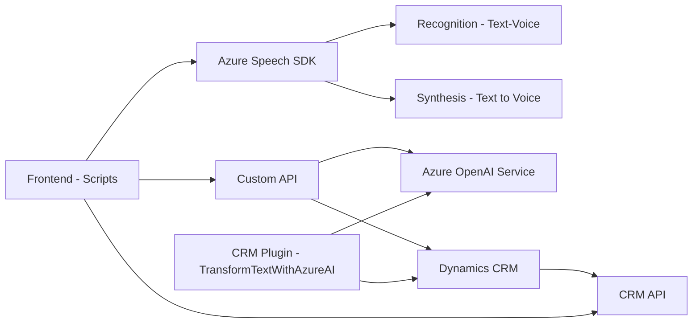

### Breve resumen técnico
El repositorio contiene tres archivos que forman parte de una solución basada en tecnología Microsoft Dynamics CRM y Azure Cloud, implementando funcionalidades avanzadas de reconocimiento de voz, síntesis de audio, procesamiento de formularios y uso de inteligencia artificial para transformación de texto. La estructura sugiere que es un sistema que extiende las funcionalidades de un CRM mediante plugins y componentes que interactúan con un sistema externo (Azure APIs).

---

### Descripción de arquitectura
La solución sigue una arquitectura **orientada a servicios** e implementa patrones específicos como Microservicio y Plug-in Architecture de Dynamics CRM. Se divide en tres capas principales:
1. **Frontend/JS (readForm.js, speechForm.js)**: Compuesto por scripts para manejar la interacción de usuarios a través de un contexto de formularios en el CRM utilizando el SDK de Azure Speech.
2. **Plugin (TransformTextWithAzureAI.cs)**: Responsable de ejecutar lógica específica en el servidor de Dynamics CRM mediante eventos configurados y utiliza Azure OpenAI para realizar transformaciones específicas.
3. **Servicios Externos**: Comunicación bidireccional con APIs proporcionadas por Azure para reconocer voz, sintetizarla y procesar texto mediante AI.

La arquitectura puede ser considerada como **n-capas**, donde las capas principales están separadas por funcionalidad: presentación, negocio/plugin y servicios externos.

Estas capas también están conectadas de manera cohesionada, lo que indica que no se trata de una arquitectura de **microservicios** en su totalidad sino una solución que utiliza microservicios externos como apoyo.

---

### Tecnologías usadas
1. **Azure Speech SDK**:
   - Reconocimiento y síntesis de voz en tiempo real.
   - Configuración mediante claves de Azure Speech API.

2. **Azure OpenAI (GPT):**
   - Procesamiento de texto estructurado con normas gestionadas en JSON.

3. **Microsoft Dynamics CRM SDK**:
   - Gestión del contexto del formulario.
   - Ejecución de plugins y consumo de APIs nativas como `Xrm.WebAPI`.

4. **Backend Plugins (C#)**:
   - Usando librerías .NET y SDK de Dynamics para acceder y gestionar datos.

---

### Dependencias y componentes externos
1. **Azure Speech SDK**:
   - Cargado dinámicamente durante la ejecución.
   - Utiliza claves de autenticación específicas para acceder a servicios de Azure.

2. **Azure OpenAI Service**: 
   - Procesa texto mediante inteligencia artificial para obtener resultados de forma estructurada.

3. **Microsoft Dynamics CRM SDK**:
   - Para la interacción directamente con el entorno y registros del CRM.

4. **Desde el frontend:**
   - Servicios personalizados (API externa) que probablemente realicen tareas adicionales como consultar datos del CRM o enriquecer las transcripciones con IA.

---

### Diagrama Mermaid válido para GitHub

---

### Conclusión final
La solución implementa una extensión de Dynamics CRM que integra la funcionalidad de reconocimiento de voz, procesamiento de formularios, y transformación inteligente de texto utilizando el servicio Azure OpenAI. Su arquitectura es una combinación de **n-capas y plug-in architecture**, donde cada uno de los archivos descritos cumple funciones específicas en la interacción entre el usuario, Dynamics CRM y los servicios externos de Azure. La solución usa técnicas avanzadas de carga dinámica de SDK (patrón cargador dinámico) y delegación de servicios para enriquecer las capacidades del CRM, haciendo uso de tecnologías modernas como el Azure Speech SDK y el Azure OpenAI Service.