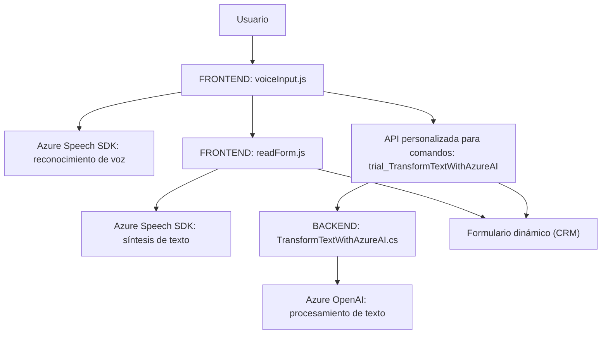

## Breve resumen técnico

Esta es una solución híbrida que combina componentes de frontend y backend. Sus principales funcionalidades incluyen la interfaz por voz para interacción con formularios y procesamiento de comandos hablados utilizando Microsoft Azure Speech SDK, así como un plugin en CRM que emplea Azure OpenAI para transformar texto de forma estructurada. La solución está claramente orientada a mejorar accesibilidad y automatizar procesos en CRM bajo un esquema de colaboración entre servicios externos y lógica interna.

---

## Descripción de arquitectura

La arquitectura de esta solución es **n capas**, donde se distinguen claramente:
1. **Capa de presentación**: Archivos como `readForm.js` y `voiceInput.js` funcionan en el cliente (browser), interactuando directamente con formularios CRM.
2. **Capa de lógica de negocio**: Representada por el plugin en Dynamics CRM (`TransformTextWithAzureAI.cs`) que aplica reglas específicas y consume servicios de Azure AI.
3. **Capa de servicios externos**: Conexión con APIs de Microsoft Azure Speech SDK para síntesis/reconocimiento de voz y Azure OpenAI para procesamiento de comandos.

El patrón de diseño observado es una integración cliente-servidor con procesamiento en la nube. Dentro de cada capa, se emplean características moduladas y orientación basada en eventos.

---

## Tecnologías usadas

1. **Frontend**:
   - **JavaScript** para interacción con formularios CRM y Azure SDK.
   - **Microsoft Azure Speech SDK** para reconocimiento y síntesis de voz.

2. **Backend**:
   - **C#** para lógica de negocio en el plugin (Dynamics CRM).
   - **Azure OpenAI** como servicio externo para procesamiento de texto avanzado.

3. **Dependencias adicionales**:
   - Frameworks y librerías:
     - `Newtonsoft.Json`, `System.Text.Json`, `System.Net.Http` para manipulación de JSON y comunicación con servicios externos.
   - Dynamics CRM SDK: Para registrar y ejecutar plugins.

---

## Diagrama Mermaid

---

## Conclusión final

La solución está diseñada con una arquitectura **n capas**, optimizando la interacción entre la interfaz de usuario y el servidor. Es apta para entornos empresariales donde la integración con servicios como **Dynamics CRM** y **Microsoft Azure** es esencial. Destaca por su uso extendido de patrones de modularización y eventos, donde la comunicación entre cliente y backend es esencial para cumplir el propósito de mejorar la experiencia del usuario mediante comandos de voz y procesamiento avanzado de texto.

Se sugiere mantener la modularización actual, optimizar la gestión de errores en el plugin y explorar mejoras en el manejo de dependencias para minimizar acoplamientos entre servicios externos y lógica interna.