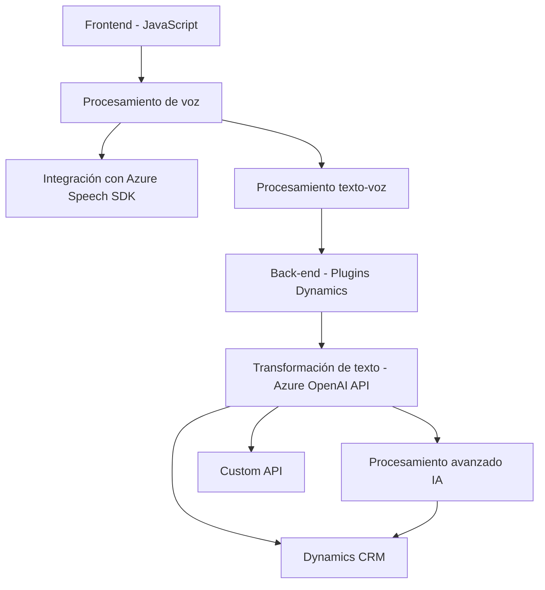

# Breve resumen técnico

El proyecto es una solución que integra el procesamiento de voz y texto con formularios en Dynamics CRM, utilizando Azure Speech SDK y Azure OpenAI API para análisis y transformación de información en tiempo real. Implementa diferentes funcionalidades en un frontend interactivo, un motor de procesamiento de voz y un plugin integrado en Dynamics.

---

# Descripción de arquitectura

La solución aplica una arquitectura **n-capas** con integración de servicios externos. A nivel conceptual:
1. La **capa de presentación** (frontend) gestiona la interacción del usuario con formularios y procesamiento de voz. 
2. La **capa de negocio** realiza el procesamiento avanzado de texto y datos (mediante API y Azure Speech SDK).
3. La **capa de datos** está representada por la interacción con Dynamics CRM como repositorio de datos, configurando los valores en formularios.
4. En la **capa de integración**, usa múltiples APIs externas, como Azure Speech SDK y OpenAI REST API.

---

# Tecnologías usadas
1. **Frontend**:
   - ECMAScript (JavaScript).
   - Integración con Azure Speech SDK vía navegador.

2. **Backend y Plugins**:
   - Dynamics CRM SDK (`Microsoft.Xrm.Sdk`).
   - C#.
   - Azure OpenAI REST API.
   - `Newtonsoft.Json` y `System.Text.Json` para manejo de JSON.
   - `System.Net.Http` para solicitudes HTTP.

3. **Patrones y enfoques**:
   - **Modularización**: Crea funciones responsables de tareas específicas (p.ej., `startVoiceInput`, `applyValueToField`).
   - **Integración API**: Dependencias externas como Azure REST APIs y Dynamics CRM.
   - **Singleton-like HttpClient**: Para solicitudes HTTP.
   - **Plugin pattern**: Extiende funcionalidades de Dynamics CRM mediante `IPlugin`.

---

# Diagrama Mermaid válido para GitHub

---

# Conclusión final

Esta solución combina tecnologías frontend (JavaScript y Azure SDK) con una integración profunda del backend de Dynamics CRM (a través de plugins en C# que utilizan la unión de APIs externas: Azure Speech SDK y Azure OpenAI API). Aplica una arquitectura n-capas con elementos de modularización y eventos en el frontend, procesamiento y negocio en los plugins, y almacenamiento de datos en Dynamics CRM. La solución es efectiva para casos donde se requiere procesamiento de datos dinámicos a través de voz y síntesis de texto.