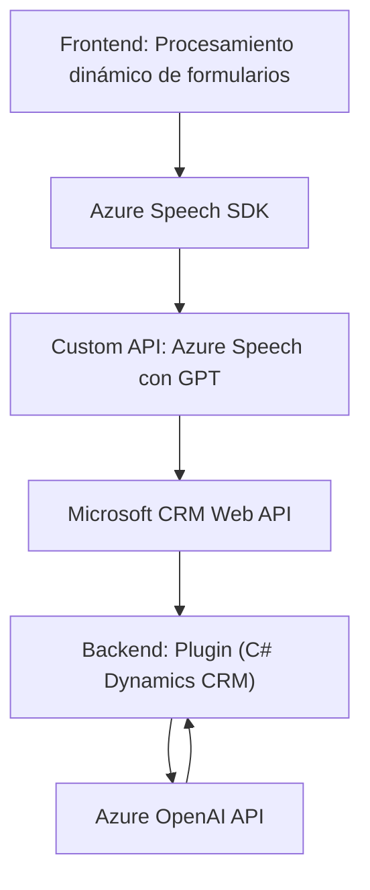

### Resumen técnico
El repositorio contiene elementos orientados al trabajo con datos de formularios dinámicos, utilizando entrada de voz y conversión de texto a voz mediante **Azure Speech SDK** y transformación de texto con **Azure OpenAI API**. Los archivos están organizados en componentes frontend y plugins para **Microsoft Dynamics CRM**.

---

### Descripción de arquitectura
- **Tipo de solución:** Mixta:
  - **Frontend:** Utiliza JavaScript para controlar interacción dinámica de voz y formularios.
  - **Backend:** Plugin desarrollado en C# para integrar lógica avanzada de transformación de texto con Dynamics CRM y OpenAI API.
- **Arquitectura:** 
  - Combina dos enfoques principales:
    - **Arquitectura de n-capas:** Divide responsabilidades entre la capa de presentación (frontend), capa lógica del CRM (plugin), y servicios externos.
    - **Servicio externo:** Usa Azure Speech SDK y OpenAI mediante servicios externos en la nube. El diseño promueve integración de microservicios para tareas específicas como transcripción y transformación del texto.
  - El uso modular de funciones permite procesamiento secuencial y organiza las interacciones del sistema.

---

### Tecnologías usadas
1. **Frontend:**
   - Lenguaje: JavaScript.
   - Dependencias:
     - **Azure Speech SDK** para síntesis de voz y transcripción.
     - Manipulación de DOM para formularios dinámicos.
   - Patrones:
     - Modularidad: Organización en funciones individuales relacionadas con carga de SDK, procesamiento de datos y manipulación del formulario.
     - Pipeline: Procesamiento estructurado para las tareas de entrada de datos y conversión a voz.

2. **Backend:**
   - Lenguaje: C# (CLR compatible).
   - Frameworks:
     - **Microsoft Dynamics SDK**: Implementación de plugins en CRM.
     - Dependencias internas (`System.Net.Http`, `System.Text.Json`) para manejar solicitudes y procesamiento de datos.
   - Servicios:
     - **Azure OpenAI API:** Procesamiento de texto con inteligencia artificial (GPT-4).
   - Patrones:
     - Plugin Architecture: Enfoque basado en la integración con Dynamics CRM.
     - API Integration: Uso directo de servicios externos.

---

### Diagrama Mermaid válido para GitHub
El siguiente diagrama muestra las interacciones principales entre componentes:

---

### Conclusión final
La solución demuestra una ejecución efectiva de integración entre frontend, API externas y backend mediante el plugin de Microsoft Dynamics CRM, capitalizando lo mejor de servicios en la nube como Azure Speech SDK y Azure OpenAI API. Está diseñada para manejar datos de formularios dinámicos transformados por entrada y salida de voz e inteligencia artificial, logrando modularidad, extensibilidad y eficiencia operativa.

Este enfoque es ideal para entornos que buscan mezclar interacción avanzada de usuarios con modelos de datos enriquecidos por inteligencia artificial en sistemas empresariales.