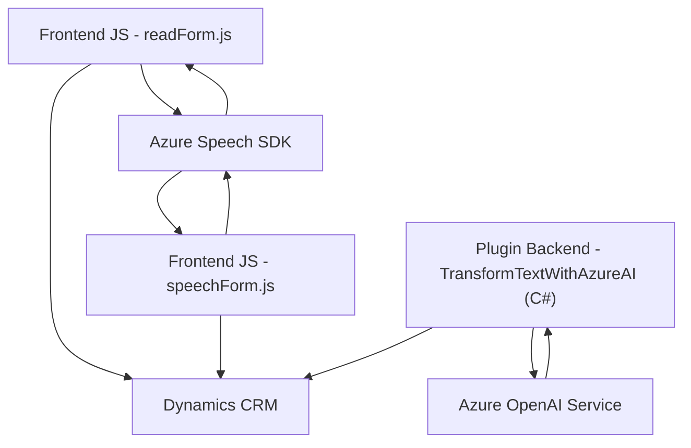

### Breve resumen técnico
En este repositorio, se observa una combinación de archivos que integran funcionalidades de reconocimiento de voz, síntesis de voz, manipulación de datos en formularios y extensión de Dynamics CRM mediante plugins. Las tecnologías principales incluyen **Azure Speech SDK**, **Azure OpenAI** y **Dynamics CRM SDK**, configuradas en funciones y métodos específicos para una arquitectura que facilita la accesibilidad y automatización.

---

### Descripción de arquitectura
La arquitectura del sistema es una combinación de:
1. **Arquitectura n capas**:
   - Se tiene claramente separada la lógica del frontend (JavaScript) de la lógica de procesamiento basada en plugins (.NET, C#), que interactúan con APIs externas como Azure OpenAI.
   - El frontend realiza el manejo de datos en formularios y su traducción en texto o voz.
2. **Microintegración**:
   - Los plugins en C# representan pequeñas unidades funcionales que consumen servicios externos como Azure Speech SDK y Azure OpenAI para procesar y transformar datos.
3. **Workflows contextuales**:
   - El uso intensivo de `executionContext` en formularios refleja una integración directa con Dynamics CRM. Los componentes están diseñados para trabajar dentro de este ecosistema, entregando información procesada en tiempo real.

---

### Tecnologías usadas
1. **Frontend (JavaScript)**:
   - **Azure Speech SDK**: Para interacción con texto a voz y reconocimiento de voz.
   - ECMAScript (JavaScript) para la lógica del cliente.
   - Frameworks integrados en Dynamics CRM, como el manejo del `executionContext`.
2. **Backend (C#, Dynamics CRM Plugin)**:
   - **Azure OpenAI Service** para solicitudes de procesamiento de lenguaje natural y generación de texto.
   - **Dynamics CRM SDK**: Extiende funcionalidades del CRM, gestionando datos del entorno organizacional.
   - **JSON (Newtonsoft.Json)** para manejo estructurado de datos.
3. **Dependencias externas**:
   - Servicios REST como endpoints de Azure.
   - Recursos externos cargados dinámicamente, como el script del Azure Speech SDK.

---

### Diagrama Mermaid (válido para GitHub)

---

### Conclusión final
Este repositorio representa una solución integrada orientada a la accesibilidad y manejo de datos en formularios de Dynamics CRM. Gestiona interacciones naturales de usuarios mediante voz, interfaces de texto y manipulación directa de los datos del CRM. La solución aprovecha componentes estándar y reconocidos como **Azure Speech SDK**, **Azure OpenAI** y **Dynamics CRM API**, en una arquitectura de múltiples capas con elementos de microintegración para consumir servicios externos. Es ideal para ambientes corporativos con alta dependencia de Microsoft Dynamics y con necesidades de accesibilidad y automatización.