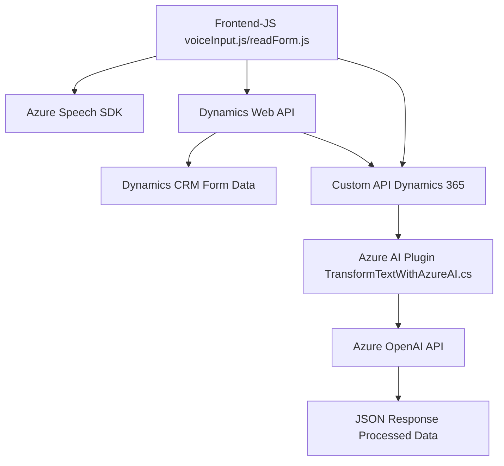

### Breve resumen técnico:
La solución consiste en un sistema que integra reconocimiento de voz, síntesis de texto a voz, y transformación de comandos mediante inteligencia artificial, diseñado para interactuar con formularios dinámicos en Microsoft Dynamics CRM. Incluye componentes frontend basados en JavaScript, integrados con servicios de Azure Speech y Dynamics 365 Web API, además de un plugin en C# para la transformación de texto con Azure OpenAI.

---

### Descripción de arquitectura:
La arquitectura combina elementos de **cliente-servidor** en un esquema de **n-capas**, soportando un frontend basado en JavaScript, que oficia también como un cliente para los servicios de Azure Speech SDK y Dynamics Web API, y un backend que utiliza un plugin (C#) en Dynamics CRM para la integración de Azure OpenAI. 

El diseño exalta modularidad y separación de intereses:
1. **Frontend (JS)**: 
   - Procesa el reconocimiento de voz y comunica datos de formularios con Dynamics.
   - Relaciona el procesamiento de eventos, conversión dinámica de datos de formulario, y construcción de mapeos dinámicos de atributos.
2. **Plugin (C#)**:
   - Opera como una pieza de dominio de Dynamics CRM para solicitar operaciones específicas al servicio de Azure OpenAI.

Por su uso de servicios de Azure Speech SDK y Azure OpenAI, además de múltiple interacción con Dynamics 365 Web API, la solución se aproxima más a un **microservicio externo** o integración de funcionalidad **IA en CRM**.

---

### Tecnologías utilizadas:
1. **Frontend**:
   - Lenguaje: JavaScript.
   - Azure Speech SDK: Reconocimiento y síntesis de voz.
   - Dynamics 365 Web API: Permite conectividad a formularios de Dynamics CRM.
2. **Plugin/back-end**:
   - Lenguaje: C#.
   - Framework: Microsoft Dynamics SDK.
   - Azure OpenAI: Comunicación con un servicio de modelado de lenguaje natural.
   - HTTP client (`System.Net.Http`): Envía y recibe datos desde Azure OpenAI.
   - JSON serialization (`System.Text.Json`, `Newtonsoft.Json`, etc.): Procesa datos estructurados JSON.

**Patrones aplicados**:
- **Modularización**: División de función lógica con alta cohesión y acoplamiento bajo.
- **Event-driven programming**: Principalmente en los flujos de voz y procesamiento de datos en el frontend.
- **Cliente-Servicio**: Integración con servicios de Azure y Dynamics API.
- **N-capas**: Separación entre frontend y backend con conectividad mediante API.

---

### Diagrama Mermaid:

---

### Conclusión final:
La solución representa un sistema **n-capas** con soporte para reconocimiento y síntesis de voz, procesamiento de lenguaje natural basado en IA (Azure OpenAI), y manipulación de datos proporcionados en formularios dinámicos en Dynamics CRM. La arquitectura combina recursos de **cliente-servidor** distribuidos, donde cada componente realiza tareas específicas en forma modular. Su uso de SDK y servicios externos apunta a un diseño escalable con un alto nivel de integraciones empresariales. 

Los componentes pueden ser mejorados en términos de organización (como la optimización de imports no utilizados), pero su diseño y el uso de tecnologías como Azure Speech SDK y Dynamics Web API demuestran una solución bien enfocada en un dominio empresarial.