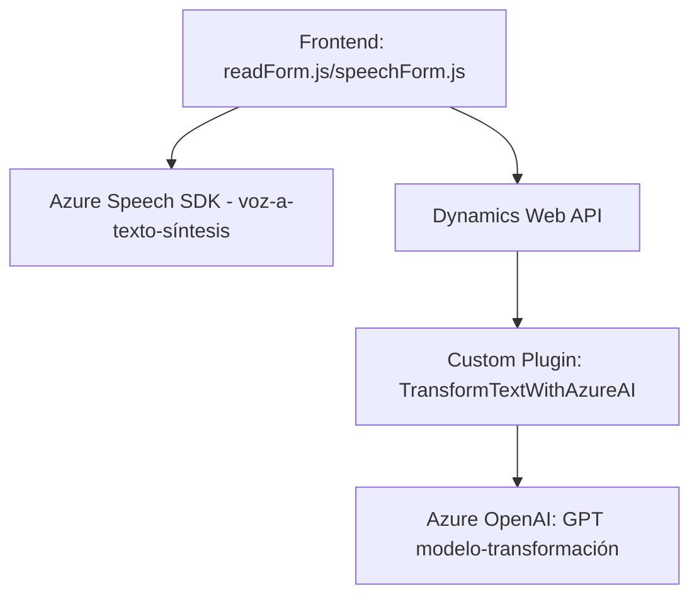

### Breve Resumen Técnico

El repositorio presenta una solución basada en tres componentes principales:
1. **Frontend**: Permite la interacción con formularios mediante la voz, utilizando tecnologías como el Azure Speech SDK. Implementa accesibilidad y mejora la experiencia del usuario.
2. **Backend (plugin)**: Define un plugin en Dynamics CRM que conecta con Azure OpenAI para transformar texto según reglas específicas mediante modelos GPT.
3. **Servicios Externos**: Se integra con APIs de Azure, como Speech SDK y OpenAI, para proporcionar funcionalidad avanzada en procesamiento y síntesis de texto y voz.

### Descripción de Arquitectura

La solución puede clasificarse como una **arquitectura basada en servicios externos**, siendo híbrida:
- El **Frontend** opera como una capa de interacción enfocada en el usuario, integrándose con el backend mediante Dynamics 365 Web API y APIs de Azure.
- El **Backend (plugin)** actúa como middleware, centralizando el procesamiento. Utiliza un enfoque de microservicio para delegar la lógica compleja en una API externa (Azure OpenAI).
- La arquitectura general no es completamente desacoplada debido a la dependencia del entorno de Dynamics 365, pero sigue patrones de modularidad y delegación.

Se asemeja al **patrón de arquitectura n-capas**:
- **Capa de presentación**: La interfaz de usuario que permite entrada por voz y síntesis.
- **Capa de lógica de negocio**: Plugins de Dynamics que conectan con servicios de Azure.
- **Capa de integración**: API externas de Azure OpenAI y Speech SDK.

### Tecnologías Usadas

1. **Frontend**:
   - **JavaScript** para lógica de procesamiento.
   - **Azure Speech SDK**: Para reconocimiento y síntesis de voz.
   - **Dynamics Web API**: Gestiona la integración con campos de los formularios.

2. **Backend** (Plugins):
   - **C#**: Código en el framework de Dynamics CRM.
   - **Newtonsoft.Json** y **System.Text.Json**: Manipulación de JSON.
   - **Azure OpenAI**: Provee transformación avanzada de texto.

3. **Otros Patrones**:
   - **Callback-driven**: Uso de callbacks para cargar scripts dinámicamente.
   - **Asincronía (async/await)** en la interacción con APIs.
   - **Encapsulación**: Lógica organizada en funciones y clases específicas.
   - **MVC-like design**: Adopción de principios similares al patrón MVC en las interacciones con formularios.

### Diagrama Mermaid

### Conclusión Final

La solución muestra una integración robusta entre un frontend accesible basado en voz y un backend que delega la lógica avanzada a APIs externas de Azure. Su arquitectura es modular y basada en múltiples capas, aunque depende estrechamente del entorno Dynamics CRM. La elección de Azure Speech SDK y OpenAI refleja una clara orientación hacia la nube y servicios externos, lo que permite escalar y mantener la solución con facilidad.

Se recomienda considerar oportunidades futuras de desacoplar el backend para que pueda operar fuera de Dynamics CRM si la necesidad así lo requiere. Además, podría explorarse un enfoque más completo de **microservicios** si se busca aislar el procesamiento de esa dependencia.