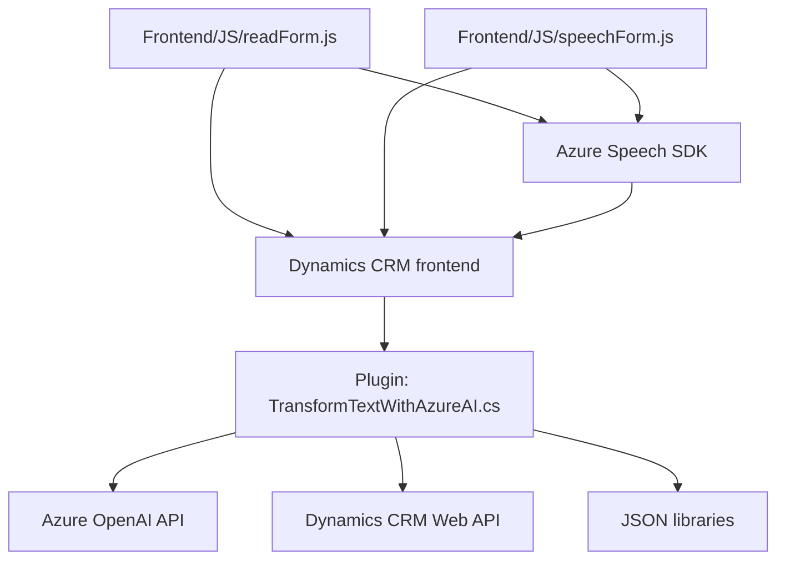

## Breve Resumen Técnico
El repositorio contiene elementos de un sistema cuya finalidad es integrar funcionalidades de entrada y salida de datos mediante reconocimiento y síntesis de voz, apoyándose en Azure Speech SDK y un plugin para transformar texto con Azure OpenAI en formato JSON. Este sistema se inserta dentro de un entorno de **Microsoft Dynamics CRM** para automatizar el procesamiento de formularios, mediante mapeo de transcripciones a campos de CRM, con soporte para diferentes formatos de datos. 

---

## Descripción de Arquitectura
La arquitectura del repositorio puede clasificarse como **n capas** con componentes distribuidos en:
1. **Presentación (Frontend)**: Módulos JavaScript que interactúan con tecnologías frontend, el SDK Azure Speech y Microsoft Dynamics CRM.
2. **Lógica de Negocio**: Representada por las funciones en los archivos de `FRONTEND/JS` y el plugin `"Plugins/TransformTextWithAzureAI.cs"`. Las operaciones complejas se orquestan aquí, gestionando integraciones con servicios externos como Azure Speech y Azure OpenAI.
3. **Acceso a Datos**: Mediante el uso de la API de Dynamics CRM (`Xrm.WebApi`) y el acceso HTTP a Azure OpenAI en el backend (C# con .NET).

Las comunicaciones principales se ejecutan mediante un esquema **event-driven** y están orientadas hacia la integración de servicios externos.

---

## Tecnologías Usadas
- **JavaScript**: Punto de entrada para la interacción del usuario en el backend de Dynamics CRM, con dependencias como el Azure Speech SDK.
- **Microsoft Dynamics CRM SDK**: Específicamente, los APIs relacionados con manipulación de datos del sistema CRM (e.g., `Xrm.WebApi`, `getAttribute`, `setValue`).
- **Azure Speech SDK**: Para síntesis de voz desde texto y reconocimiento de voz en la interfaz cliente.
- **Azure OpenAI API**: Procesamiento avanzado de texto mediante Machine Learning.
- **C# + .NET Framework**: Plugin para Dynamics CRM que orquesta transformaciones de texto con inteligencia artificial.
- **Newtonsoft.Json** y **System.Text.Json**: Para serialización y deserialización en estructuras JSON.
- **HttpClient (C#)**: Para comunicación con APIs externas.

---

## Diagrama Mermaid

---

## Conclusión Final
Este repositorio se basa en una arquitectura de **n capas** que integra una solución de front-end en JavaScript y un plugin en C#. El propósito es implementar automatización en el entorno de Dynamics CRM mediante servicios externos en la nube como **Azure Speech SDK** y **Azure OpenAI API**. Se hace uso de componentes modulares con distintas responsabilidades, buenas prácticas como separación de responsabilidades, y un enfoque en patrones de integración de servicios externos. Esto permite construir un sistema altamente extensible y escalable para la gestión de formularios y procesamiento de datos.