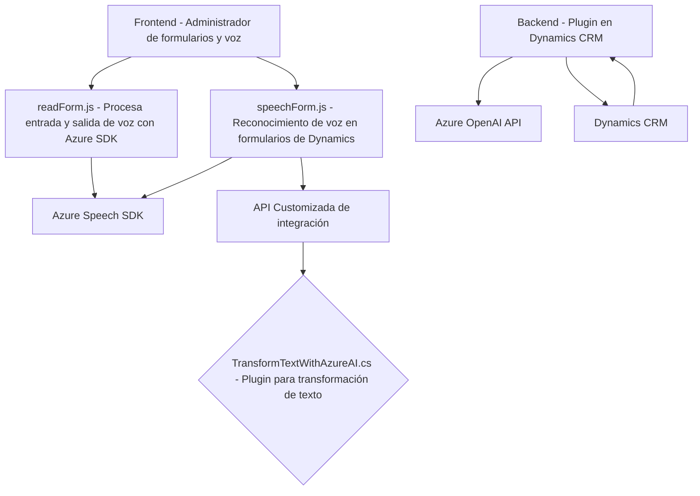

### Breve Resumen Técnico
Este repositorio contiene tres archivos principales con componentes que están destinados a trabajar en conjunto para proporcionar funcionalidades avanzadas relacionadas con la entrada y salida de voz, y la interacción con formularios y APIs externas. Utilizan tecnologías como **Azure Speech SDK** y **Azure OpenAI API** integradas con la plataforma **Microsoft Dynamics 365 CRM**.

---

### Descripción de Arquitectura
1. **Tipo de solución:** Este conjunto de archivos describe una integración de **Microsoft Dynamics 365** que utiliza componentes frontend (interacción con usuario) y backend (plugins de Dynamics y llamadas a APIs externas). La solución se configura como una parte de un sistema más grande para dinamizar la entrada y procesamiento de voz, y proporcionar capacidades avanzadas utilizando inteligencia artificial.

2. **Arquitectura general:** La arquitectura está diseñada bajo el modelo de **n-capas** con separación clara de capas de lógica:
   - Frontend (interacciones con usuario).
   - Backend (plugins y gestión de datos en Dynamics CRM).
   - Integración con servicios externos (Azure Speech y OpenAI).

   Además, ciertos componentes implementan principios del **patrón hexagonal**, en particular con sus interfaces para interactuar tanto con Dynamics como con APIs externas.

3. **Patrones y tecnologías empleadas:**
   - **Patrones:**
     - **Event-driven:** Uso de callbacks para la carga asíncrona de SDKs.
     - **Integration Pattern:** Integración con servicios SaaS externos.
     - **Dynamic Forms Interaction:** Mecanismos para interactuar con formularios de Dynamics CRM.
     - **Stateless Logic:** Plugins y funciones son independientes del estado interno.
     - **SDK Wrapper:** Abstracción sobre las APIs de Speech SDK y Dynamics 365.
   - **Tecnologías/frameworks:**
     - **Frontend:** JavaScript (modular, con funciones que dividen responsabilidades).
     - **Backend:** Microsoft Dynamics 365 SDK, .NET framework, Azure OpenAI API.
     - **Azure Services:** Speech SDK y OpenAI API.

---

### Dependencias Externas
1. **Azure Speech SDK**: Para reconocimiento y síntesis de voz.
2. **Azure OpenAI API**: Inteligencia artificial para simplificar energía de procesamiento de texto.
3. **Xrm.WebApi**: Librería interna de Dynamics para interactuar con datos del CRM.
4. **HTTP Client Libraries**: Para integrarse con las APIs externas mencionadas (e.g., Azure SDK).

Estas dependencias permiten que los archivos en el repositorio implementen su funcionalidad.

---

### Diagrama Mermaid

A continuación se proporciona un diagrama **Mermaid** para representar el flujo entre los diferentes componentes. Este diagrama sigue las reglas establecidas para compatibilidad con **GitHub Markdown**.

---

### Conclusión Final
Esta solución se centra en proporcionar una integración de voz avanzada con Microsoft Dynamics 365 utilizando tanto una capa frontend en JavaScript como un plugin en .NET para el backend. Utiliza APIs y SDKs externos (Azure Speech y Azure OpenAI) con Dynamics CRM para crear una experiencia de usuario fluida y funcional en la captura y procesamiento de voz.

El uso de Azure Speech SDK y OpenAI API evidencia que el sistema está diseñado para ser parte de un ecosistema conectado en la nube, aprovechando la integración SaaS para expandir las capacidades de Dynamics CRM.

Si bien el diseño muestra modularidad y separación de responsabilidades, se podrían mejorar aspectos como la parametrización de claves y regiones para evitar datos sensibles en el código fuente. Este enfoque permitiría una mayor flexibilidad y seguridad en la gestión de entornos y configuraciones.