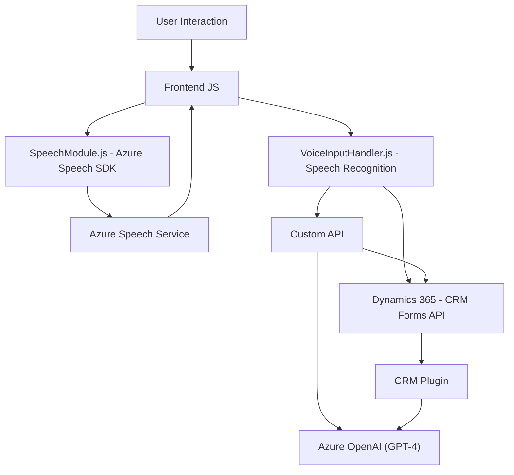

### Breve resumen técnico
El repositorio presenta una solución basada en la integración de **sistemas externos** (Azure Speech SDK y Azure OpenAI) con **Microsoft Dynamics 365**, para habilitar funcionalidades avanzadas como síntesis y reconocimiento de voz, además de transformación semántica y estructuración de datos a través de una API personalizada. 

Está diseñado como una **extensión modular y orientada a microservicios** que permite enriquecer la experiencia de usuario y automatizar la interacción con formularios.

---

### Descripción de arquitectura
La arquitectura planteada es una **híbrida de n-capas y microservicios**. Se reconoce la separación de responsabilidades en:
1. **Frontend**: Proceso y manejo de interacción visual del usuario y del SDK de Azure Speech.
2. **Backend como Plugin**: Plugin en Dynamics CRM para consumir APIs externas con Azure OpenAI y gestionar lógica de negocio dentro del CRM.
3. **Microservicios**: Servicios externos delegados a Azure para tareas específicas como transcripción de voz y transformación de texto.

Los componentes están organizados de forma **modular**, asegurando eficiencia y escalabilidad para extender funcionalidad sin modificar el núcleo del sistema.

---

### Tecnologías usadas
- **Frontend (JavaScript)**:
  - Azure Speech SDK (https://aka.ms/csspeech/jsbrowserpackageraw).
  - Dynamics 365 (Xrm API).
  - Integración con APIs externas (llamadas dinámicas).

- **Backend (.NET/C#)**:
  - Microsoft Dynamics CRM Plugin Framework.
  - Azure OpenAI GPT-4 (usando `System.Net.Http` y `Newtonsoft.Json`).
  - Serialización JSON (`System.Text.Json`).

- **Arquitectura y patrones**:
  - **Modular**: Separación de funcionalidades clave en diferentes funciones y controladores.
  - **Microservicios y Gateway**: Uso de servicios externos como Azure Speech y OpenAI para encapsular tareas específicas.
  - **Builder**: Configuración dinámica de objetos (como `SpeechConfig`).
  - **Facade**: Las funciones principales (ej. `startVoiceInput`) encapsulan la lógica interna del SDK.
  - **Adapter/Dynamic Loading**: Realización de carga de recursos externos como el SDK de Azure en tiempo de ejecución.

---

### Diagrama Mermaid válido para GitHub

---

### Conclusión final
La solución presentada en el repositorio integra varias tecnologías modernas fusionando un enfoque modular y escalable. Está diseñada para interactuar de forma eficiente con servicios externos como **Azure Speech SDK** y **Azure OpenAI**, aplicando los principios de **microservicios** para delegar responsabilidades específicas fuera del sistema principal. 

Es una excelente elección para organizaciones que requieren automatización en procesos basados en inteligencia artificial, como reconocimiento de voz, síntesis de texto y procesamiento inteligente de datos en aplicaciones empresariales como Dynamics 365. Sin embargo, este tipo de solución tiene dependencias críticas en los servicios externos; cualquier interrupción puede impactar el funcionamiento. Una estrategia como el uso de reserva o fallback para los servicios externos sería recomendable.