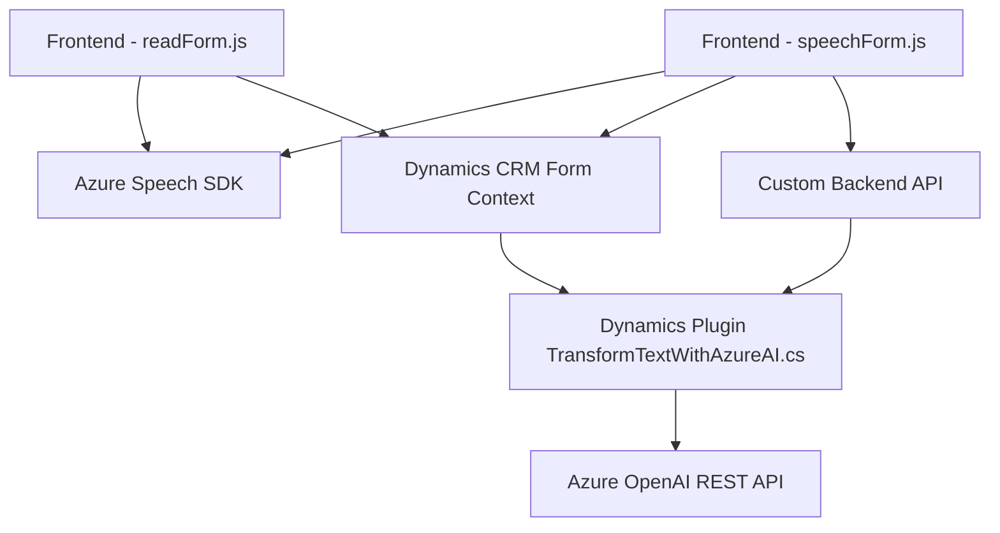

### Breve resumen técnico
Este repositorio contiene una solución que combina **frontend JavaScript** y **backend CRM plugins**, integrando servicios como Azure Speech SDK y Azure OpenAI API. La solución está centrada en la interacción por voz (síntesis y entrada) con formularios web, probablemente en el contexto de Microsoft Dynamics CRM (un sistema usado comúnmente para gestión de relaciones con clientes).

### Descripción de la arquitectura
La estructura del código sugiere una **arquitectura en capas adaptada a servicios externos**, donde cada componente tiene una responsabilidad específica. Los componentes comunicados son:
1. El **frontend (readForm.js y speechForm.js)** proporciona entrada y salida de datos mediante la interacción de un usuario con un formulario (mediante voz y texto).
2. El **backend plugin TransformTextWithAzureAI.cs** actúa como la capa de lógica personalizada de Dynamics CRM, delegando la transformación de texto a un servicio externo (Azure OpenAI).

Esta arquitectura utiliza integración basada en APIs entre frontend, backend y servicios como Azure Speech SDK y Azure OpenAI.

### Tecnologías usadas
1. **Frontend:**
   - **JavaScript:** Scripts para interacción por voz y procesamiento de formularios.
   - **Azure Speech SDK:** Para síntesis de voz y reconocimiento de voz.
   - **Microsoft Dynamics CRM Framework:** Para manipulación de datos dentro de formularios del sistema.

2. **Backend:**
   - **C# y Microsoft Dynamics CRM SDK:** Para implementar plugins que extienden la funcionalidad del CRM.
   - **REST API (Azure OpenAI):** Para texto y procesamiento con IA.
   - **System.Net.Http, Newtonsoft.Json.Linq, System.Text.Json:** Para consumir y gestionar las respuestas del servicio REST de Azure OpenAI.

### Diagramas **Mermaid** para GitHub Markdown

### Conclusión final
Esta solución combina tecnologías de frontend y servicios externos (Azure Speech SDK, Azure OpenAI API) con un backend **plugin dinámico de CRM**. La arquitectura sigue un enfoque **event-driven** y se adapta al patrón de **integración de servicios** con APIs externas.

Este diseño es adecuado para sistemas que requieren extensibilidad y uso de servicios avanzados como IA o reconocimiento de voz, manteniendo la lógica principal modular y fácilmente integrable en ecosistemas corporativos como Microsoft Dynamics CRM.