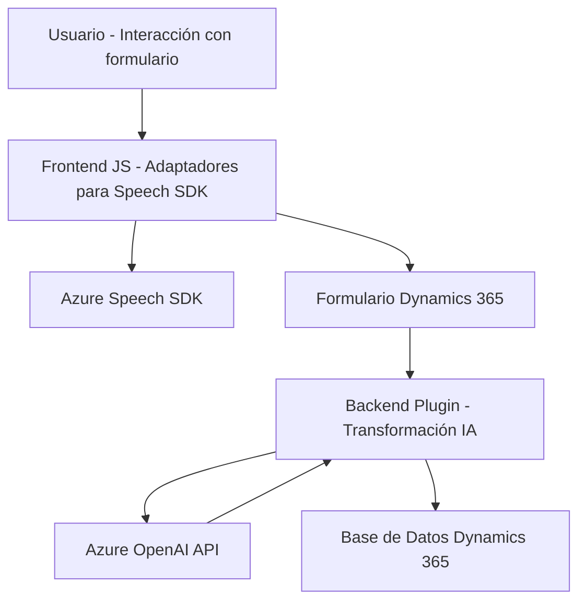

### Breve resumen técnico

El repositorio contiene componentes relacionados con la integración de tecnologías de Azure, especialmente para el reconocimiento de voz y la transformación de texto en un formato estandarizado para su uso en un sistema CRM (Dynamics 365). Incluye código frontend en JavaScript para la manipulación de formularios con interacción vocal y el backend, un plugin en C#, que se integra con Dynamics CRM para transformar texto utilizando Azure OpenAI.

---

### Descripción de arquitectura

1. **Tipo de solución**:
   - La solución consiste en una combinación de **frontend** (interfaz web en JavaScript) y un **plugin backend** desarrollado en C#. Es un sistema híbrido que proporciona interfaces de entrada y procesamiento de datos para formularios en un entorno Dynamics 365.

2. **Arquitectura**:
   - **Capas**:
     - **Frontend**: Interactúa directamente con el usuario y conecta con Azure Speech SDK y el backend mediante APIs o servicios.
     - **Backend**: Extiende la funcionalidad del entorno de Dynamics 365 con plugins para procesamiento avanzado y almacenamiento.
   - **Modelo híbrido n-capas**:
     - La interacción entre servicios externos (Azure Speech SDK, Azure OpenAI) y el sistema interno (Dynamics 365) sigue principios de modularización y desacoplamiento.
   - La arquitectura se encuentra entre un modelo de **arquitectura modular** y **hexagonal** (puertos y adaptadores), debido a la integración de sistemas externos como APIs de Azure.

---

### Tecnologías usadas
1. **Frontend**:
   - **JavaScript**: Para el manejo de lógica de formularios y el enlace con SDKs externos.
   - **Azure Speech SDK**: Suministro de texto a voz y voz a texto gracias a servicios de Microsoft.
   - **DOM Manipulation**: Carga dinámica y actualización de elementos HTML.
   - **CRM Dynamics API**: Comunicación directa mediante el modelo Xrm.
   
2. **Backend**:
   - **C#**: Lenguaje de implementación de plugins.
   - **Microsoft Xrm.SDK**: Para creación, actualización y operación dentro del entorno Dynamics.
   - **Azure OpenAI**: Servicio para transformar texto en información estructurada según normas mediante IA.
   - Serialización de datos: Uso de `Newtonsoft.Json` y `System.Text.Json` para manejar JSON.
   
3. **General**:
   - Patrón de delegación para cargar SDKs y manejar dependencias condicionales.
   - Integración mediante **API RESTful** con servicios externos.

---

### Dependencias o componentes externos
1. **Azure Speech SDK**: Usado para voz a texto y text-to-voice en el frontend.
2. **Microsoft Dynamics CRM (Xrm)**: Contexto para formularios y gestión de entidades en el backend.
3. **Azure OpenAI**: Procesamiento de texto y transformación a JSON con servicios IA.
4. **Node.js**, probablemente necesario para gestión dinámica de dependencias del frontend.
5. **Newtonsoft.Json** y **System.Text.Json**: Serialización JSON en el backend.

---

### Diagram **Mermaid** 100% compatible con GitHub Markdown

---

### Conclusión final

La solución representa una integración avanzada entre tecnologías de Azure y un sistema CRM como Dynamics 365. Su implementación refleja principios modernos como la modularidad, adaptadores para servicios externos, y soporte para procesamiento inteligente mediante Azure OpenAI.

El diseño favorece la automatización tanto en la entrada (voz) como en el procesamiento (texto). Sin embargo, existen áreas de mejora como la gestión de credenciales y la configuración externa para que sea más segura y mantenible a largo plazo.