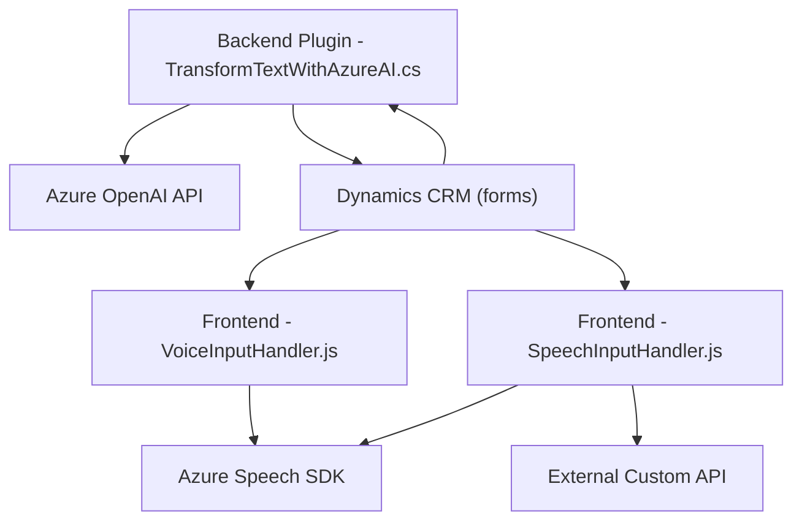

### Breve resumen técnico:
El repositorio contiene archivos que implementan lógica para integrar capacidades de síntesis y reconocimiento de voz utilizando Azure Speech SDK y procesamiento de texto semántico con Azure OpenAI. Los archivos abarcan funcionalidad de frontend JavaScript, dinámica en formularios personalizados, y un plugin de Microsoft Dynamics CRM orientado a procesamiento de texto con IA.

---

### Descripción de arquitectura:
1. **Tipo de solución**:
   La solución es una combinación de:
   - **Frontend**: para manejo dinámico de formularios y síntesis/entrada de voz.
   - **Backend**: con un plugin que interactúa con servicios externos (Azure OpenAI) desde Microsoft Dynamics CRM.
   - **Microservicio externo**: Azure Speech SDK y Azure OpenAI actúan como servicios remotos.

2. **Arquitectura**:
   - Modular y desacoplada: El repositorio muestra una implementación basada en **componentes funcionales autónomos**, diseñados para manipular formularios mediante mapeo de datos y generación de solicitudes API.
   - Los patrones **Callback** y **Reactor Pattern** son usados extensamente en funciones de frontend.
   - La parte de Dynamics CRM sigue el estilo **Plugin Architecture** y se orienta a **Arquitectura n Capas**, con integración de lógica de negocio y acceso a datos.

---

### Tecnologías usadas:
1. **Azure Speech SDK**: Para síntesis y reconocimiento de voz.
2. **Azure OpenAI**: Para el procesamiento semántico y generación de JSON.
3. **Microsoft Dynamics CRM SDK**: Para el desarrollo de plugins y manipulación de datos en Dynamics.
4. **JavaScript**: En frontend, utilizando programación funcional y orientada a eventos.
5. **C#**: Para el desarrollo del plugin de Dynamics CRM.
6. **Newtonsoft.Json** y **System.Text.Json**: Para manipulación JSON.
7. **System.Net.Http**: Para manejo de solicitudes HTTP en C# backend.

---

### Dependencias o componentes externos:
1. **Microsoft Dynamics CRM**: Backend como base del sistema empresarial.
2. **Azure Speech SDK**: Framework para entrada y salida de voz.
3. **Azure OpenAI API**: Procesamiento semántico de texto.
4. **API personalizada con Dynamics** (indicado en el análisis): conexión a servicios de terceros para realizar búsqueda en entidades o aplicar lógica de negocio.

---

### Diagrama Mermaid:

---

### Conclusión final:
La solución proporciona integración avanzada de capacidades de procesamiento y generación de voz con manejo semántico de texto en un entorno empresarial basado en Dynamics CRM. Utiliza una **arquitectura modular n capas** con una fuerte dependencia de APIs externas (Azure Speech SDK y Azure OpenAI) y patrones bien definidos para asegurar su funcionalidad. Este enfoque permite una alta extensibilidad y facilita el mantenimiento, especialmente para sistemas corporativos con requisitos complejos como el manejo de formularios dinámicos y la integración con IA.