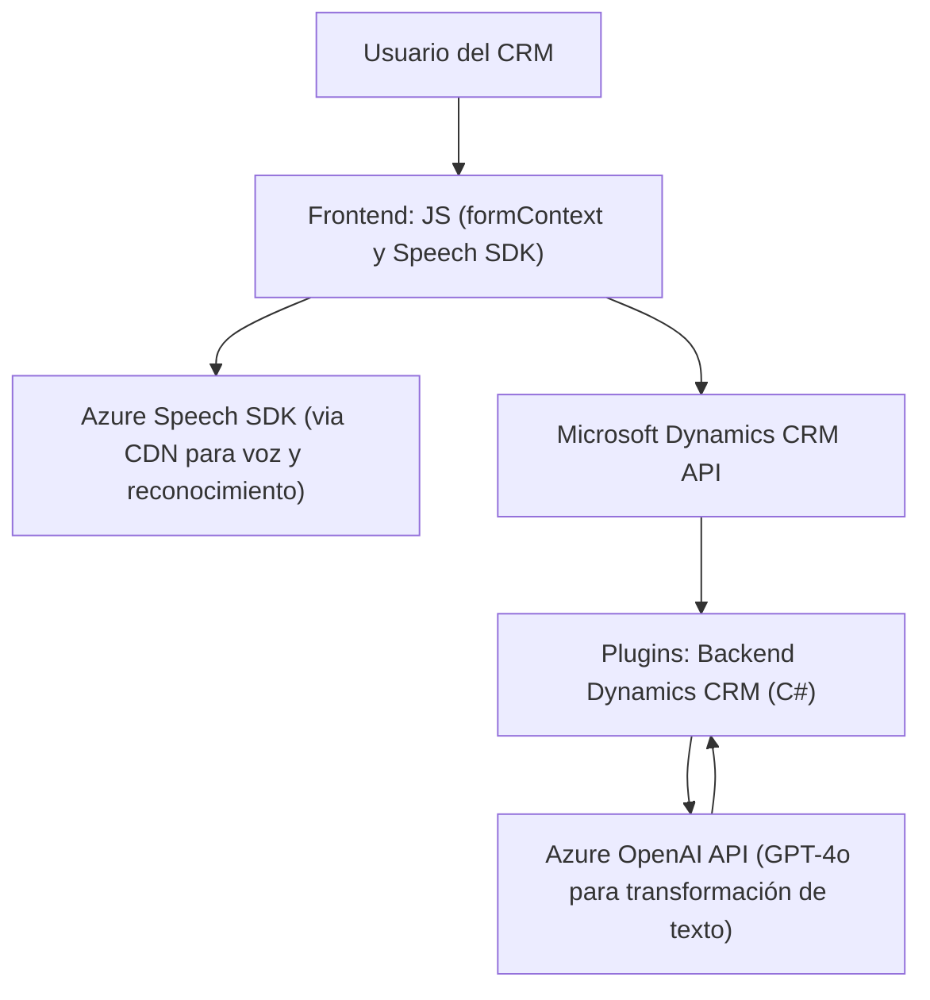

### Breve resumen técnico
El repositorio presenta una solución centrada en la integración de funcionalidades de reconocimiento de voz, síntesis de texto a voz, y procesamiento avanzado mediante Microsoft Dynamics CRM, en combinación con servicios en la nube de Microsoft Azure. La arquitectura incluye módulos para el frontend en JavaScript y plugins de backend en C# que interactúan con APIs externas como Azure Speech SDK y Azure OpenAI.

---

### Descripción de arquitectura

La arquitectura empleada es una mezcla de **n-capas** y **event-driven**.
- La capa de presentación (frontend) opera como un **cliente ligero**, centrado en la captura y manejo de formularios a través de voz y texto.
- La capa de negocio (backend) está representada por plugins de Dynamics CRM que procesan el texto transformado y los datos formularios.
- Estas capas interactúan mediante un **patrón de integración con API externas**, como Azure Speech SDK y Azure OpenAI, proporcionando funcionalidades especializadas de reconocimiento, síntesis de voz, y procesamiento dinámico de texto.

---

### Tecnologías usadas

**Frontend**:
1. **JavaScript**:
   - Microsoft Dynamics JavaScript SDK (`formContext`, `Xrm.WebApi`).
   - Azure Speech SDK, cargado dinámicamente desde un CDN.

**Backend**:
1. **C#** (.NET Framework):
   - Dependencia de Dynamics CRM SDK (`IPlugin`, `IOrganizationService`).
   - Integración con **Azure OpenAI API**: modelo GPT-4 (HTTP POST).

**Frameworks y servicios externos**:
1. Azure Speech SDK para conversión de texto a voz y reconocimiento de voz.
2. Azure OpenAI para transformación avanzada de texto.
3. Dynamics CRM para la gestión de eventos y lógicas basadas en datos dinámicos.

**Patrones usados**:
1. Modularización funcional: Todas las funciones del frontend tienen responsabilidades delimitadas.
2. Adaptador: En el frontend y backend, los datos son transformados en legible/útil.
3. Event-driven: El plugin en Dynamics CRM es disparado mediante un flujo de eventos.
4. External API Integration: Dependencia en servicios de Azure.

---

### Diagrama Mermaid

---

### Conclusión final

Este repositorio corresponde a una **solución híbrida de integración basada en eventos**, donde el frontend maneja capturas de voz y dinámica de formularios, mientras que el backend extiende la lógica de negocio en Microsoft Dynamics CRM mediante plugins personalizados. Además, la dependencia en servicios de nube como Azure Speech SDK y Azure OpenAI posiciona la solución dentro del ámbito de **aplicaciones basadas en APIs integradas y microservicios periféricos**.

La solución podría beneficiarse del enfoque de **arquitectura hexagonal** si se busca desacoplar con mayor profundidad las capas del sistema, por ejemplo, aislando mejor la lógica de negocio del acceso a servicios externos (API). Sin embargo, el diseño actual parece ser funcional y adecuado para casos de uso dentro de Dynamics CRM basado en extensión de plugins.